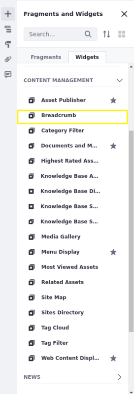

## Using the Breadcrumb Widget 

This widget provides a way to easily navigate to related pages or sites through links.

1. From the Fragments and Widgets section, add the *Breadcrumb* widget to a page. It can be found in the Content Management list. 

    

You can configure the widget via its *Options* button (): 

**Display Template:** Select the desired display alignment for the navigation options.

**Show Current Site:** Whether to display the current site where this page is. 

**Show Guest Site:** Whether to display the guest site where the current site is.

**Show Page:** Whether to display the current page.

**Show Parent Sites:** Whether to display the current site's parent sites.

**Show Application Breadcrumb:** Whether to show the Application Breadcrumb.

