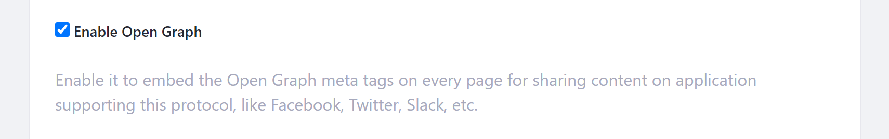
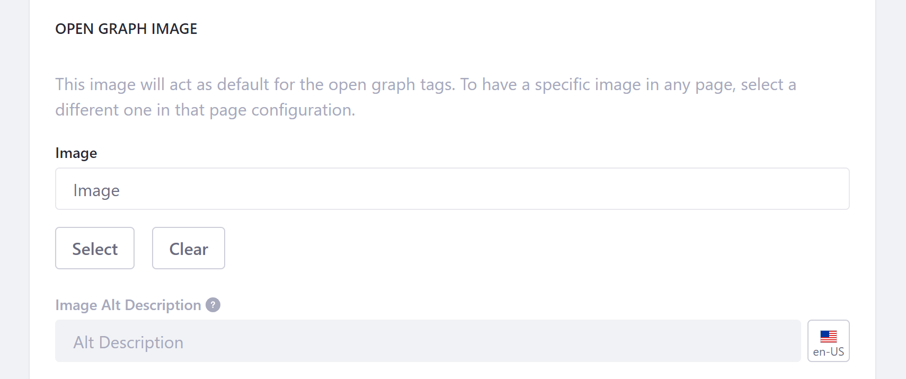

---
taxonomy-category-names:
- Sites
- SEO
- Liferay Self-Hosted
- Liferay PaaS
- Liferay SaaS
uuid: c85f3045-c786-448a-aef9-2388660b7397
---

# Configuring Open Graph for Sites

{bdg-secondary}`Liferay DXP/Portal 7.3+`

[Open Graph](https://ogp.me) is an Internet protocol that standardizes previews of site content when shared in application contexts that support it, such as Facebook, Slack, and Twitter. It does this by embedding structured data in page headers as `<meta>` tags, similar to [RDFa](https://en.wikipedia.org/wiki/RDFa).

By default, Open Graph `<meta>` tags are embedded in all public Liferay pages, but you can disable this behavior at the site level if desired. In site settings, you can also set default `og:image` properties. These values are used for all pages, unless they're overridden at the [page](../creating-pages/page-settings/page-settings-ui-reference.md#open-graph) or [display page](../displaying-content/using-display-page-templates/configuring-seo-and-open-graph-settings-for-display-page-templates.md) level.

!!! note
    Custom `<meta>` tags are only included in page headers for unauthenticated users. They are not included when the user is logged in.

To configure Open Graph for your site,

1. Open the *Site Menu* () and go to *Configuration* &rarr; *Settings* (previously *Site Settings*).

1. Scroll down to the *Open Graph* sub-heading and expand it.

1. Check/uncheck the *Enable Open Graph* setting to enable/disable Open Graph for your site.

   

1. (Optional) Use the *Image* and *Image Alt Description* fields to set default `og:image` properties for the site's pages.

   These values are overridden by [page](../creating-pages/page-settings/page-settings-ui-reference.md#open-graph) and [display page](../displaying-content/using-display-page-templates/configuring-seo-and-open-graph-settings-for-display-page-templates.md) configurations.

   

1. Preview your default `og:image` configuration.

   Keep in mind the image's ratio may change depending on where its shared.

   

1. Click *Save*.

## Analyzing the `og:image` Properties

When you select an image, DXP automatically adds structured properties that determine how your selected image appears. The Image field defines the following `<meta>` tags.

```html
<meta property="og:image" content="http://example.com/ogp.jpg" />
<meta property="og:image:secure_url" content="https://secure.example.com/ogp.jpg" />
<meta property="og:image:type" content="image/jpeg" />
<meta property="og:image:width" content="400" />
<meta property="og:image:height" content="300" />
```

When you enter text into the `Image Alt Description` field, you determine the default text read by screen readers for your selected image.

To create localized alt descriptions for your Open Graph image, click on the *Language Flag* button and select the language you want to set. Values entered here define the default `og:image:alt` tag.

```html
<meta property="og:image:alt" content="This is an example." />
```

## Related Topics

- [Search Engine Optimization](../optimizing-sites.md)
- [Site Settings UI Reference](./site-settings-ui-reference.md)
- [Page Settings UI Reference](../creating-pages/page-settings/page-settings-ui-reference.md)
