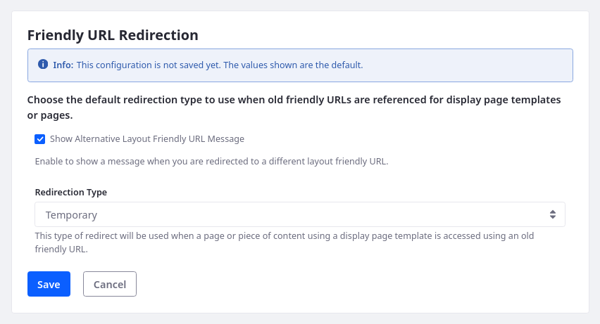

---
taxonomy-category-names:
- Sites
- SEO
- Liferay Self-Hosted
- Liferay PaaS
- Liferay SaaS
uuid: f5befd14-b9eb-4877-97f5-dc313e9e8fe3
---

# Configuring Friendly URL Redirects

{bdg-secondary}`Liferay 7.4+`

When you update friendly URLs for pages, blogs, and documents, Liferay automatically stores the old URLs. As long as the old URL remains in the history, Liferay redirects users to the latest version of the page or asset. This is to improve your site's SEO and provide a more optimal user experience.

By default friendly URL redirects are temporary (302), but you can configure them to be permanent (301) if needed. You can also determine whether Liferay displays a message when users are redirected to a different friendly URL.

!!! warning
    Make sure your URLs don't have a trailing slash. For example, instead of `https://example.com/product/item1/`, use `https://example.com/product/item1`. 

To configure friendly URL redirects,

1. Open the _Global Menu_ () and go to _Control Panel_ &rarr; _System Settings_ &rarr; _Pages_ &rarr; _Friendly URL Redirection_.

   Alternatively, you can configure these settings under Instance Settings.

   

1. Enable or disable _Show Alternative Layout Friendly URL Message_ to determine if Liferay displays a message whenever users are redirected to a different friendly URL.

1. Set the Redirection Type to _Temporary_ or _Permanent_.

   **Permanent**: Use a 301 code to inform search engines and other tools accessing your site that the requested resource has been permanently relocated. Search engines replace the old URL with the new destination in search results, and browsers cache the new destination for an indeterminate amount of time. A 301 code should be used only when you intend to use the destination URL indefinitely. This improves SEO and helps avoid unintended caching.

   **Temporary**: Use a 302 code to inform search engines and other tools accessing your site that the requested resource has temporarily moved. A 302 code is useful when you want to conduct A/B testing or redirect traffic while fixing a problem, without impacting your site ranking. Liferay uses 302 codes by default.

   !!! important
       Setting redirects to temporary after making them permanent can have unintended consequences. In some cases, users who previously received a permanent redirect may not be able to reach the original URL again. For this reason, use permanent redirects with care.

1. Click _Save_.

## Related Topics

- [Setting Up Redirects and 404 Tracking](./setting-up-redirects-and-404-tracking.md)
- [Configuring Your Site's Friendly URL](./configuring-your-sites-friendly-url.md)
- [Configuring Virtual Hosts Site URLs](./configuring-virtual-hosts-site-urls.md)
