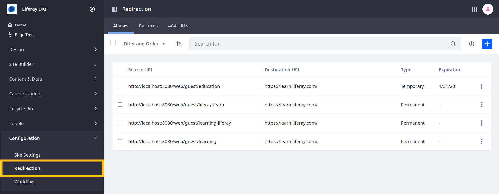

---
toc:
  - ./setting-up-redirects-and-404-tracking/using-alias-redirects.md
  - ./setting-up-redirects-and-404-tracking/using-pattern-redirects.md
  - ./setting-up-redirects-and-404-tracking/tracking-404-urls.md
taxonomy-category-names:
- Sites
- SEO
- Liferay Self-Hosted
- Liferay PaaS
- Liferay SaaS
uuid: 19c713cc-87be-41e6-ba6d-fc23ee75ad82
---

# Setting Up Redirects and 404 Tracking

{bdg-secondary}`7.4 U48+/GA48+`

Maintaining URL integrity is important for any site. Liferay's _Redirection_ tool provides a convenient and integrated way to manage HTTP redirects and track 404 errors for individual sites. Use it to avoid and fix broken links, improving both user experience and site SEO.

To access the application, open the _Site Menu_ () and go to _Configuration_ &rarr; _Redirection_.

Liferay automatically creates a friendly URL history for page, blog entry, and document URLs. See [Configuring Friendly URL Redirects](./configuring-friendly-url-redirects.md) for more information.

## Defining Redirects

You can define two kinds of redirects:

**Alias Redirects**: Define permanent (301) or temporary (302) URL redirects using an absolute source and destination URL.

**Pattern Redirects** {bdg-secondary}`7.4 U48+/GA48+`: Define bulk redirects using regular expressions that set patterns for source URLs and their replacements.

Liferay recommends alias redirects in most cases because they are more predictable. Pattern redirects are best for matching families of URLs. Depending on the exact regular expression, pattern redirects are slower and result in more URL matches than intended. See [Using Alias Redirects](./setting-up-redirects-and-404-tracking/using-alias-redirects.md) and [Using Pattern Redirects](./setting-up-redirects-and-404-tracking/using-pattern-redirects.md) for more information.

## Resolving 404 Errors

In the Redirection application, you can view and manage site requests that result in a 404 error, so you can assess and quickly resolve any issues. For Liferay 7.4+, 404 tracking is disabled by default. Enabling this feature activates the 404 URLs tab in the Redirection application and begins cataloging errors. See [Tracking 404 URLs](./setting-up-redirects-and-404-tracking/tracking-404-urls.md) for more information.

::::{grid} 2
:gutter: 3 3 3 3

:::{grid-item-card} Using Alias Redirects
:link: ./setting-up-redirects-and-404-tracking/using-alias-redirects.md
:::

:::{grid-item-card} Using Pattern Redirects
:link: ./setting-up-redirects-and-404-tracking/using-pattern-redirects.md
:::

:::{grid-item-card} Tracking 404 URLs
:link: ./setting-up-redirects-and-404-tracking/tracking-404-urls.md
:::
::::
