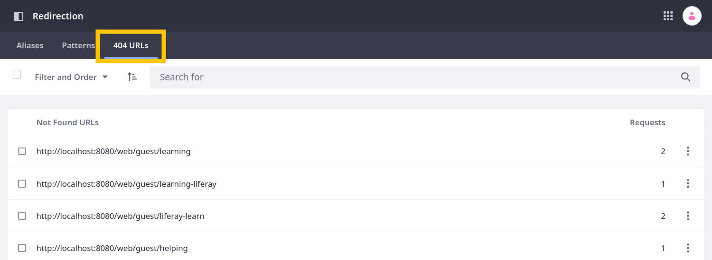
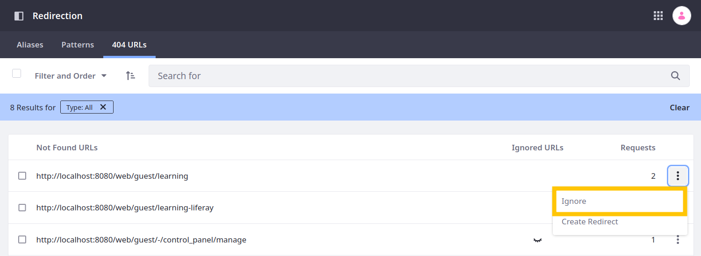

# Tracking 404 URLs

With the Redirection application, you can view and manage site requests leading to 404 errors. While enabled, Liferay catalogs each error, so you can assess the cause of the errors and quickly resolve any issues. These URLs are preserved in your database according to your Redirection configurations.



```{important}
For Liferay 7.4+, 404 tracking is disabled by default. To use this feature, you must first [enable 404 tracking](#enabling-404-tracking). This enables both 404 tracking and the 404 URLs tab in the Redirection application.
```

## Viewing 404 URLs

You can filter cataloged requests by both *type* and *date*. When filtering by type, you can choose to display *Active*, *Ignored*, or *All* 404 URLs. When filtering by date, you can determine whether to view all URLs, or only those that have been requested within the last day, week, or month. You can also order cataloged requests by their *modified date* or *number of requests*.

By default, this page displays all active URLs by number in descending order.


## Ignore/Unignore 404 URLs

Define a URL as active or ignored by clicking its *Actions* button () and selecting *Ignore*/*Unignore*. When ignored, the URL is hidden in the default Active view, though you can change its status at any time.



## Creating Redirects for 404 URLs

Create an alias redirect for a 404 URL by clicking its *Actions* button () and selecting *Create Redirect*. This shows a form with the source URL pre-filled with the selected 404. Finish filling out the form and click *Create* to save the new redirect.


## Configuring 404 Settings

You can configure how long 404 URLs are retained between requests, the maximum number of 404 URLs stored in your database, and the interval between 404 URL checks.

1. Open the *Global Menu* (), click the *Control Panel* tab, and go to *System Settings* &rarr; *Pages* &rarr; *Redirection* under Virtual Instance Scope.

By default, the 404 URL Maximum Age is set to 30 days, the Maximum Number of 404 URLs is set to 1000 entries, and the system checks for 404 URLs every 24 hours.


## Enabling 404 Tracking

{bdg-secondary}`Available 7.4+`

1. Open the *Global Menu* (), click the *Control Panel* tab, and go to *System Settings* &rarr; *Pages* &rarr; *Redirection*.

   

1. Check *Enabled*.

1. Click *Update*.

Once enabled, you can access the 404 URL management tab in the Redirection application.

```{important}
Enabling or disabling the application does not affect data stored in the database. If disabled, you can reenable the feature to access your data at any time.
```

## Additional Information

* [Managing Site URLs](../../managing-site-urls.md)
* [Using Alias Redirects](./using-alias-redirects.md)
* [Using Pattern Redirects](./using-pattern-redirects.md)
* [Configuring Virtual Hosts Site URLs](../configuring-virtual-hosts-site-urls.md)
* [Configuring Your Site's Friendly URL](../configuring-your-sites-friendly-url.md)
