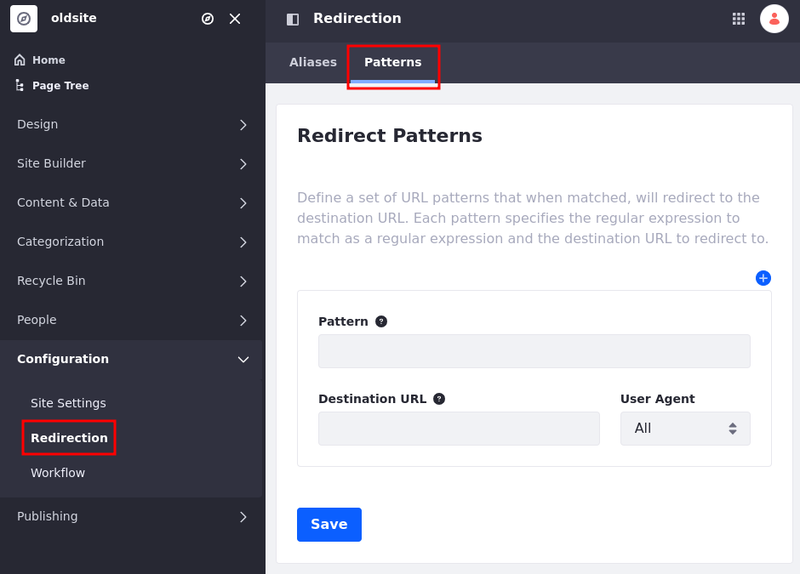
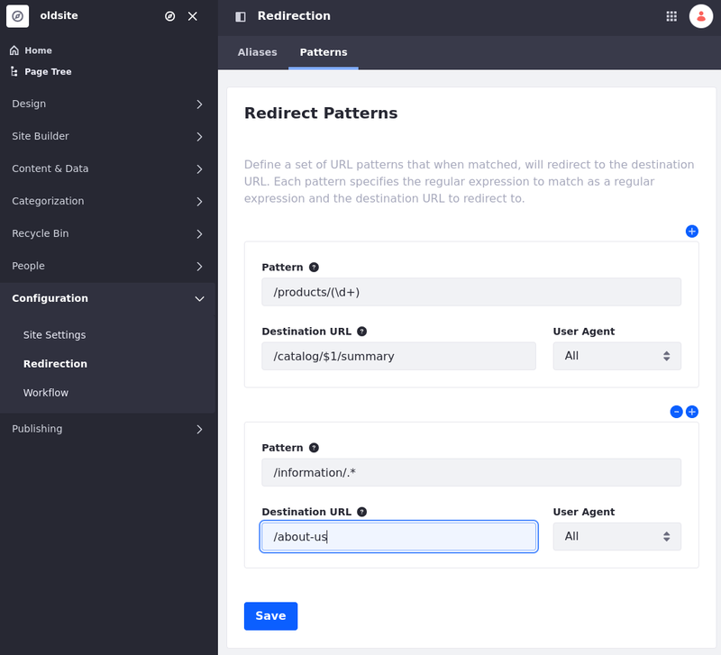

---
taxonomy-category-names:
- Sites
- SEO
- Liferay Self-Hosted
- Liferay PaaS
- Liferay SaaS
uuid: 86f08f77-e511-4054-86eb-13cf4b3dd3ba
---
# Using Pattern Redirects

{bdg-secondary}`Available 7.4 U48+/GA48+`

Pattern redirects use regular expressions to define patterns for multiple source URLs and their replacements. Consequently, they are best used when you have large groups of URLs to map to new URLs. You can create bulk redirects in a web server like Nginx or Apache, but since this is an out-of-the-box feature, you can set up pattern redirects directly in Liferay.

```{important}
Because Liferay interprets redirect patterns as friendly URLs based on the current site's friendly URL, you cannot use redirect patterns with non-friendly URLs (e.g., virtual host names, port numbers) or redirect to pages outside of the current site's scope (i.e., redirect from page A in site A to page B in site B).

However, you can redirect to external websites by adding the protocol before the address. (e.g., use http://www.externalwebsite.com to redirect to the external website).

Depending on the regular expression you use, pattern redirects can be slower than [alias redirects](./using-alias-redirects.md) and result in more URL matches than intended. For these reasons, alias redirects are recommended when possible. See [Setting Up Redirects and 404 Tracking](../setting-up-redirects-and-404-tracking.md) for more information.
```

## Creating Pattern Redirects

1. Open the *Site Menu* (  ) and go to *Configuration* &rarr; *Redirection*.

1. Go to the *Patterns* tab.

   

1. In the Pattern field, enter a regular expression for the source URL. It's implicitly anchored to the beginning of each page's friendly URL, so `/home` is equivalent to `^/home` in regex.

   Liferay supports all operations provided by the Java regular expression package. See the [JDK documentation](https://docs.oracle.com/javase/7/docs/api/java/util/regex/Pattern.html) for more information.

1. Enter a destination URL.

   ```{tip}
   You can use references to capture groups of URLs in the replacement pattern. For example, in the following image, the `$1` value is replaced with the group of values captured by the `(\d+)` regular expression.
   ```

   

1. (Optional) Click the *Plus* button to add multiple redirect patterns for the site.

1. Click *Save*.

```{warning}
Avoid creating circular redirects. These are easy to create when defining redirects for content friendly URLs (e.g. redirecting between different friendly URLs for the same content). Liferay cannot reliably detect these loops.
```

### Creating Pattern Redirects: Changing Domains

If you have two domains such as https://www.old-site.com and https://www.new-site.com, you can redirect a page from one domain to the other:

1. Navigate to https://www.old-site.com.

1. Open the *Site Menu* (  ) and go to *Configuration* &rarr; *Redirection*.

1. Under Pattern, add `^(.*)`.

   This regular expression captures the entire URL path of the source request.

1. Under Destination URL, add `https://www.new-site.com/$0`.

   `$0` appends the entire captured URL path from the source to the destination URL.

1. Click *Save*.

Now, if you go to https://www.old-site.com/examplepage, you are redirected to https://www.new-site.com/examplepage.

## Understanding Pattern Redirects

When a user attempts to access the source URL, Liferay tests the patterns against the layout friendly URL in the order specified. The matching process roughly follows these rules:

* If the URL is a control panel URL, no matching is performed, since it is impossible to capture control panel URLs.

* If there is an alias redirect for the current URL, the user is redirected to that destination.

* If no alias is found, Liferay tests each redirect pattern in sequence until all patterns are exhausted or one of them matches. Liferay redirects users to the first match.

## Related Topics

* [Managing Site URLs](../../managing-site-urls.md)
* [Using Alias Redirects](./using-alias-redirects.md)
* [Configuring Virtual Hosts Site URLs](../configuring-virtual-hosts-site-urls.md)
* [Configuring Your Site's Friendly URL](../configuring-your-sites-friendly-url.md)
