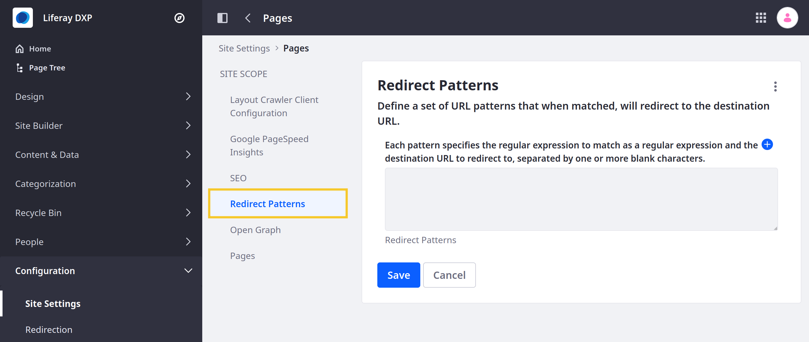
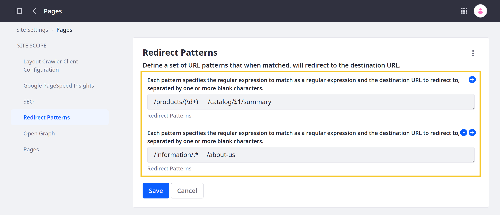

# Using Pattern Redirects

{bdg-secondary}`Available 7.4 U42+/GA42+`

Pattern redirects use regular expressions to define patterns for multiple source URLs and their replacements. For this reason, they are best used when you have large groups of URLS that you need to map to new URLs. While you can set up bulk redirects using Nginx, Apache, or a similar service, Liferay provides this capability out of the box, so you can set up pattern redirects directly in Liferay DXP.

```{important}
In Liferay, redirect patterns are interpreted as friendly URLs based on the current site's friendly URL. For this reason, it is not possible to use redirect patterns with non-friendly URLs (e.g., virtual host names, port numbers) or redirect users to pages outside of the current site.

Also, depending on the regular expression you use, pattern redirects can be slower than [alias redirects](../managing-site-urls.md#site-redirects) and result in more URL matches than intended. For these reasons, alias redirects are recommended in most use cases. See [Using the Redirection Tool](./using-the-redirection-tool.md) for more information about setting them up.
```

Follow these steps to set up pattern redirects for a site:

1. Navigate to the desired site.

1. Open the *Site Menu* (), expand *Configuration*, and go to *Site Settings*.

1. Under Content and Data, click *Pages* and go to the *Redirect Patterns* tab.

   

1. Enter a redirect pattern. If needed, you can click the *plus* button to add multiple redirect patterns for the Site.

   Each redirect pattern should include a source URL pattern and a destination URL pattern. These values are added to the same entry and are separated by one or more spaces. When setting the source URL, use a regular expression. Each regular expression is implicitly anchored to the beginning of each page's friendly URL (e.g., `/home` is equivalent to `^/home` in regex).

   Liferay supports all operations provided by the Java regular expression package. See official [JDK documentation](https://docs.oracle.com/javase/7/docs/api/java/util/regex/Pattern.html) for more information.

   

   ```{tip}
   If desired, you can use references to capture groups of URLs in the replacement pattern. For example, in the above image, the `$1` value is replaced with the group of values captured by the `(\d+)` regular expression.
   ```

1. Click *Save*.

When a user attempts to access the source URL, Liferay tests the patterns against the layout friendly URL in the order specified. The matching process roughly follows these rules:

* If the URL is a control panel URL, no matching is performed, since it is impossible to capture control panel URLs.

* If there is an alias redirect for the current URL, the user is redirected to that destination URL.

* If no alias is found, Liferay tests each redirect pattern in sequence until all patterns are exhausted or one of them matches. Liferay redirects users to the first match.

## Additional Information

* [Managing Site URLs](../managing-site-urls.md)
* [Using the Redirection Tool](./using-the-redirection-tool.md)
* [Configuring Virtual Hosts Site URLs](./managing-site-urls/configuring-virtual-hosts-site-urls.md)
* [Configuring Your Site's Friendly URL](./managing-site-urls/configuring-your-sites-friendly-url.md)
