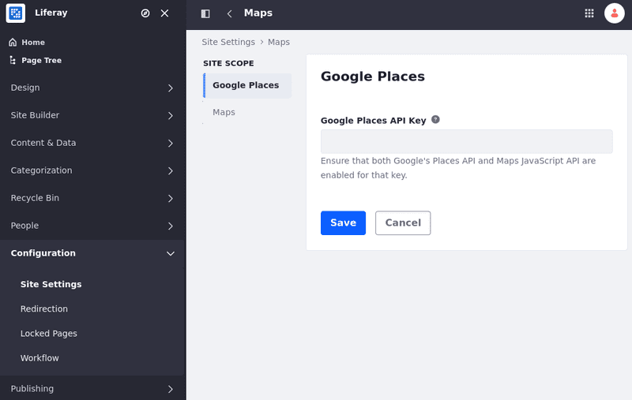
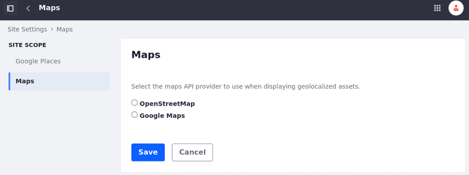

---
taxonomy-category-names:
- Content Management System
- Content Configurations
- Localization
- Liferay Self-Hosted
- Liferay PaaS
- Liferay SaaS
uuid: 5870418b-597c-4930-9bf5-b92373c9b811
---

# Configuring Geolocation for Assets

Geolocated assets include geographical data, allowing them to be displayed on maps or filtered based on location. You can use geolocation data to display a list of local events, nearby facilities, or region-specific news articles.

To enable geolocation for assets,

<!-- This article could use an introductory paragraph that answers: what geolocated assets are - IDEALLY we present a screenshot of an asset being displayed in liferay that shows geolocation data included. This gives the reader a sense of what this article is helping them accomplish. -->

<!-- I tested it but I couldn't make it work. So, I still can't show an image of it working. I just updated the page for now. Eric. -->

1. Open the *Site Menu* () and go to *Configuration* &rarr; *Site Settings*.

1. Under Platform, click *Maps*.

1. On the Google Places option on the left, you can add a Google Places API Key.

   

1. On the Maps option, Select the maps API provider you want to use when displaying your geolocated assets. There are two available options: OpenStreetMap and Google Maps.

   

1. Scroll down and click *Save* to apply the changes.

[Geolocated assets](../../../content-authoring-and-management/tags-and-categories/geolocating-assets.md) can be displayed for documents, web content articles, DDL records, etc.

## Related Topics

- [Site Content Configurations](../site-content-configurations.md)
