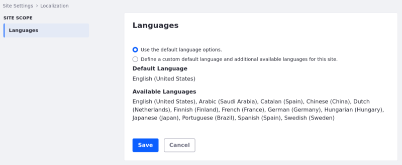

---
taxonomy-category-names:
- Sites
- Localization
- Liferay Self-Hosted
- Liferay PaaS
- Liferay SaaS
uuid: ce0a8b5e-a09a-49bf-98c5-47ff980b6a7c
---

# Site Localization

!!! note
    If you are setting up your Liferay installation for the first time, we recommend reviewing [Initial Instance Localization](../../installation-and-upgrades/setting-up-liferay/initial-instance-localization.md) first.

## Configuring Site Languages

You can set your Site's default language. You can also define a Site's enabled languages:

1. Go to *[Site Settings](./site-settings-ui-reference.md#language)* &rarr; *Localization*.

   

1. Click *Define a custom default language and additional available languages for this site*.

   

1. You can change the default language to any language in the list.

1. You can also choose which additional languages are enabled or disabled.

   

1. Use the left and right arrow buttons to disable or enable additional languages respectively.

1. Click the *Save* button to save any changes.

## Modifying Localizable Site Fields

Some fields have an appended language flag button. These fields can be translated into other languages.

1. Click the language flag beside the field.

   

1. Enter the new value in the selected language. The default value appears beneath the field for reference.

   

Liferay automatically saves the translation for each language and displays the translated value when that language is selected for the instance. If a translation for the field is not provided, the default instance language's value for that field appears.

## Locale Prepend Friendly URL Style

Locale Prepend Friendly URL Style configures the website's content management system or web server to recognize language codes in URLs and serve the appropriate content. For example, in `example.com/en/about` the language identifier appears in the URL before the rest of the path.

Locale Prepend Friendly URL Style helps search engines determine the content's language, improving search engine rankings for users of that language.

1. Open the *Global Menu* (), go to the *Control Panel* tab, and click *Instance Settings*.

1. Under *Platform*, click *Localization*.

1. Click *Locale Prepend Friendly URL Style*.

Once you click the selector, these options appear:

**Locale is automatically prepended to a URL when the requested locale is not the default user locale** (default value): The default user locale is set English (en). For guests or those using the default locale, the URL `example.com/about` is preserved without adding a locale prefix. If a user from France visits the About page. The URL changes from `example.com/about` to `example.com/fr/about` automatically.

**Locale is not automatically prepended to a URL**: The default user locale is set to English (en), and a user from France visits the About page. The URL `example.com/about` is preserved without adding a locale prefix.

**Locale is automatically prepended to a URL when the requested locale is not the default locale**: The default user is set to English (en), and a user from France visits the About page. Instead of the URL being `example.com/about`, it is changed to `example.com/es/about`, indicating that the French version of the About page is being accessed.

<!-- The above definition doesn't make sense. If the default user is set to English, and somebody from France accesses the page, why would it switch to Spanish? Also, you need to determine what the difference is between the first option and this one. The only difference in the name of the option is the word "user." I verified this is indeed what's in the user interface, which is clear as mud (that's an English expression to indicate it's not clear). 

Can you get clarification from the Product team on what these options mean? Otherwise, I wordsmithed everything, and this PR would be ready except for this.

-Rich 

-->

**Locale is automatically prepended to every URL**: The default user locale is set to English (en). For guests or those using the default locale, the URL `example.com/about` changes to `example.com/en/about` automatically, showing the default locale. If a user from France (fr) visits the page, the URL changes to `example.com/fr/about` automatically, showing the chosen locale.

1. Select the option that meets your needs. Click *Save* once done.

!!! warning
    Make sure your URLs don't have a trailing slash (e.g instead of `https://example.com/product/item1/`, use `https://example.com/product/item1`). 
    
## Related Topics

- [Localization](../../system-administration/configuring-liferay/virtual-instances/localization.md)
- [Changing Translations with Language Override](../../system-administration/configuring-liferay/changing-translations-with-language-override.md)
- [Adding a Language](../../liferay-development/liferay-internals/extending-liferay/customizing-localization/adding-a-language.md)