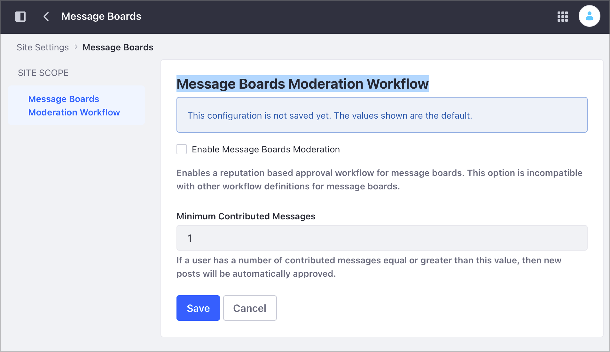

---
taxonomy-category-names:
- Sites
- Site Administration
- Liferay Self-Hosted
- Liferay PaaS
- Liferay SaaS
uuid: 044fab43-2666-4c99-ae59-e5c60fdc7516
---

# Site Settings UI Reference

Starting with Liferay DXP 7.4, the Site Settings application layout is consistent with other configuration areas, such as Instance Settings or System Settings.

!!! note
    The Site Settings application changes significantly in Liferay DXP 7.4+. See [Site Settings UI Reference in Liferay DXP 7.2 and 7.3](#site-setting-ui-reference-in-liferay-dxp-72-and-73) below for information on previous versions.

## Accessing the Site Settings Application

1. Go to Site Administration &rarr; *Configuration* &rarr; *Site Settings*.

1. Click on a setting to open its configuration.

You can find the following configuration areas:

- [Commerce](#commerce)
- [Platform](#platform)
- [Content and Data](#content-and-data)
- [Other](#other)


## Commerce

By default, the commerce area includes the following settings:

- Catalog
- Orders
- Payment
- Shipping

Here you can configure the commerce settings at the site scope. For more information about commerce settings, see [Liferay Commerce Configuration Overview](https://learn.liferay.com/w/commerce/store-management/liferay-commerce-configuration-overview).

## Platform

By default, the Platform area includes the following settings:

- [Analytics](#analytics)
- [Localization](#localization)
- [Site Configuration](#site-configuration)
- [Third Party](#third-party)
- [Maps](#maps)
- [Users](#users)
- [SEO](#seo)

### Analytics

Use these settings to configure the Google Analytics options for your site.

If you require a different analytics service, you can add it. See [Adding a New Analytics Service](./adding-a-new-analytics-service.md) for more information and how to add additional fields for different analytics services.

### Localization

Here you can choose whether to use the installation's default language options or define your own for the site. For more information on setting your site's language options, read [Site Localization](../site-settings/site-localization.md).

### Site Configuration

By default, Site Configuration includes the Details and Site URL sections.

Here's the information included in the Details Menu:

| Setting                            | Description                                                                                                                                                                                             |
| :--------------------------------- | :------------------------------------------------------------------------------------------------------------------------------------------------------------------------------------------------------ |
| Site ID                            | A unique number automatically generated for a site at its creation. This ID is permanent and cannot be changed.                                                                                         |
| Description                        | Use the this field to explain a site's purpose.                                                                                                                                                         |
| Parent Site                        | Designate a site as a child site by selecting its parent site. See [Site Hierarchies](../sites/site-hierarchies.md) for more information.                                                               |
| Membership Type                    | Determines how restrictive a site's membership is. See [Changing Site Membership Types](../site-settings/site-users/changing-site-membership-type.md) for more information.                             |
| Allow Manual Membership Management | Determine whether to allow members to be manually added or removed from a site. See [Changing Site Membership Type](../site-settings/site-users/changing-site-membership-type.md) for more information. |

Here's the information included in the Site URL Menu:

| Setting      | Description                                                                                                                                                                                                  |
| :----------- | :----------------------------------------------------------------------------------------------------------------------------------------------------------------------------------------------------------- |
| Friendly URL | Set a custom URL for site pages. See [Configuring Your Site's Friendly URL](../site-settings/managing-site-urls/configuring-your-sites-friendly-url.md) for more information.                                |
| Pages        | Set virtual hosts that map to friendly URL for the site's pages. See [Configuring Virtual Hosts Site URLs](../site-settings/managing-site-urls/configuring-virtual-hosts-site-urls.md) for more information. |

### Third Party

Configure third party integrations such as [Salesforce](https://learn.liferay.com/w/commerce/add-ons-and-connectors/salesforce/liferay-connector-to-salesforce) and [SugarCRM](../../liferay-development/objects/integrating-objects-with-third-party-services/managing-data-from-external-systems/using-objects-with-sugar-crm.md) to further enhance your site's features.

### Maps

By default, the Maps Application includes the Maps and Google Places sections. Read [Configuring Geolocation for Assets](./site-content-configurations/configuring-geolocation-for-assets.md) to learn more.

| Section               | Description                                                                                                                                                                                                                                                                                                                  |
| :-------------------- | :--------------------------------------------------------------------------------------------------------------------------------------------------------------------------------------------------------------------------------------------------------------------------------------------------------------------------- |
| Maps                  | Select the maps API provider to use when displaying geo-localized assets in your site. Geo-localized assets can be displayed for documents, web content articles, DDL records, and more. See [Geo-locating Assets](../../content-authoring-and-management/tags-and-categories/geolocating-assets.md) for more information. |
| Google Places API Key | Set the Google Places API Key.                                                                                                                                                                                                                                                                                               |

### Users

By default, the Users section includes the Default User Associations setting, where you can configure the default roles and teams for new site members. For more information, see [Configuring Role and Team Defaults for Site Members](../site-settings/site-users/configuring-role-and-team-defaults-for-site-members.md).

### SEO

Configure whether instance and site names appear in the HTML title to control how your site information appears in browser tabs and search engine results. Read [SEO and Metadata Configuration Reference](../optimizing-sites/seo-and-metadata-configuration-reference.md) to learn more about other SEO configuration options.

By default, the instance and site names are included in the HTML title. You can exclude the instance and/or the site names and display only the page name in the HTML title.

In this example, the page is called `Advanced Home Security Systems`, the instance is `omniconsumerproducts.com`, and the site is `Products Site`.

```html
<!-- (Default) Page, site, and instance names -->
<title>Advanced Home Security Systems - Products Site - omniconsumerproducts.com</title>

<!-- Page and site names -->
<title>Advanced Home Security Systems - Products Site</title>

<!-- Page and instance names -->
<title>Advanced Home Security Systems - omniconsumerproducts.com</title>

<!-- Only the page name -->
<title>Advanced Home Security Systems</title>
```

## Content and Data

By default, the Content and Data area includes the following settings:

- [Assets](#assets)
- [Click to Chat](#click-to-chat)
- [Community Tools](#community-tools)
- [Digital Signature](#digital-signature)
- [Documents and Media](#documents-and-media)
- [Message Boards](#message-boards)
- [Pages](#pages)
- [Recycle Bin](#recycle-bin)
- [Reports](#reports)
- [Sharing](#sharing)

### Assets

| Section            | Description                                                                                                                                                                                                                                                                                                                             |
| :----------------- | :-------------------------------------------------------------------------------------------------------------------------------------------------------------------------------------------------------------------------------------------------------------------------------------------------------------------------------------- |
| Asset Auto Tagging | When enabled, assets are auto tagged by the providers configured at the Instance scope. See [Configuring Asset Auto Tagging](../../content-authoring-and-management/tags-and-categories/auto-tagging/configuring-asset-auto-tagging.md) for more information.                                                                           |
| Categorization     | Use this section to categorize your site. This setting does not affect the categories and tags available for the site. For more information on using categories and tags, see [Organizing Content with Categories and Tags](../../content-authoring-and-management/tags-and-categories/organizing-content-with-categories-and-tags.md). |

### Click to Chat

{bdg-secondary}`Liferay 7.4 GA2+`

You can integrate Liferay DXP with live support chat platforms. The configuration at site scope depends on the Click to Chat configuration at instance scope. For more information, read [Enabling Automated Live Chat Systems](../personalizing-site-experience/enabling-automated-live-chat-systems.md).

You can see the type of configuration for this setting at the instance scope under the Site Settings Strategy text:


!!! note
    Depending on your configuration at the instance scope, you may not be able to update the configuration at site scope. To verify your instance configuration, got to the Site Menu &rarr; Control Panel &rarr; Instance Settings &rarr; Content and Data &rarr; Click to Chat.

### Community Tools

| Section  | Description                                                                                                                                                                                                                     |
| :------- | :------------------------------------------------------------------------------------------------------------------------------------------------------------------------------------------------------------------------------ |
| Mentions | Determines whether to allow users to mention other users in site applications. See [Configuring Mentions](../../collaboration-and-social/notifications-and-requests/user-guide/configuring-mentions.md) for more information.   |
| Ratings  | Here you can select the type of ratings used for the different site applications. See [Configuring Content Rating Types](../site-settings/site-content-configurations/configuring-content-rating-type.md) for more information. |

### Digital Signature

You can integrate Liferay DXP with DocuSign to manage electronic signatures. The configuration at site scope depends on the Digital Signature configuration at instance scope.

!!! note
    Depending on your Digital Signature configuration at the instance scope, you may not be able to update the configuration at site scope. To verify your instance configuration, go to Site Menu &rarr; Control Panel &rarr; Instance Settings &rarr; Content and Data &rarr; Digital Signature.

### Documents and Media

When enabled, a user with view permission can browse the site's document library files and folders. For more information, see [Securing Site Documents Content](../site-settings/site-content-configurations/securing-site-documents-content.md).

### Message Boards

Using this option, you can enable automatic moderation of user messages on message boards after a predefined number of messages.



### Pages

| Section                                      | Description                                                                                                                                                                                                                                                                                                                                                               |
| :------------------------------------------- | :------------------------------------------------------------------------------------------------------------------------------------------------------------------------------------------------------------------------------------------------------------------------------------------------------------------------------------------------------------------------ |
| Google PageSpeed Insights (Liferay DXP 7.4+) | Enable the Google PageSpeed Insight integration in Liferay DXP. Using this option, you can audit your pages for accessibility issues and check suggestions for fixing them. See [Analyzing SEO and Accessibility on Pages](../../content-authoring-and-management/page-performance-and-accessibility/analyze-seo-and-accessibility-on-pages.md) for more information.     |
| Open Graph                                   | These tags define page metadata to create engaging representations of your site's content when shared in applications that support the Open Graph protocol, such as Facebook, Slack, and Twitter. When enabled Open Graph `<meta>` tags are embedded in the `head` of the Site's pages. For more information, read [Configuring Open Graph](./configuring-open-graph.md). |
| Pages                                        | View the site's pages. On this section, you can also configure the propagation of changes from a site template, if one exists. See [Site Templates](../sites/site-templates.md) and [Propagating Template Changes](../sites/site-templates/propagating-template-changes.md) for more information.                                                                         |

### Recycle Bin

Configure the recycle bin for a site. You can specify the number of minutes an asset remains in the recycle bin before automatic deletion. By default, the max age for recycled items is 43200 minutes (30 days). See [Configuring the Asset Recycle Bin for Sites](../site-settings/site-content-configurations/configuring-the-asset-recycle-bin-for-sites.md) for more information.

### Reports

Settings for the Reports Group Service functionality.

### Sharing

| Section         | Description                                                                                                                                                                                                                                                                                                                                                                                      |
| :-------------- | :----------------------------------------------------------------------------------------------------------------------------------------------------------------------------------------------------------------------------------------------------------------------------------------------------------------------------------------------------------------------------------------------- |
| Content Sharing | Enable this option to allow child sites to display content from this site, including structures, templates, categories, or widget templates. When you disable this option, you immediately revoke content sharing from all child sites. See [Managing Content Sharing Across Sites](../site-settings/site-content-configurations/managing-content-sharing-across-sites.md) for more information. |
| Sharing         | When enabled, users can share items with one another. See [Enabling and Configuring Sharing](../../content-authoring-and-management/documents-and-media/publishing-and-sharing/managing-document-access/enabling-and-configuring-sharing.md) for more information.                                                                                                                               |

## Other

By default, the Other area includes the following settings:

| Section           | Description                                                                                                                                                                                                                                         |
| :---------------- | :-------------------------------------------------------------------------------------------------------------------------------------------------------------------------------------------------------------------------------------------------- |
| Other             | Includes custom site settings you have defined for your site, if any. For more information, read [Setting and Accessing Configurations](../../liferay-development/core-frameworks/configuration-framework/setting-and-accessing-configurations.md). |
| Tax               | Configure the settings for the Remote Commerce Tax Configuration in Liferay Commerce. For more information, see the [Liferay Commerce](https://learn.liferay.com/w/commerce/index) documentation.                                                   |
| category.tax-rate | Configure the settings for the Liferay Commerce Avalara integration. For more information, see the [Liferay Commerce](https://learn.liferay.com/w/commerce/index) documentation.                                                                    |

## Site Setting UI Reference in Liferay DXP 7.2 and 7.3

To view a Site's settings, open the *Site Menu* () and go to *Configuration* &rarr; *Settings*, to see the following tabs:

- [General](#general)
- [Social](#social)
- [Language](#language)
- [Advanced](#advanced)


!!! note
    Many of these settings can be localized to provide translations based on a user's locale. See [Initial Instance Localization](../../installation-and-upgrades/setting-up-liferay/initial-instance-localization.md) and [Modifying Localizable Site Fields](./site-localization.md#modifying-localizable-site-fields) for more information.

### General

General settings range from core configuration, like a site's membership type, to finer details like documents and media indexing options. The tab's content is organized into the following subsections: Details, Pages, Categorization, Site URL, Documents and Media, Open Graph, Asset Auto Tagging, Sharing, and Custom Fields.

#### Details

**Site ID**: A unique number automatically generated for a Site at its creation. This ID is permanent and cannot be changed.

**Name**: Set a site's title using the *Name* field. This title appears in the browser's title bar as well as the header for each site page. You can also localize a site's name via the *Language Flag* button.

**Description**: Use the *Description* field to explain a site's purpose. You can also localize a site's description via the *Language Flag* button.

**Active**: Determine whether a site is *Active* or *Inactive*. While inactive, a site is inaccessible to users, though it can be reactivated if desired.

**Membership Type**: A *Membership Type* determines how restrictive a site's membership is. See [Changing Site Membership Types](./site-users/changing-site-membership-type.md) for more information.

**Allow Manual Membership Management**: Determine whether to allow members to be manually added or removed from a site. If your site's membership is handled automatically by a membership policy, you can disable this setting. See [Managing Membership Policies for Sites](./site-users/changing-site-membership-type.md) for more information.

**Parent Site**: Designate a site as a child site by selecting its parent site. See [Site Hierarchies](../sites/site-hierarchies.md) for more information.

**Limit Membership to Parent Site Members**: Determine whether a child site's membership is limited to members of its parent site. This option only appears for child sites.

#### Pages

View a site's Public and Private Pages, if any exist, and enable or disable the propagation of changes from the selected site template. If they don't exist, a site Templates selector appears for creating pages with a template.

### Custom Fields

View and configure any custom fields you've defined for your pages. With these fields, you can set page metadata, such as author, date of creation, and geolocation. This section only appears once you've configured custom fields for your site. See [Custom Fields](../../system-administration/configuring-liferay/adding-custom-fields.md) for more information.

#### Categorization

Use Categories and Tags to categorize a site's content so users can more easily find it. For more information on using tags and categories, see [Organizing Content with Tags and Categories](../../content-authoring-and-management/tags-and-categories/organizing-content-with-categories-and-tags.md).

#### Site URL

**Friendly URL**: Set a custom URL for both public and private site pages. See [Configuring Your Site's Friendly URL](./managing-site-urls/configuring-your-sites-friendly-url.md) for more information.

**Public and Private Virtual Host**: Set public and private virtual hosts to map to a site's public and private Pages. See [Configuring Virtual Hosts Site URLs](./managing-site-urls/configuring-virtual-hosts-site-urls.md) for more information.

#### Documents and Media

Determine whether to enable Directory Indexing for a site. When enabled, a User with view permission can browse the site's document library files and folders.

#### Site Template

If you created your site using a *Site Template*, it's displayed here, along with whether the template allows Users to modify pages that inherit it. See [Site Templates](../sites/site-templates.md) for more information.

#### Open Graph

**Enable Open Graph**: Determine whether to embed [Open Graph](https://ogp.me/) `<meta>` tags in the `<head>` of your site's pages. These tags define page metadata to create engaging representations of your site's content when shared in applications that support the Open Graph protocol, such as Facebook, Slack, and Twitter.

**Image**: Use the Image field to define the following Open Graph `<meta>` properties for a page:

   ```html
      <meta property="og:image" content="http://example.com/ogp.jpg" />
      <meta property="og:image:secure_url" content="https://secure.example.com/ogp.jpg" />
      <meta property="og:image:type" content="image/jpeg" />
      <meta property="og:image:width" content="400" />
      <meta property="og:image:height" content="300" />
   ```

**Image Alt Description**: Use the Image Alt Description field to define the `og:image:alt` property for a page. You can also localize an image's alt description via the *Language Flag* button.

See [Configuring Open Graph](./configuring-open-graph.md) to learn more.

#### Sharing

Determine whether to enable document sharing between site users. When enabled, users can share items with one another. See [Sharing Documents with Other users](../../content-authoring-and-management/documents-and-media/publishing-and-sharing/managing-document-access/sharing-documents-with-other-users.md) for more information.

#### Asset Auto Tagging

Determine whether to enable asset auto tagging for a site. When enabled, assets are auto tagged by the providers configured at Instance scope. See [Configuring Asset Auto Tagging](../../content-authoring-and-management/tags-and-categories/auto-tagging/configuring-asset-auto-tagging.md) for more information.

### Social

Here you can manage the social interactions between users on a site.

#### Ratings

Here you can select the type of ratings used for the following Site applications: Comments, Knowledge Base, Blogs, Wiki, Message Boards, Web Content, and Documents and Media. See [Configuring Content Ratings Types](./site-content-configurations/configuring-content-rating-type.md) for more information.

#### Mentions

Determine whether to allow users to mention other users in site applications. See [Mentioning Users](../../collaboration-and-social/notifications-and-requests/user-guide/configuring-mentions.md) for more information.

### Language

Here you can choose whether to use the installation's default language options, or define your own for a Site.

### Advanced

Here you can configure additional settings, including analytics services, content sharing, and more.

#### Default User Associations

Select the roles and teams that new site members are assigned to by default. See [Configuring Role and Team Defaults for Site Members](./site-users/configuring-role-and-team-defaults-for-site-members.md) for more information.

#### Analytics

Use the provided fields to set a site's Google Analytics ID and configure additional Google Analytics options. You can also set the Piwik Analytics tracking code for a site by entering the full script code, including script start and end tags.

If you require a different analytics service, you can add it. See [Adding a New Analytics Service](./adding-a-new-analytics-service.md) for more information and how to add additional fields for different analytics services.

#### Maps

Select which maps API provider to use when displaying geolocated assets in your site. Geolocated assets can be displayed for documents, web content articles, DDL records, and more. See [Geolocating Assets](./site-content-configurations/configuring-geolocation-for-assets.md) for more information.

#### Recycle Bin

Determine whether to enable the recycle bin for a site. You can specify the number of minutes an asset remains in the recycle bin before being automatically deleted. By default, the max age for recycled items is 43200 minutes (i.e., 30 days). See [Configuring the Asset Recycle Bin for Sites](./site-content-configurations/configuring-the-asset-recycle-bin-for-sites.md) for more information.

#### Content Sharing

Determine whether child sites can display content from this site, including structures, templates, categories, widget templates, and more. Disabling this option immediately revokes content sharing from all child sites. See [Managing Content Sharing Across Sites](./site-content-configurations/managing-content-sharing-across-sites.md) for more information.

## Related Topics

- [Page Configuration UI Reference](../creating-pages/page-settings/page-settings-ui-reference.md)
- [Configuring Page Sets](../creating-pages/page-settings/configuring-page-sets.md)
