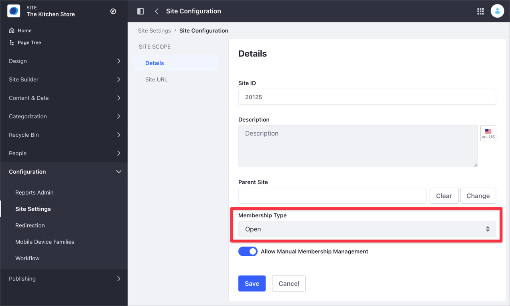
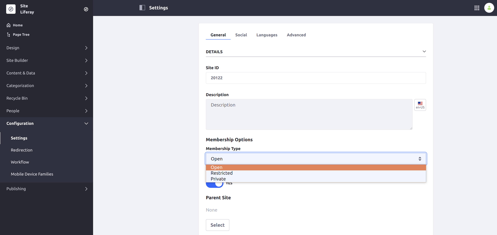

---
taxonomy-category-names:
- Sites
- Site Administration
- Liferay Self-Hosted
- Liferay PaaS
- Liferay SaaS
uuid: f96d3598-f85e-4a03-a5fc-5f56e1c0a52d
---

# Changing Site Membership Type

A site's membership type determines how freely users may join your site. There are three types of site membership:

- **Open:** Users can join and leave whenever they want. The site is visible to all users in the My Sites app.

- **Restricted:** Site is visible in the My Sites application, and users must request membership to join.

- **Private:** A site administrator must explicitly invite users to join and then add them to the site. Private membership sites don't appear in the My Sites app.

## Setting Site Membership Type

1. Access the Membership Type option:

   -  In Liferay DXP 7.4+

      1. From the Site Menu, go to *Configuration* &rarr; *Site Settings*.

      1. In the Platform section, click *Site Configuration* and then click *Details*.

         

   -  In previous Liferay DXP versions

      1. From the Site Menu, go to *Configuration* and click the *General* section.

      1. Find the Membership Type option under the Details area.

         

1. Open the *Membership Type* selector and choose an option.

1. Click *Save*.

## Related Topics

- [Managing Site Membership and Permissions With User Groups](../../../users-and-permissions/user-groups/managing-site-membership-and-permissions-with-user-groups)
- [Site Membership](../../sites/site-membership.md)
- [Site Settings UI Reference](../site-settings-ui-reference.md)
