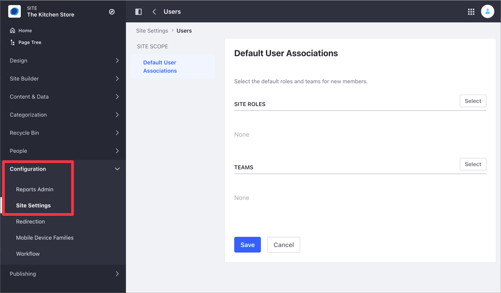
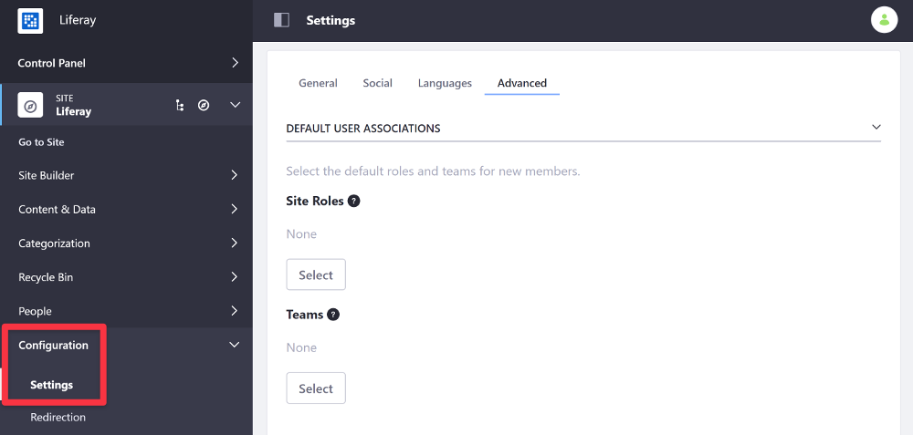

---
taxonomy-category-names:
- Sites
- Site Administration
- Liferay Self-Hosted
- Liferay PaaS
- Liferay SaaS
uuid: 84769714-2ab1-41d9-90b6-c550f4d00ab1
---

# Configuring Role and Team Defaults for Site Members

You can configure the default roles and teams you assign to new site members.

1. Access the Default User Associations option:

   -  In Liferay DXP 7.4+

      1. From the Site Menu, go to *Configuration* &rarr; *Site Settings*.

      1. In the Platform section, click *Users* and then click *Default User Associations*.

         

   - In previous Liferay DXP versions,

     1. From the Site Menu, go to *Configuration* &rarr; *Settings*.

     1. Under the Advanced area, find the Default User Associations option.

        

1. In the Default User Associations area, click *Select* under either the *Site Roles* label to define default roles or the *Teams* label to define default teams (if any exist) for your site members.

1. Choose the default site roles and teams for new site members.

1. Click *Save*.

!!! note
    The default Site Roles and Teams you configure do not affect existing Site members.

## Related Topics

- [Changing Site Membership Type](./changing-site-membership-type.md)
- [Site Settings UI Reference](../site-settings-ui-reference.md)
- [Roles and Permissions](../../../users-and-permissions/roles-and-permissions/understanding-roles-and-permissions.md)
- [Creating Teams for Advanced Site Membership Management](../../sites/site-membership/creating-teams-for-sites.md)
