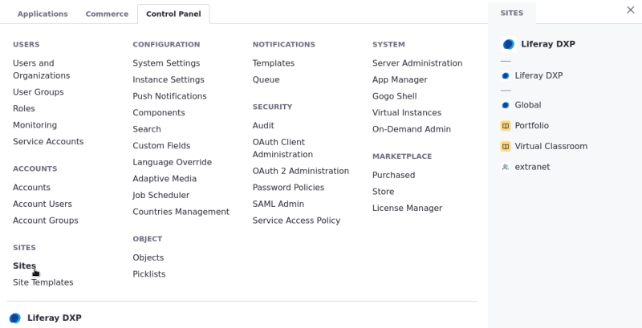
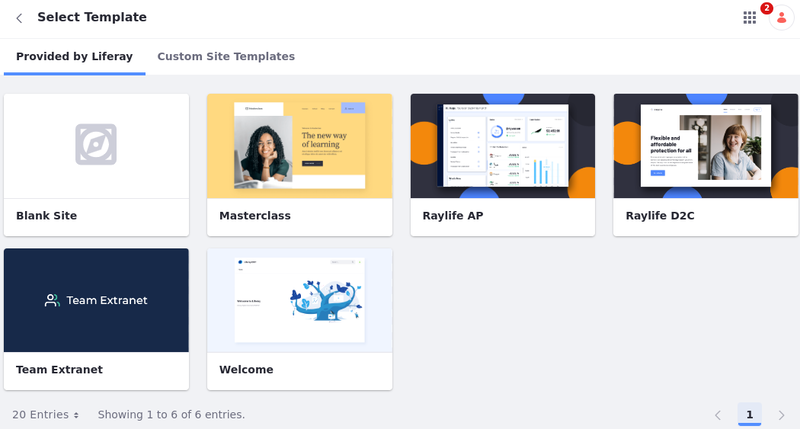

---
taxonomy-category-names:
- Sites
- Site Administration
- Liferay Self-Hosted
- Liferay PaaS
- Liferay SaaS
uuid: 33c781c1-c24e-44fe-8efc-90c0327abc3f
---
# Adding a Site

Sites are customizable spaces for building personalized digital experiences. Follow these steps to create a basic site in your Liferay instance:

1. Open the *Global Menu* (  ) and go to the *Control Panel* tab &rarr; *Sites*.

    

1. Click *Add* (  ).

1. Select a *Site Template*. Choose between templates *Provided by Liferay* or [*Custom Site Templates*](./site-templates.md) to create your site.

    Choose the *Blank Site* template, to create a new site without any pages or content.

    

1. Enter a *Name* for the site.

   ```{note}
   If [Private Pages](../creating-pages/understanding-pages.md#enabling-private-pages) are enabled for your system, you, you can determine whether all pages inherited from a site template are private.
   ```

1. Click *Add* to begin creating your site.

Once finished, you are redirected to your new [site's settings](../site-settings/site-settings-ui-reference.md). You can begin configuring your site, or see [Default Site Applications](./default-site-applications.md) for a full list of applications you can use to build your site.

## Creating Organization Sites

Liferay [organizations](../../users-and-permissions/organizations/understanding-organizations.md) enable distributed user management, providing a convenient way to organize and manage instance users and roles to reflect your organizational hierarchy. Once an organization is created, you can also enable a dedicated site for your organization to facilitate distributed portal administration. This feature is available for both parent and child organizations, so you can quickly create a hierarchy of sites with content created, administered, and tailored specifically to each group's needs. See [Organization Sites](../../users-and-permissions/organizations/organization-sites.md) for more information.

```{note}
You can only use the blank template or custom templates when creating an organization site. You cannot use other default templates.
```

## Creating Group Sites

Liferay [user groups](../../users-and-permissions/user-groups/creating-and-managing-user-groups.md) are lists of users that can span multiple organizations and sites. If desired, you can create dedicated sites for user groups to add pages to the [personal site](./personal-sites.md) of each group member. See [User Group Sites](../../users-and-permissions/user-groups/user-group-sites.md) for more information.

## Related Topics

* [Getting Started With Site Building](../getting-started-with-site-building.md)
* [Site Templates](./site-templates.md)
* [Adding Members to Sites](./site-membership/adding-members-to-sites.md)
