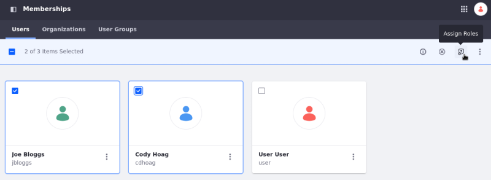
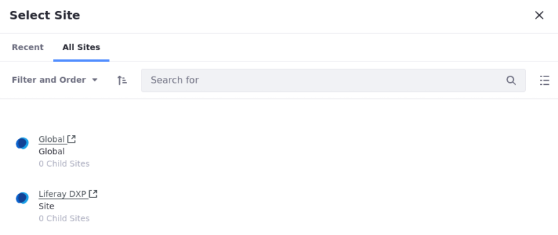

# Adding Members to Sites

Users and sites are central concepts in Liferay DXP. Sites are where all your content and pages are stored, and users access and create that content. While user management is covered in depth in [User Management](../../../users-and-permissions.md), there are some configuration options specific to site management and assigning users to sites that are relevant here:

* [Managing Site Membership](#managing-site-membership)
* Configuring Users to Automatically Join a Site
* [Creating Teams](./creating-teams-for-sites.md) or groups of site members for various site functions

The steps below show how to add users manually to sites and how to provide options for self-management.

## Managing Site Membership

Administrators can manage site members from that site's Memberships app.

1. Open the *Product Menu* (), click  the compass icon(), and select the site you want to manage. 
1. Select *People* &rarr; *Memberships* in the Product Menu. If you don't see this option, Manual Membership is disabled. To enable Manual Membership, select *Site Settings* &rarr; *Site Configuration*. In the *Details* tab, toggle *Allow Manual Membership Management*.

From here you can manage site memberships, organizations, and user group associations. You can learn more about those in [Users and Organizations](../../../users-and-permissions.md). On this page, you can see a list of all current site members and you can add or remove user memberships from the site.

### Adding Members to a Site

Follow these steps to make an existing user a member of the site:

1. Click *Add* () in the top right of the screen.
1. Use *Filter and Order* or the *Search* function to locate the user you want to add to the site.
1. Select the user(s) you want to add and click *Done*.

On the *Assign Users to This Site* screen, all users eligible to be added to the site appear. Deactivated users do not appear. Site members also appear, but with a greyed-out checkbox.

### Removing User Membership from a Site

There are two ways to remove a user from a site. To remove an individual member, follow these steps:

1. Click the *Actions* () icon for the user that you want to remove.
2. Select *Remove Membership*.
3. In the pop-up that appears, confirm the removal.

To bulk remove users from a site, follow these steps:

1. Click the checkbox for each user that you want to remove.
1. In the menu at the top of the page, click the `X` icon to remove the users from the site.
1. In the pop-up that appears, confirm the removal.

Removed users lose membership in any site roles or teams they had.

### Assigning Site Roles

Roles grant permissions in Liferay Portal. Roles can be assigned for the entire instance or just for one specific site or organization. Site roles assign permissions for a specific site. Learn more about roles in [Roles and Permissions](../../../users-and-permissions/roles-and-permissions/understanding-roles-and-permissions.md).

Follow these steps to assign site roles to users:

1. Select a user or users and click *Assign Roles* (either through the Actions menu or the menu at the top). This takes you to the *Assign Roles* screen.
1. Select the roles you want to assign to the selected user(s).
1. Click *Done*.

    

## Joining Sites with the My Sites Application

The My Sites application lists the sites a user belongs to. This application is added to the User Profile Menu [Dashboard pages](../personal-sites.md) by default. You can view the available open and restricted sites by adding the My Sites application to a page and accessing the *All Sites* tab. You can request access to any of the sites you're not a member of by selecting the site's *Options* button () and clicking *Join*.

## Related Topics

You can also invite users to become members of a site by using the Invitations widget. See [Inviting Members to Your Site](./inviting-members-to-your-site.md) to learn more.
