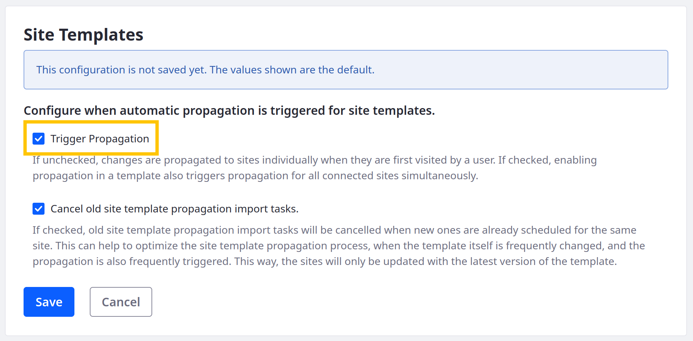

---
taxonomy-category-names:
- Sites
- Site Administration
- Liferay Self-Hosted
- Liferay PaaS
uuid: 630e4176-d453-436c-978a-0f1fad059614
---

# Configuring Site Template Propagation

{bdg-secondary}`Liferay 7.4 U23+/GA23+`

By default, site template changes are propagated automatically to a connected site when a user visits the site after the template is updated. However, you can configure an additional manual trigger that propagates to all connected sites simultaneously.

To enable manual propagation, use the Trigger Propagation setting. When enabled, clicking the [Ready for Propagation](./propagating-template-changes.md#enabling-and-disabling-propagation) button in the site template editor triggers propagation to all connected sites. Enabling this setting does not stop the automatic propagation of template changes that occurs when users visit connected sites.

!!! note
    {bdg-secondary}`Liferay DXP 2024.Q2+/Portal 7.4 GA126+` When visiting a site page, if the site is not up to date with the latest site template, propagation runs in the background. Users see the previous version of the site template while the update occurs.

!!! important
    Automatic propagation can be resource intensive, depending the scope of changes made to a template.

To configure site template propagation,

1. Open the *Global Menu* (), go to the *Control Panel* tab, and click *System Settings* under Configuration.

1. Under Platform, go to *Infrastructure* settings and click *Site Templates* under Virtual Instance Scope in the side menu.

1. Check *Trigger Propagation*.

   If unchecked, changes are propagated to sites individually when they’re first visited by a user.

   If checked, enabling automatic propagation in a template also triggers propagation for all connected sites simultaneously.

   

1. Click *Save*.

If propagation is disabled for a site template, enabling propagation immediately begins propagating changes to connected sites simultaneously. While propagation remains enabled for the template, subsequent changes are propagated to sites individually when they’re first visited by a user.

## Related Topics

- [Site Templates](../site-templates.md)
- [Propagating Template Changes](./propagating-template-changes.md)
