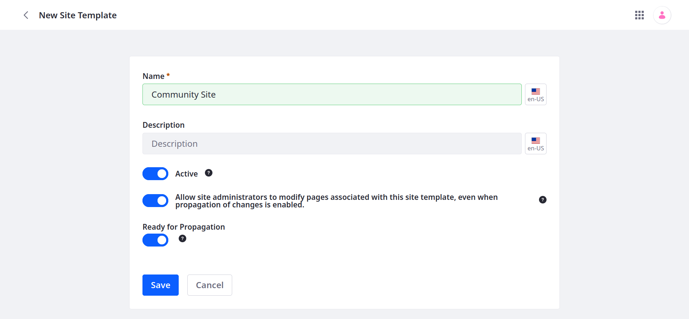

---
taxonomy-category-names:
- Sites
- Site Administration
- Liferay Self-Hosted
- Liferay PaaS
- Liferay SaaS
uuid: dcb71149-fcc2-4d97-bd48-bedc5599bd7b
---

# Creating Site Templates

With site templates, you can design and configure templates for creating sites. Each template is built using the same tools as sites.

!!! tip
    Site templates are primarily intended for maintaining pages across multiple sites. If you must create and maintain web content and other assets across sites, use [asset libraries](../../../content-authoring-and-management/asset-libraries.md). Also, if automatic propagation is not necessary for your use case, you can [export and import](./exporting-importing-site-templates.md) site data to transfer it between environments.

To create a site template,

1. Open the *Global Menu* (), go to the *Control Panel*, and click *Site Templates*.

1. Click the *Add* button .

1. Enter a *name* and *description* for the template.

1. Determine whether the template is active or inactive.

   Only active templates appear during [site creation](../adding-a-site.md).

1. Determine whether users can directly modify pages inherited from this template.

1. Toggle *Ready for Propagation* to enable or disable automatic propagation.

   See [Propagating Template Changes](./propagating-template-changes.md) to learn more about automatic propagation.

   

1. Click *Save*.

Once saved, you can select the template to begin editing it.

The UI for designing the template is identical to the UI for designing sites. Open the *Product Menu* () to access available applications and begin adding style books, page templates, pages, and more.

!!! important
    Pages inherited from a template cannot be deleted. You also cannot directly add child pages to them on the site level. They can only be added or removed in the site template.

## Related Topics

- [Site Templates](../site-templates.md)
- [Propagating Template Changes](./propagating-template-changes.md)
- [Configuring Site Template Propagation](./configuring-site-template-propagation.md)
