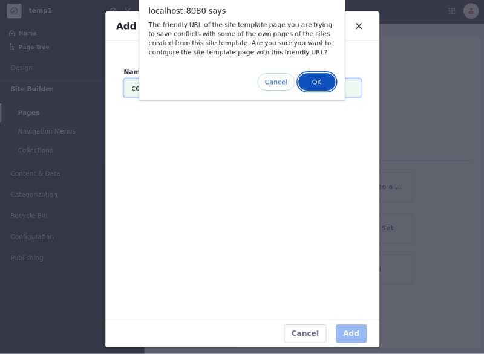
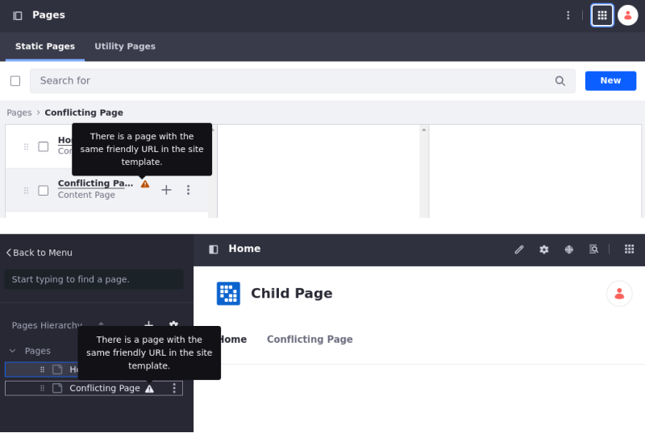
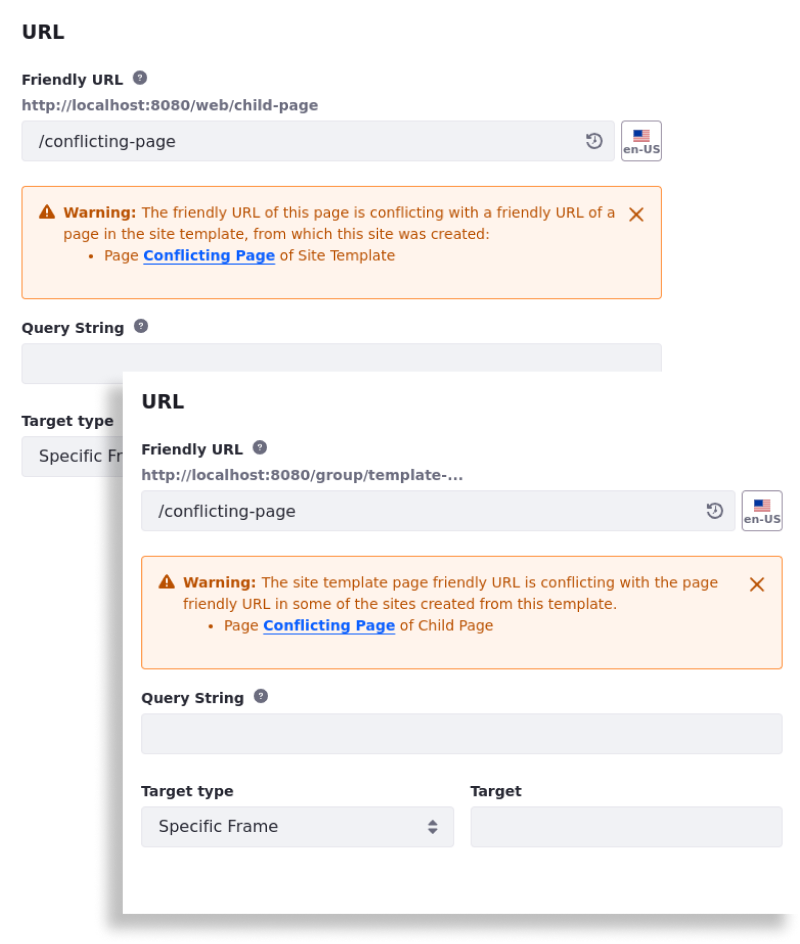
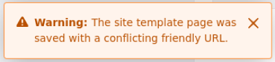

---
taxonomy-category-names:
- Sites
- Site Administration
- Liferay Self-Hosted
- Liferay PaaS
- Liferay SaaS
uuid: 601084b6-d76b-47b8-b428-661ad421f6f4
---

# Handling Friendly URL Conflicts in Site Templates

!!! important
    Currently, this feature is behind a beta feature flag (LPS-174417). Read [Beta Feature Flags](../../../system-administration/configuring-liferay/feature-flags.md#beta-feature-flags) for more information.

Liferay doesn't allow duplicated friendly URLs, ensuring that each element within a site has a unique address. When multiple sites are connected via site templates, conflicts can occur if two or more pages share the same friendly URL.

To prevent these issues, Liferay displays warnings when a duplicate friendly URL is detected, notifying users of the conflict.

!!! note
    If you create a page with the same friendly URL as an existing page within the same site, Liferay automatically appends a unique identifier to the new page's URL. For example, if an `About Us` page already exists, a new page with the same friendly URL is updated to `about-us1`.

## Warning Messages

Warning messages appear when in a site template you attempt to create a page that shares the same friendly URL as an existing page in a child site, or when in a child site you create a page with the same friendly URL as an existing page in the associated site template.

- When you create a page with a conflicting friendly URL, a conflict alert appears. You can choose to ignore the warning and save the page, but the conflict persists.

  

- If you ignore the warning, a warning icon appears next to the page in the Pages application and in the site's Page Tree.

  

- You can also see a warning in the page configuration where you can change the page's friendly URL. The conflict message appears in both the site template and in the child site.

  If you have the appropriate permissions, you can view details about the conflicting page by accessing its configuration page; otherwise, only the page and site names are visible.

  

- Additionally, if you change a friendly URL to one that already exists, a warning appears at the bottom of the screen, notifying you that the page was saved with a conflicting friendly URL.

  

Liferay doesn't resolve these conflicts automatically as it does with pages in the same site. You must manually change the friendly URL to eliminate the warnings.

## Related Topics

- [Configuring Your Page's Friendly URL](../../creating-pages/page-settings/configuring-your-pages-friendly-url.md)
- [Configuring Friendly URL Redirects](../../site-settings/managing-site-urls/configuring-friendly-url-redirects.md)
