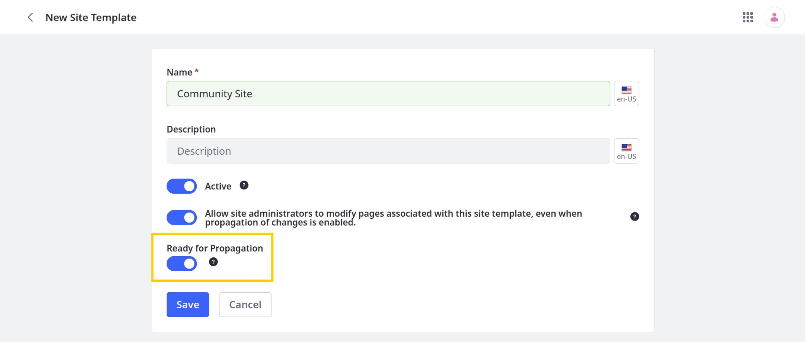
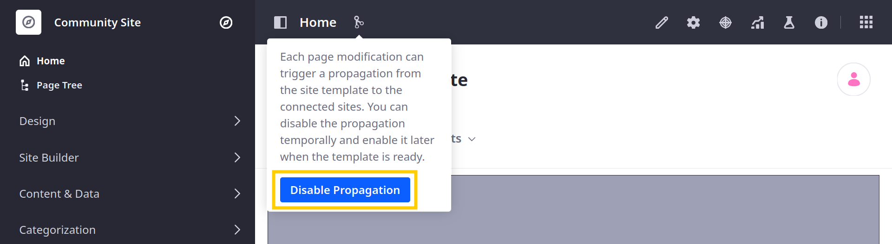
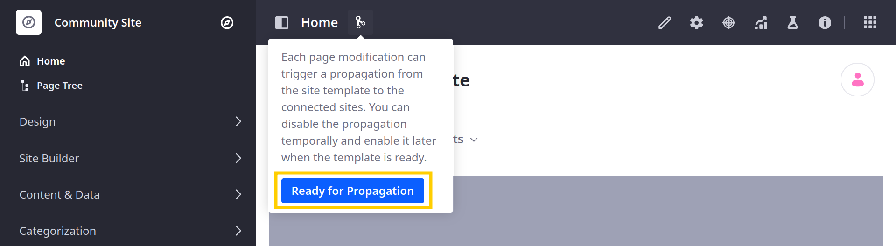
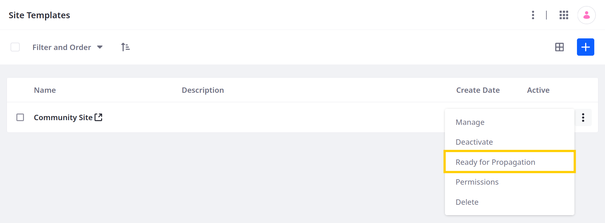
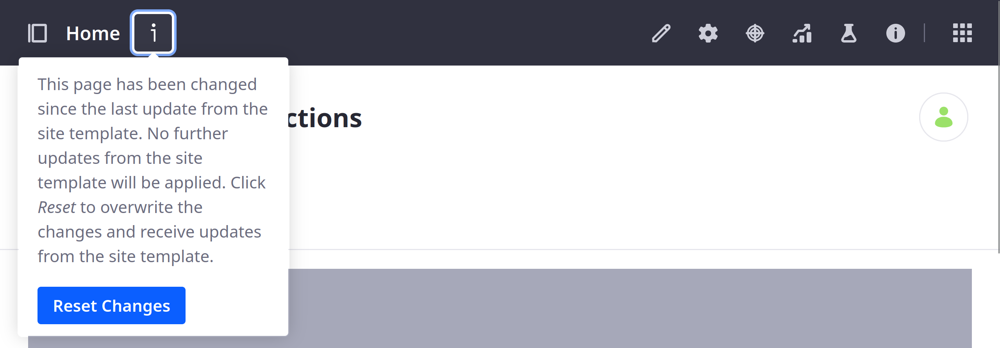

---
taxonomy-category-names:
- Sites
- Site Administration
- Liferay Self-Hosted
- Liferay PaaS
- Liferay SaaS
uuid: 90b72e72-7d53-4a6c-b39c-e50b46174004
---
# Propagating Template Changes

When site template propagation is enabled, you can make changes to the template's pages and automatically propagate those changes to connected sites. However, making changes to a site page inherited from a template prevents the propagation of template changes to that page. To restore propagation for the page, you must discard changes made to it in the site. If you've edited multiple inherited pages and you'd like to restore propagation from the site template, you must reset changes for each one individually.

```{note}
By default, propagation is triggered for each connected site individually, when it is first visited by a user after changes are made. However, you can configure your system to also trigger propagation to connected sites simultaneously whenever users toggle a template to *Ready for Propagation*. See [Configuring Site Template Propagation](./configuring-site-template-propagation.md) for more information.
```

## Which Template Changes are Propagated?

Only changes to a template's pages and page elements are propagated to connected sites. This includes newly created pages as well as any changes to fragments and widgets in existing pages. Other application data is only copied at initial site creation; subsequent changes are not automatically propagated.

For this reason, site templates are primarily intended for maintaining pages across multiple sites. If you must create and maintain web content and other assets across sites, use [asset libraries](../../../content-authoring-and-management/asset-libraries.md).

It's important to note that automatic propagation does note applies to certain content elements within Site Templates. The following section explores scenarios where changes might not apply automatically:

**Master Pages**: If a user edits the Master Page directly on a connected site, that edit breaks the connection between the Site Template's Master Page and the connected site's Master Page. Also, if the user disconnects, future changes made to the Site Template's Master Page is not propagate to that specific connected site because it's no longer referencing the Site Template version.

**Page Templates**: Edits made directly to a Page Template within the Site Template do not automatically propagate to connected sites. Since Page Templates define the layout structure, changes impact how content is arranged, not the content itself. These layout changes must to be applied to each page that uses the template.

**Display Page Templates**: Similar to Page Templates, edits made to Display Page Templates within the Site Template do not propagate automatically to connected sites. Any changes to a Display Page Template must be manually applied to the corresponding page types on connected sites.

**Utility Pages**: If you update a Utility Page in the Site Template, you must to manually integrate those changes into the relevant pages on connected sites that utilize the Utility Page.


## Enabling and Disabling Propagation

When [creating a template](./creating-site-templates.md), you determine whether to enable or disable automatic propagation, but you can change this setting at any time.



Follow these steps to enable or disable propagation after template creation:

1. Open the *Global Menu* (), go to the *Control Panel* tab, and click *Site Templates*.

1. Select the desired template.

1. Click the *Propagation* button ()

   If propagation is enabled, click *Disable Propagation* to prevent template changes from being automatically propagated to connected site pages.

   

   If propagation is disabled, click *Ready for Propagation* to enable automatic propagation.

   

Alternatively, you can enable or disable automatic propagation via the site templates application page. Click *Actions* () for the desired template and select *Disable Propagation* or *Ready for Propagation*.



## Reconnecting Inherited Pages to Their Template

If you make changes to a site page inherited from a template, it is disconnected from the template's page and is not automatically propagated. To reconnect the site page to the template, you must discard your changes to the site page.

Follow these steps to discard changes to a site page and resync it with its template:

1. Navigate to the site page.

1. Click the *Additional Information* icon () in the Application bar.

   

1. Click *Reset Changes*.

   ```{warning}
   Resetting changes **reverts any changes made to the site page directly**. This can result in data loss. Proceed with caution.
   ```

<!-- ## Resolving Propagation Conflicts

In some cases, you may encounter conflicts when propagating Site Template changes. For example, if Pages in a template have conflicting friendly URLs, Liferay DXP stops the propagation and displays an error message.


After encountering a conflict, follow these steps to restore automatic propagation:

1. Manually resolve all conflicts identified in the error message.

1. Open the *Site Menu* (), expand *Configuration*, and go to *Site Settings*.

1. Click the *Reset and Propagate* button to reset the merge fail count and attempts to propagate your site's changes again. -->

## Related Topics

* [Site Templates](../site-templates.md)
* [Configuring Site Template Propagation](./configuring-site-template-propagation.md)
