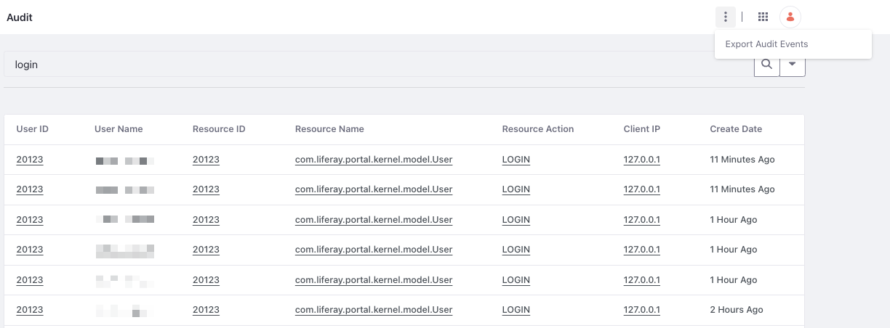
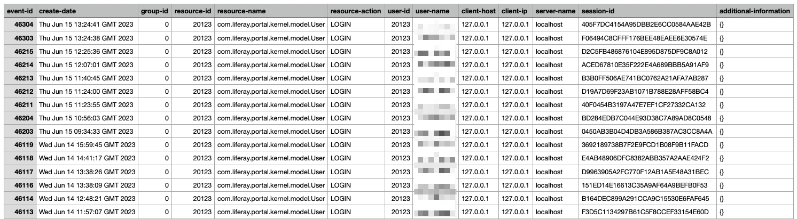

# Searching and Exporting Audit Events

The audit application comes with simple and advanced searching capabilities. To use the simple search, you can enter a search term and click the magnifying glass icon. To use advanced search,

1. Click the downward arrow next to the search icon.

1. Enter data for the search fields.

   | Field                                                          | Description                                                                                                                                                     |
   |:---------------------------------------------------------------|:----------------------------------------------------------------------------------------------------------------------------------------------------------------|
   | Match                                                          | Search for matches to all the fields you’ve specified or any single field.                                                                                      |
   | User ID                                                        | The user ID to search for. This is usually the user who performed some action you want to audit.                                                                |
   | Group ID {bdg-secondary}`Liferay DXP 7.4 U81+/GA81+` | The group ID that shows the site context of the audit event where available.                                                                                    |
   | User Name                                                      | The user name to search for. This is often easier than searching for a user ID, especially if you don’t have access to the database containing the user ID.     |
   | Resource ID                                                    | The ID of the resource that was modified or viewed in this audit record.                                                                                        |
   | Class Name                                                     | The name of the resource modified or viewed in this audit record. For example, you could search for user resources to see if someone modified a user’s account. |
   | Resource Action                                                | One of these actions performed on the resource: add, assign, delete, impersonate, login, login_failure, logout, unassign, or update.                            |
   | Session ID                                                     | The session ID to search for. You can use this to correlate a session ID from your web server logs with activity in Liferay DXP.                                |
   | Client IP                                                      | The IP address of the client that performed the activity you wish to audit.                                                                                     |
   | Client Host                                                    | The host name of the client that performed the activity you wish to audit.                                                                                      |
   | Server Name                                                    | The name of the server in which the activity occurred. If you’re using a cluster, each member of the cluster can be individually queried.                       |
   | Server Port                                                    | The server port in which the activity occurred. You need this if you run a vertical cluster of multiple VMs on the same machine.                                |
   | Start Date                                                     | The low end of the date range you wish to search for.                                                                                                           |
   | End Date                                                       | The high end of the date range you wish to search.                                                                                                              |

1. Click on the magnifying glass icon.

## Viewing Audit Events

After finding a specific audit event, you can click on it to get more information. Each event highlights the following fields:

* Event ID
* Create Date
* Group ID
* Resource ID
* Resource Name
* Resource Action
* User ID
* User Name
* Client Host
* Client IP
* Server Name
* Additional Information

`Additional Information` highlights the data associated with the entity during a resource action. For instance, users are active by default at the time of creation. Given below is the additional information of the audit event when you deactivate a user.

```json
{"attributes":[{"newValue":"false","name":"active","oldValue":"true"}]}
```

The `name` field shows the attribute that changed. The `oldValue` field shows the value of the field before the update, and the `newValue` field shows the value of the field after the update.

## Exporting Audit Events

{bdg-secondary}`Liferay DXP 7.4 U81+/GA81+`

To analyze audit events in a third-party system, Liferay supports exporting audit events to CSV. To do this, open the Global Menu and navigate to *Control Panel* &rarr; *Audit*. Click on the *Actions* () icon at the top of the page and select *Export Audit Events*.

This exports all the audit events from your Liferay instance. If you want to export a subset, you can use the simple search or advanced search to get a set of results, and then use the export function. For instance, if you want to view only the `LOGIN` events for a particular user,

1. Enter `login` in the search bar and click on the magnifying glass icon.

1. Click on the *Actions* () icon at the top of the page.

   

1. Select *Export Audit Events*.



You can edit the columns exported to the CSV file by changing the `CSV Logging Message Formatter` configuration. See [CSV Logging Message Formatter](./audit-configuration-reference.md#csv-logging-message-formatter) for more information.

```{warning}
The CSV export contains user supplied inputs. Be cautious while opening it in a spreadsheet program.
```

```{important}
The export to CSV feature is currently behind a release feature flag. To use it, add this `feature.flag.LPS-177194=true` to `portal-ext.properties` or `LIFERAY_FEATURE_PERIOD_FLAG_PERIOD__UPPERCASEL__UPPERCASEP__UPPERCASES__MINUS__NUMBER1__NUMBER7__NUMBER7__NUMBER1__NUMBER9__NUMBER4_=true` as an environment variable to your configuration.
```

## Related Topics

* [Audit Configuration Reference](./audit-configuration-reference.md)