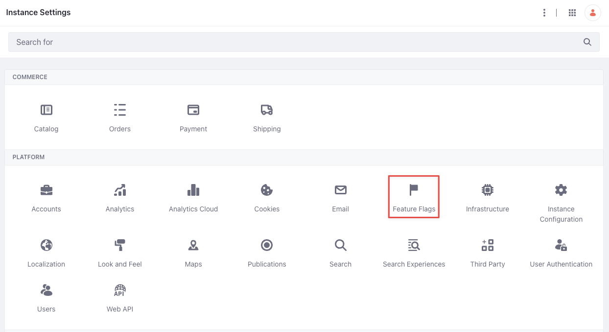
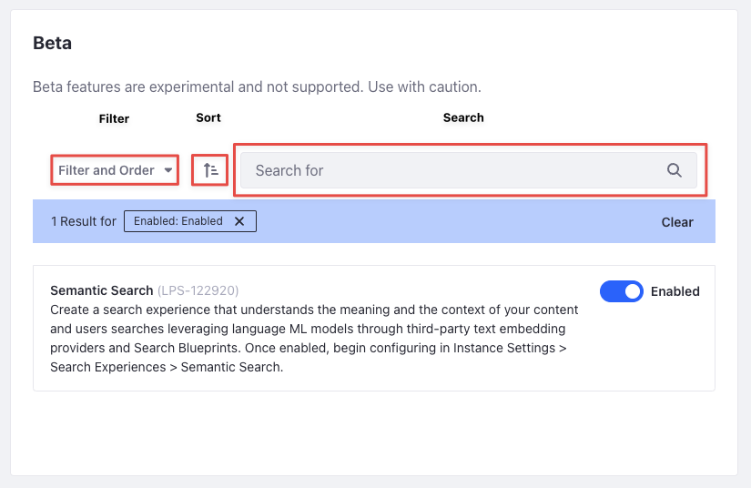
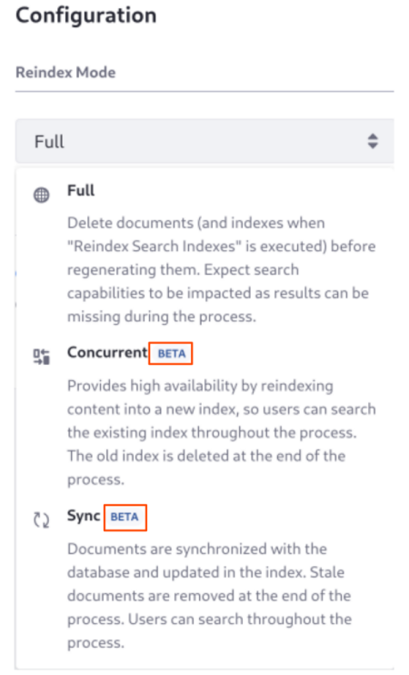

# Beta Features and Feature Flags

## Feature Flags

{bdg-secondary}`DXP 7.4 U69+/GA69+`

Some features in Liferay are hidden behind *feature flags*. Using feature flags, you have control over new functionality introduced into your Liferay instance. New and experimental features can be adopted and validated more effectively with feature flags.

!!! tip
    Read [Maintenance Mode and Deprecations in 7.4](../../../system-administration/configuring-liferay/feature-flags.md) to learn more about other feature statuses: maintenance, deprecated, and removed.

To access and manage feature flags, open the *Global Menu* () and navigate to *Control Panel* &rarr; *Instance Settings*. Click *Feature Flags* under *Platform*. There are three types of feature flags available: 

1. [Beta feature flags](#beta-feature-flags)

1. [Release feature flags](#release-feature-flags)

1. [Dev feature flags](#dev-feature-flags)



The documentation for a beta feature includes a badge to set it apart: 



## Beta Feature Flags

Beta features are functional features or capabilities undergoing business validation. These are experimental and require careful consideration before usage. Beta features may be deprecated after a limited time period or converted into a [release feature](#release-feature-flags). You can give feedback on beta features through Liferay's [Community Slack](https://liferay.dev/chat).

To enable a beta feature,

1. Open the *Global Menu* () and navigate to *Control Panel* &rarr; *Instance Settings*. 

1. Click *Feature Flags* under Platform, then click *Beta*. 

1. All beta features appear. Toggle to enable or disable a feature. 

You can also use the search bar to find beta features, sort them using the Sort () button, or filter them based on their status. 


## Release Feature Flags

Release features are fully functional, but remain hidden behind a flag for a limited time. The flag allows you to control the visibility of a new feature and enable it when ready. 

To enable a release feature, 

1. Open the *Global Menu* () and navigate to *Control Panel* &rarr; *Instance Settings*. 

1. Click *Feature Flags* under Platform, then click *Release*. 

1. All release features are listed. Toggle to enable or disable a feature. 

You can also use the search bar to find release features, sort them using the Sort () button, or filter them based on their status. The flag for release features is removed after a period of time, so monitor the release notes for your Liferay update.


## Dev Feature Flags

Dev feature flags are for features and capabilities in active development, and you must not enable them in production. Only enable dev features for testing. 

To enable a theoretical dev feature flag with the code `XXX-000000` using a portal property, add this to `portal-ext.properties`: 

```
feature.flag.XXX-000000=true
```

To enable a theoretical dev feature flag with the code `XXX-000000` using an environment variable, add this to your configuration: 

```
LIFERAY_FEATURE_PERIOD_FLAG_PERIOD__UPPERCASEX__UPPERCASEX__UPPERCASEX__MINUS__NUMBER0__NUMBER0__NUMBER0__NUMBER0__NUMBER0__NUMBER0_=true
```

!!! warning
    Never use dev features in production. Instabilities in Liferay are expected side effects of enabling dev feature flags. 

## Out-of-the-Box Beta Features

{bdg-secondary}`Liferay 2023.Q4+/GA102+`

As described above, beta features are experimental and require careful consideration before usage. Beta features may be deprecated after a limited time period or converted into a [release feature](#release-feature-flags). You can give feedback on beta features through Liferay's [Community Slack](https://liferay.dev/chat).

Some beta features are added behind a [beta feature flag](#beta-feature-flags).

As of Liferay 2023.Q4, some beta features are enabled out-of-the-box, but are marked with a tag in the UI to highlight their beta status ().



## Related Topics

- [Semantic Search](../../using-search/liferay-enterprise-search/search-experiences/semantic-search.md)
- [Maintenance Mode and Deprecations in 7.4](../../installation-and-upgrades/upgrading-liferay/reference/maintenance-mode-and-deprecations-in-7-4.md)
