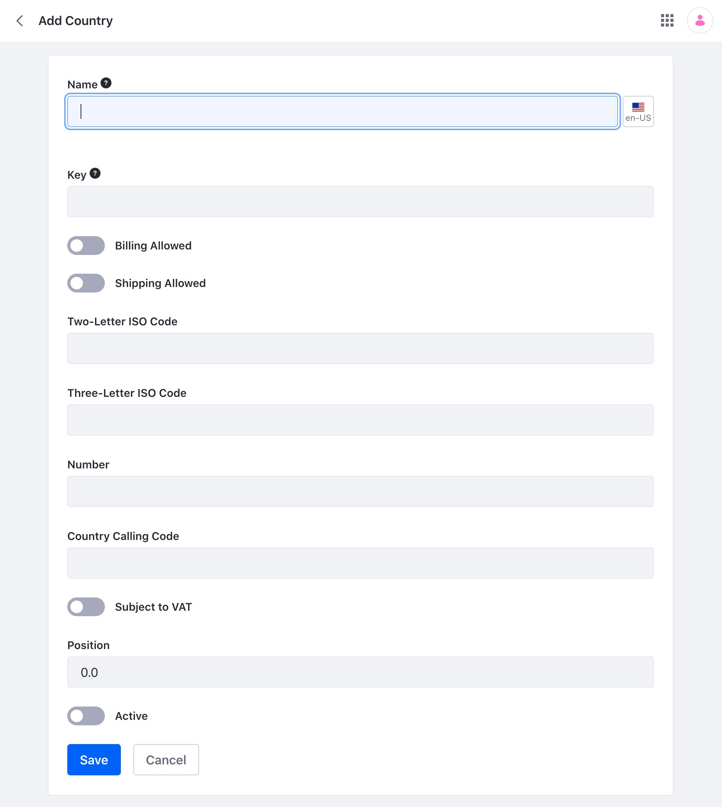
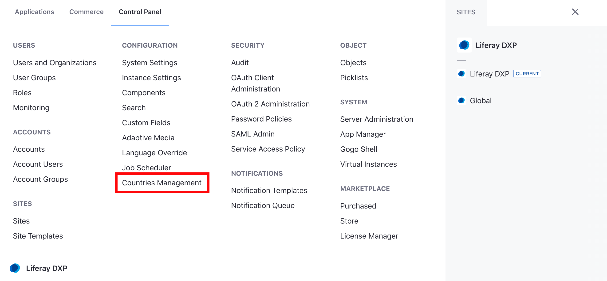

# Managing Countries

{bdg-secondary}`Liferay DXP 7.4 U36/Liferay Portal 7.4 GA36 and above`

Liferay contains a list of available countries as defined by the [ISO 3166 Standard](https://www.iso.org/iso-3166-country-codes.html), but you can use the Countries Management app to modify an existing entry or add a new entry.

```{note}
For liferay DXP 7.4 U36 - U40 (or Liferay Portal 7.4 GA36 - GA40), the Countries Management app is hidden from the UI and must be enabled with the use of feature flags. See [Enable the Countries Management App](#enable-the-countries-management-app) below to see the steps.
```

## Edit an Existing Country

1. Open the Global Menu (). Navigate to *Control Panel* &rarr; *Configuration* &rarr; *Countries Management*

1. Select a country by clicking its name, or click _Options_ () on the country and click _Edit_. Use the search bar to locate a specific country quickly.

1. Make your desired changes and click *Save*. The country has now been modified.

## Deactivate a Country

1. Open the Global Menu (). Navigate to *Control Panel* &rarr; *Configuration* &rarr; *Countries Management*.

1. Locate a country by scrolling through the list of countries. Use the search bar to locate a specific country quickly.

1. Click _Options_ () on the Country and click _Deactivate_.

1. Click _OK_ to confirm, and the country is deactivated.

## Activate a Country

1. Open the Global Menu (). Navigate to *Control Panel* &rarr; *Configuration* &rarr; *Countries Management*

1. Click _Filter and Order_ next to the search bar and select *Inactive* to see a list of deactivated countries. Use the search bar to locate a specific country quickly.

1. Click _Options_ () on the Country and click _Activate_. The country is now active.

## Delete a Country

1. Open the Global Menu (). Navigate to *Control Panel* &rarr; *Configuration* &rarr; *Countries Management*.

1. Locate a country by scrolling through the list of countries. Use the search bar to locate a specific country quickly.

1. Click _Options_ () on the Country and click _Delete_.

1. Click _OK_ to confirm and the country is deleted.

```{warning}
Make sure you intend to delete an entry before you click _OK_. The entry cannot be recovered once deleted.
```

## Add a New Country

1. Open the Global Menu (). Navigate to *Control Panel* &rarr; *Configuration* &rarr; *Countries Management*

1. Click _Add_ () next to the search bar. A new page appears for adding a country.

   

1. Complete the form to add a new country. Name, Two-Letter ISO Code, Three-Letter ISO Code, and Number are required fields.

1. Click _Save_, and the new country has been added.

## Enable the Countries Management App

By default, the Countries Management App is hidden from the UI. To enable the UI,

1. Add the following property to your [`portal-ext.properties`](../../installation-and-upgrades/reference/portal-properties.md) file:

   `feature.flag.LPS-122223=true`

   If using Docker, use the following [`environment variable`](../../installation-and-upgrades/installing-liferay/using-liferay-docker-images/configuring-containers.md#portal-properties) upon first startup:

   `--env LIFERAY_FEATURE_PERIOD_FLAG_PERIOD__UPPERCASEL__UPPERCASEP__UPPERCASES__MINUS__NUMBER1__NUMBER2__NUMBER2__NUMBER2__NUMBER2__NUMBER3_=true`

1. Restart your server. The app now appears.

   