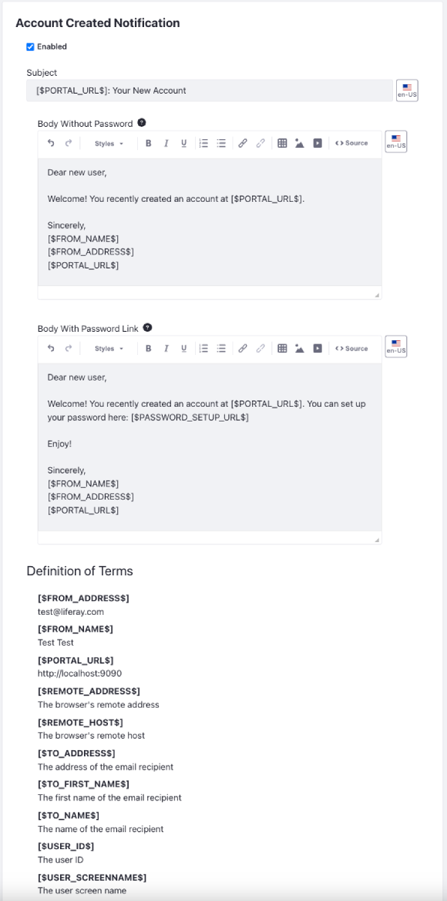
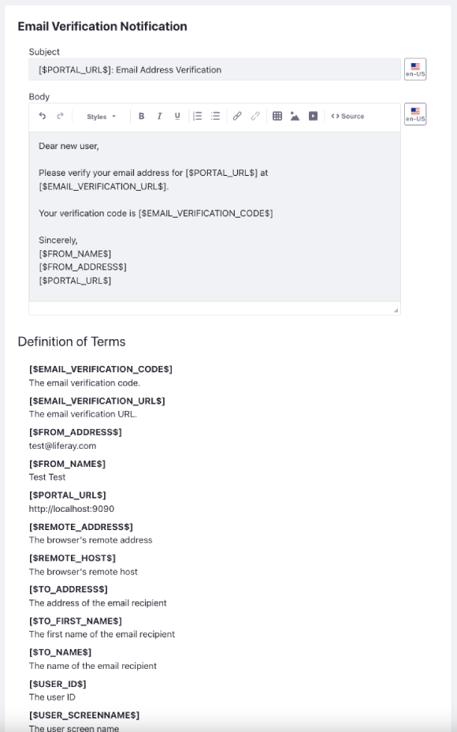
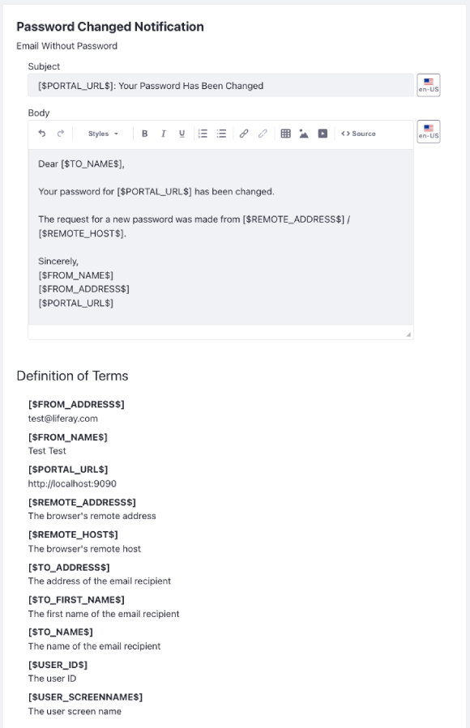
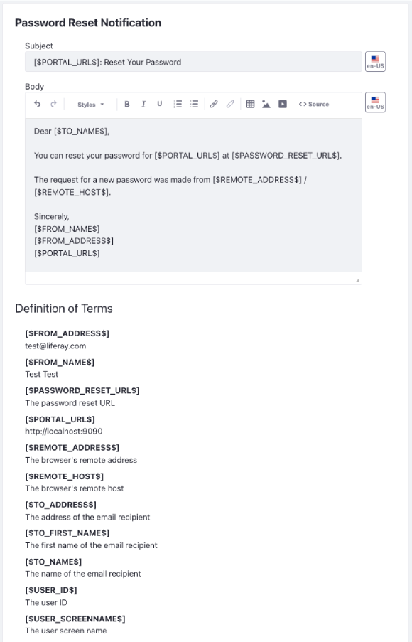

# Email Settings

The email configuration is where you configure email notifications at the virtual instance scope.

To access these options,

1. Open the *Global Menu* () and navigate to *Control Panel* &rarr; *Configuration* &rarr; *Instance Settings*.

1. Select *Email* under Platform.

Configuration options appear on the left:

| Configuration                                                       | Purpose                                                                                            |
|:--------------------------------------------------------------------|:---------------------------------------------------------------------------------------------------|
| [Account Created Notification](#account-created-notification)       | Enable/Disable email notifications for account creation and determine the notification's template. |
| [Email Sender](#email-sender)                                       | Set the sender's name and address for email templates.                                             |
| [Email Verification Notification](#email-verification-notification) | Determine the email template for requesting users to verify their email address.                   |
| [Mail Host Names](#mail-host-names)                                 | Enter mail hosts associated with the instance.                                                     |
| Mail Settings                                                       | Connect a mail server to the instance.                                                             |
| [Password Changed Notification](#password-changed-notification)     | Determine the email template for password changes.                                                 |
| [Password Reset Notification](#password-reset-notification)         | Determine the email template for password reset requests.                                          |

```{note}
Your installation must have a [configured connection to a mail server](../../../installation-and-upgrades/setting-up-liferay/configuring-mail.md) to send email notifications. Mail server configurations set at the instance scope override server level configurations. 

For each notification template, you can view available template variables at the bottom of the page. Use these variables to populate emails dynamically.
```

## Account Created Notification

These templates define emails sent to users after creating an account. One template includes a password setup link, while the other does not.

Use the *Enabled* checkbox at the top to enable this notification.



## Email Sender

The email sender specifies the virtual instance's administrative name and email address for email notifications. You can include these values in notification templates using the `[$FROM_NAME$]` and `[$FROM_ADDRESS$]` variables. Defaults from [portal properties](https://learn.liferay.com/reference/latest/en/dxp/propertiesdoc/portal.properties.html#Admin%20Portlet) are `admin.email.from.name` and `admin.email.from.address`. This name and email address appear in the *From* field in all email messages sent by the virtual instance.


## Email Verification Notification

This template defines emails sent to users when asked to verify their email address.



## Mail Host Names

You can specify additional mail host names here that are owned by your organization for the virtual instance. Enter one mail host name per line, but don't enter the one specified in the virtual instance configuration.


## Password Changed Notification

This template defines emails notifying users that their password has been changed.



## Password Reset Notification

This template is for password reset requests.



## Related Topics

[Configuring Mail](../../../installation-and-upgrades/setting-up-liferay/configuring-mail.md)

[Notifications](../../../process-automation/notifications.md)
