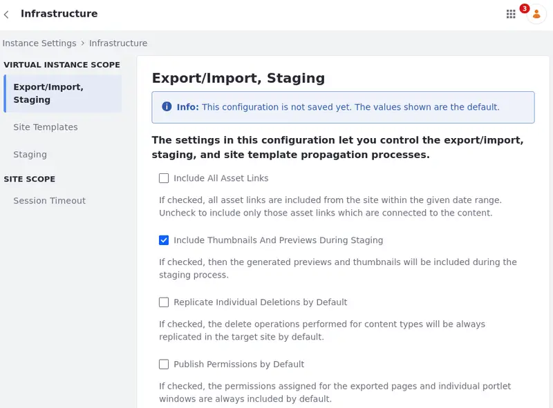

#  Infrastructure

The Infrastructure category contains settings related to the [export/import](#exportimport), [staging](#staging), and [site template propagation](#site-template-propagation) processes.

You can also configure the [session timeout](#session-timeout) portal property without altering the `portal-ext.properties` file.

To access these settings, open the *Global Menu* (), select the Control Panel tab, and click *Instance Settings* under the Configuration section. In the Instance Settings page, select *Infrastructure* under the Platform heading.

## Export/Import

The Export/Import category contains settings that specify what is included and replicated by default and which content types are validated during the Import/Export process.

| Configuration | Purpose |
| :--- | :--- |
| Include All Asset Links | If checked, all site's asset links (within the given date range) are included. Uncheck to include only those asset links which are connected to the content. |
| Include Thumbnails And Previews During Staging | If checked, the generated previews and thumbnails are included during the staging process. |
| Replicate Individual Deletions by Default | If checked, the delete operations performed for content types are always replicated in the target site by default. |
| Publish Permissions by Default | If checked, the permissions assigned for the exported pages and individual portlet windows are always included by default. |
| Validate File Entries | If checked, publishing or importing some types of text content causes Liferay DXP to check the content for links to documents and ensure that each link points to a valid document. |
| Validate Journal Feed References | If checked, publishing or importing some types of text content causes Liferay DXP to check the content for references to web content feeds, and ensure that each reference points to a valid feed. |
| Validate Layout References | If checked, publishing or importing some types of text content triggers validation of links that reference a Liferay DXP virtual host, ensuring that each link points to a valid page within the portal. Uncheck this if your virtual host has pages outside of Liferay DXP. |
| Validate Missing References | If checked, publishing or importing triggers a check for missing references. If unchecked, missing reference validation is skipped and references without existing targets can be published or imported to the target site. |
| Show Advanced Staging Configuration by Default | If checked, the advanced publication configuration screen will be displayed by default when publishing pages. |

## Site Template Propagation

The Site Templates category contains settings that specify when automatic propagation is triggered for [site templates](../../../site-building/sites/site-templates.md).

| Configuration | Purpose |
| :--- | :--- |
| Trigger Propagation | If checked, enabling propagation in a template also triggers propagation for all connected sites simultaneously. If unchecked, changes are propagated to sites individually when they are first visited by a user.  |
| Cancel Old Site Propagation Import Tasks | If checked, old site template propagation import tasks are cancelled when new ones are scheduled for the same site. |

## Staging

The Staging category contains settings that specify the default behavior of staging actions, such as publishing parent pages and displayed content, and whether to delete temporary LAR files during the Import/Export process.

| Configuration | Purpose |
| :--- | :--- |
| Publish Parent Pages by Default | If checked, parent pages are always published to live. |
| Publish Displayed Content by Default | If checked, the displayed content will be published to Live for Dynamic Data Lists Display, Form, Web Content Display and Wiki Display. These widgets will publish the displayed content to Live independently of the Publish Process settings. |
| Delete temporary LAR during a failed staging publication process. | Uncheck to avoid deleting the temporary LAR during a failed staging publication process. In remote staging contexts, this only applies to the staging environment. |
| Delete temporary LAR during a successful staging publication process. | Uncheck to avoid deleting the temporary LAR during a successful staging publication process. In remote staging contexts, this only applies to the staging environment. |
| Use the virtual host of the remote site. | The remote environment's virtual host is used when accessing the remote live site from the staged site. |

## Session Timeout

{bdg-secondary}`Liferay DXP 2024.Q1+/Portal 7.4 GA112+`

The Session Timeout category contains settings that specify `session.timeout.auto.extend` and `session.timeout.auto.extend.offset` [portal properties](../../../installation-and-upgrades/reference/portal-properties.md) via UI without altering the `portal-ext.properties` file.!

!!! note
    The `session.timeout.auto.extend` and `session.timeout.auto.extend.offset` properties are no longer available in `portal-ext.properties`.

| Configuration | Purpose |
| :--- | :--- |
| Auto Extend | If checked, automatically extends the session without prompting the user, keeping the session open as long as the user's browser is open with a loaded page. |
| Auto Extend Offset | When Auto Extend is enabled, set the number of seconds between when the extend process is initiated and the actual session expiration. |

## Related Topics

- [Site Templates](../../../site-building/sites/site-templates.md)
- [Configuring Site Template Propagation](../../../site-building/sites/site-templates/configuring-site-template-propagation.md)
- [Staging](../../../site-building/publishing-tools/staging.md)
- [Portal Properties](../../../installation-and-upgrades/reference/portal-properties.md)
