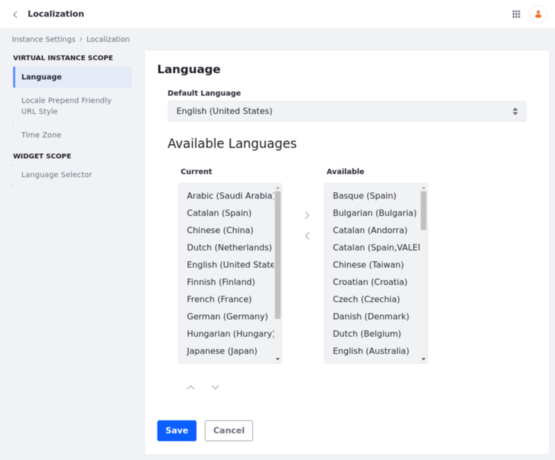

# Localization

To access the Localization settings, Open the Control Panel and navigate to *Configuration* &rarr; *Instance Settings*, and select the *Localization* category under the *PLATFORM* section. Here, you can choose the default language for your sites.

Use the left and right arrow buttons to move a language from Current (configured and active) to Available (not active, but can be configured) and back, depending on your needs. Use the up and down arrow buttons to sort the Current languages in the order you want them.

## Locale Prepend Friendly URL Style

The Locale Prepend Friendly URL Style configuration controls how locale prefixes are applied to URLs, indicating the content's language. This setting assists users and search engines in navigating and understanding localized content.

1. Open the *Global Menu* (), go to the *Control Panel* tab, and click *Instance Settings*.

1. Under *Platform*, click *Localization*.

1. Under Virtual Instance Scope, select the *Locale Prepend Friendly URL Style* option on the left and choose one of these options:

   **Locale is automatically prepended to a URL when the requested locale is not the default user locale** (default): Adds the locale prefix to the URL only if the requested locale differs from the user's preferred locale, as set in their profile. If the requested locale matches the user's preferred locale, no locale prefix is added.

   **Locale is automatically prepended to a URL when the requested locale is not the default locale**: Adds the locale prefix to the URL whenever the requested locale differs from th every URL**: Adds the locale prefix to all URLs, regardless of the en if the user's preferred locale matches the requested locale, the locale prefix is added if that locale is different from the site's default.

   **Locale is not automatically prepended to a URL**: The URL does not include a locale prefix, regardless of the user's preferred locale or the site's default locale. The URL structure remains consistent without any locale information.

   **Locale is automatically prepended to every URL**: Adds the locale prefix to all URLs, regardless of the user's preferred locale or the site's default locale. Every URL includes the locale information, even if the requested locale matches the default locale.

1. Click *Save*.

!!! warning
    Make sure your URLs don't have a trailing slash (e.g instead of `https://example.com/product/item1/`, use `https://example.com/product/item1`).

## Time Zone

Use the selector to choose the time zone for the instance.

## Language Selector

In the Language Selector tab, you can:

- Configure the Language Selector widget's [default display](../../../site-building/creating-pages/page-fragments-and-widgets/using-widgets/styling-widgets/setting-a-default-widget-template.md)

- Enable or disable the current locale from the list of available languages to choose from.

- Choose the default list of available languages. Write the language codes in a comma-separated list.

## Related Topics

- [Initial Instance Localization](../../../installation-and-upgrades/setting-up-liferay/initial-instance-localization.md)
- [Site Localization](../../../site-building/site-settings/site-localization.md)
- [Changing Translations with Language Override](../changing-translations-with-language-override.md)