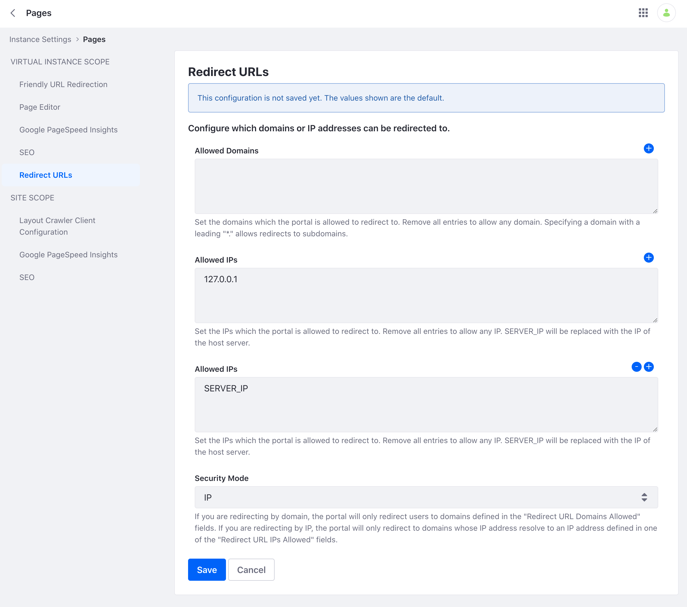

# Redirect URLs

{bdg-secondary}`Available 7.4+`

Your Liferay Instance can be configured to allow redirects to certain URLs or IP addresses. To configure, navigate to *Control Panel* &rarr; *Instance Settings* &rarr; *Content and Data* &rarr; *Pages* &rarr; *Redirect URLs*.

Under Security Mode, choose between *Domain* or *IP*. Select *Domain* if you want your Liferay Instance to redirect users to allowed domains. Select *IP* if you want your Liferay Instance to redirect users to allowed IP addresses.

If you select *Domain*, add your allowed domains under *Allowed Domains* and click *Save*. To allow redirects to any domain, remove all existing entries. Note, to allow redirects to subdomains, specify a domain with a leading _*_.

If you select *IP*, add your allowed IP addresses under Allowed IPs and click *Save*. To allow redirect to any IP address, remove all existing entries.
