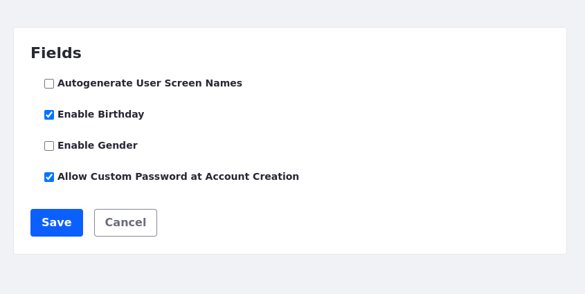

# Users

You can define the look and feel of the personal menu, the default user associations, and the fields that appear when a new user creates an account. 

To access user settings, open the *Global Menu* () and navigate to *Control Panel* &rarr; *Configuration* &rarr; *Instance Settings*, and select the *Users* category under the *PLATFORM* section. 

The Users Instance configuration contains several entries:

| Configuration             | Purpose                                                                                                        |
|:--------------------------|:---------------------------------------------------------------------------------------------------------------|
| Personal Menu             | Configure the look and feel of personal applications and whether the Personal Menu appears in the Control Menu |
| User Images               | Configure the limit on user portrait file size and dimensions.                                                 |
| Default User Associations | Automatically confer membership to some sites, roles, and user groups                                          |
| Fields                    | Enable and disable optional fields from the user form                                                          |

## Personal Menu

The Personal Menu configuration entry specifies whether personal applications use the same look and feel as the current site or if they should use the look and feel of the My Dashboard pages instead. You can also specify whether the Personal Menu appears in the Control Menu by toggling the *Show in Control Menu* option on and off. 

## User Images

{bdg-secondary}`Liferay DXP 2024.Q2+/Portal 7.4 GA120+`

Here, you can specify the maximum file size and image dimensions allowed for user portraits. There is also a toggle to check the image token on user portraits and organization logos before displaying them.

| Configuration     | Purpose                                                                                                                                                                                                                               |
| :---------------- | :------------------------------------------------------------------------------------------------------------------------------------------------------------------------------------------------------------------------------------ |
| Check Image Token | Enable this to check the image token for user portraits and organization logos before displaying them.                                                                                                                                |
| Maximum File Size | Specifies the maximum file size for user portraits. A value of `0` indicates no restrictions on the file size. This doesn't override the limit configured in *System Settings* &rarr; *Infrastructure* &rarr; *Upload Servlet Request*. |
| Maximum Height    | Specifies the maximum height allowed for user portraits. A value of `0` indicates no restrictions on the user portrait dimensions.                                                                                                      |
| Maximum Width     | Specifies the maximum width allowed for user portraits. A value of `0` indicates no restrictions on the user portrait dimensions.                                                                                                       |

!!! note
    For Liferay DXP 2024.Q1/Portal 7.4 GA112 and earlier, this setting is present under *System Settings* &rarr; *Users*.

## Default User Associations

The default user associations configuration entry defines the sites, organization sites, roles, and user groups all users are assigned to by default. By default, new users receive only the users role. User groups can pre-populate users' private sites with pages, assign roles and permissions, and manage site membership. If you update this configuration after your users have created their accounts, click the *Apply to Existing Users* checkbox to update existing users. Changes take effect the next time users sign in. 

## Fields

The Fields configuration entry contains settings for enabling/disabling the fields listed below on the add/edit user form:

* Autogenerate screen names (disabled by default)
* Birthday field (enabled by default)
* Gender field (disabled by default)
* {bdg-secondary}`Liferay DXP 2023.Q4+/Portal 7.4 GA92+` Allow Custom Password at Account Creation (enabled by default) - Use this option to allow users to edit their passwords after account creation. If unchecked, the password section does not appear. This overrides the portal property `login.create.account.allow.custom.password` set in the [portal-ext.properties file](https://learn.liferay.com/dxp/latest/en/installation-and-upgrades/reference/portal-properties.html).

