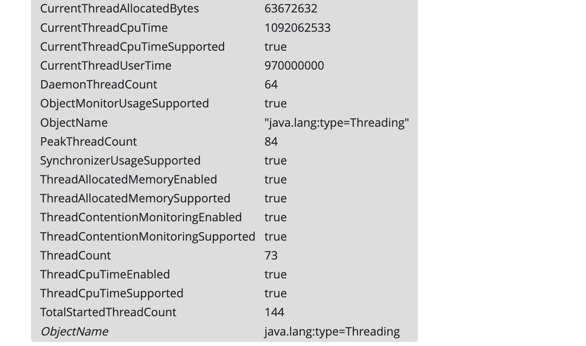

# Troubleshooting JVM Issues with Glowroot

{bdg-secondary}Liferay DXP 2023.Q4+/Portal 7.4 GA100+

Glowroot displays a dashboard to quickly identify system issues. Click the _Errors_ tab to see a list of tracked errors. The following topics are common Java environment issues you may encounter and some tips on how to use Glowroot to help you troubleshoot them.

## Java Deadlock

A deadlock occurs when multiple threads are unable to process because another thread is using a resource. The application may become very slow or unresponsive.

If a deadlock is suspected, click the _JVM_ tab in Glowroot. Click _Thread dump_ in the left navigation menu. The output will show any deadlocks that are found.

## Thread Leak

A thread leak occurs when many new threads are created, but the threads are not properly managed and closed when they are no longer needed. Over time, these threads can consume too much system resources and affect performance.

If a thread leak is suspected, a possible indicator is a `java.lang.OutOfMemory` error. Click the _Errors_ tab in Glowroot and check for any errors. Use the MBean tree to see a list of all running threads. Click the _JVM_ tab and click _Mbean tree_ in the left navigation. Scroll down to the `java.lang` section and click _Threading_. 

## Database Deadlock

A database deadlock occurs when two or more processes, or transactions, are waiting for each other to release a resource.

Check the trace of a transaction in Glowroot for slow transactions. Click the _Transactions_ tab. Under the web transactions, click _Slow traces_. Use the chart to identify any transactions that are taking too long.

## Database Connection Pool Issues

A database connection leak occurs when a program or application fails to properly release or close a database connection after it is no longer needed. This can lead to the depletion of available database connections and cause a slowdown of the system.

In Glowroot, click the _Errors_ tab to check for any connection pool timeout errors. Or check the status of the database connections. Click the _JVM_ tab and click _Mbean tree_ in the left navigation. Scroll down to the `com.zaxxer.hikari` section and click `Pool (HikariPool-1)`. See the number of active connections and threads awaiting connections. You may need to increase the pool size depending on your use cases.
