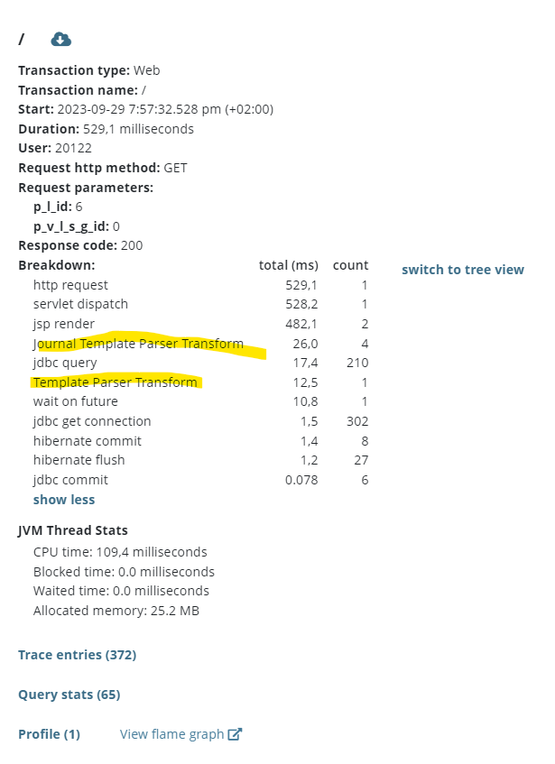
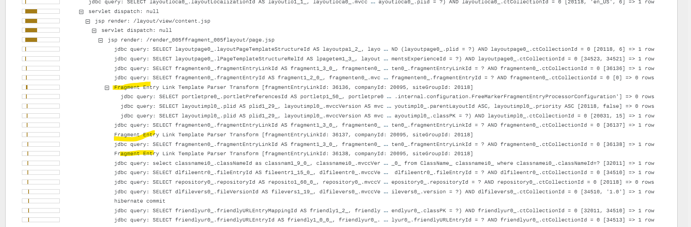

# Troubleshooting Templates with Glowroot Freemarker Plugin

{bdg-secondary}`Liferay DXP 2023.Q4+/Portal 7.4 GA100+`

Glowroot can troubleshoot [FreeMarker templates](../../site-building/displaying-content/using-information-templates.md) to pinpoint slow transactions.

## Configuring the FreeMarker Plugin

1. Navigate to _Configuration_ &rarr; _Plugins_. Click _Liferay FreeMarker Templates Plugin_.

1. The instrumentation can be configured at an `INFO`, `DEBUG`, or `TRACE` level.

   The `INFO` level shows how much time template transformations are taking. The `DEBUG` level treats each template transformation as a unique transaction for individual inspection. Note that this setting might use more Glowroot overhead. The `TRACE` level gives more details about the template script and trace details for inspection.

## Troubleshooting FreeMarker Templates

1. Navigate to the _Transactions_ tab and select _FreeMarker Templates_ from the drop-down menu. A list of all template transactions appears.

1. To see details of a specific transaction, click the _Slow traces_ tab in the transaction panel.

1. Click a data point to view transaction details. See the transformation times for the template under the Breakdown section.

   

1. Scroll down further and click _Trace entries_. The trace is expanded to show details of the fragment transformation.

   

To inspect template transaction errors,

1. Navigate to the _Errors_ tab and select _FreeMarker Templates_ from the drop-down menu.

1. Click on a specific error for inspection.
