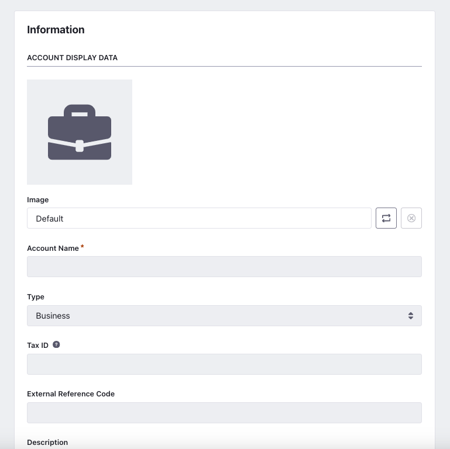
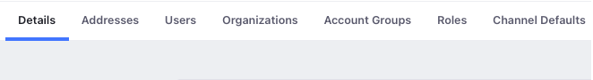
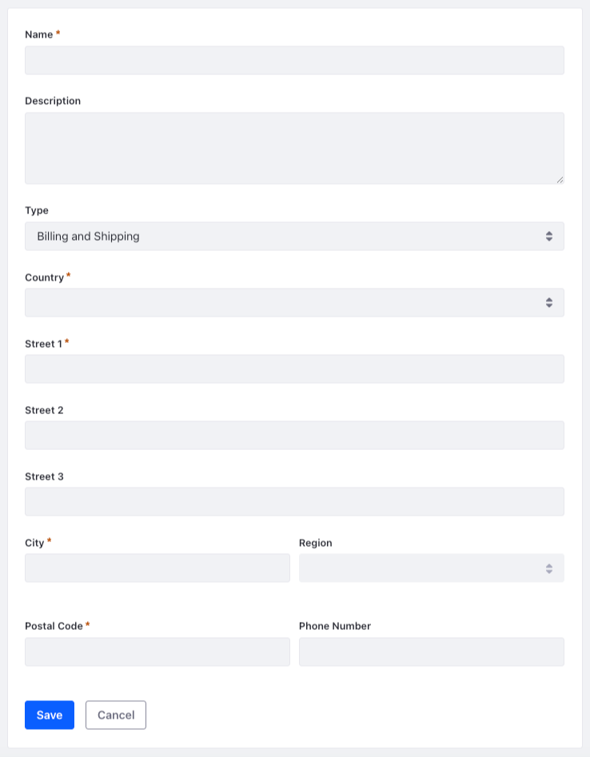

---
toc:
  - ./accounts/account-users.md
  - ./accounts/account-addresses.md
  - ./accounts/account-groups.md
  - ./accounts/account-roles.md
  - ./accounts/account-management-widget.md
  - ./accounts/using-workflow-with-accounts.md
  - ./accounts/channel-defaults.md
uuid: ed55c175-f9b4-40ac-b41b-9238b1467a11
taxonomy-category-names:
- Security
- User, Organization, and Account Management
- Liferay Self-Hosted
- Liferay SaaS
- Liferay PaaS
---
# Accounts

{bdg-secondary}`Available 7.4+`

Accounts provide administrators with a way to organize and manage users for various commerce or business needs. Unlike [organizations](./organizations.md) or [user groups](./user-groups.md), accounts help facilitate interactions that might take place in business situations such as the purchasing of goods and services or managing existing customers.

There are three different account types, *Business*, *Person*, and *Guest* types. Business accounts all you to associate multiple users to an account. Person type accounts can only have one account associated with them. Guest accounts provide a way for unregistered users to interact with your business or site.

## Creating an Account

1. Open the *Global Menu* () and navigate to *Control Panel* &rarr; *Accounts*.

1. Click *New*.

1. Give your account a name and select the type. Note that you cannot change the account type after creation.

   

   !!! note
       Starting from Liferay DXP 2024.Q1+/Portal 7.4 GA112+, account names can be up to 250 characters long. The earlier limit was 100.

1. Add additional information for your account such as Tax ID or description. Click *Save* to create the new account.

1. After creating an account, tabs appear at the top of the page.

   

### Details Tab

The Details tab displays the main information about the account such as the account name and type. A default billing address and shipping address can also be set here. [Categories](../content-authoring-and-management/tags-and-categories/defining-categories-and-vocabularies-for-content.md) or [Custom Fields](../system-administration/configuring-liferay/adding-custom-fields.md) can also be added for further customization of the account.

### Addresses Tab

The Addresses tab displays the different addresses associated with the account. To add a new address, click *New* and fill out the address information. Then, click *Save*.

See [Account Addresses](./accounts/account-addresses.md) to learn more.

### Users Tab

The Users tab displays the different users associated with the account. Note, this tab does not exist for Person type accounts or Guest type accounts. To associate a user to the account,

1. Click *New*. A window shows a list of account users available to select.

1. Select users by checking the box next to a user's name and click the *Assign* button.

1. A new user can also be created from this view. Click the *Add* icon () and see an add new user page.

1. Fill in the information for the new user and click the *Save* button.

1. Any new user that was created or associated with the account is displayed in the users tab. See [Account Users](./accounts/account-users.md) to learn more.

### Organizations Tab

The Organizations tab displays the different organizations associated with the account. To associate an organization, click the *Add* icon (). Select the organization to associate and click the *Assign* button.

### Account Groups Tab

The Account Groups tab displays the different group memberships for the account. To learn more about creating or managing these groups, see [Account Groups](./accounts/account-groups.md).

### Roles Tab

The Roles tab displays the different roles available for the account. Note, this tab does not exist for Guest type accounts.

To create an account role,

1. Click the *Add* icon ().

1. On the following page, give the role a title and description. Click *Save*.

1. Once the role is created, you can define permissions and assign users. Click the *Define Permissions* tab and choose the permissions for the role.

1. Click the *Assignees* tab to assign a user to the role. Click the *Add* icon () to select a user and click the *Assign* button.

See [Account Roles](./accounts/account-roles.md) to learn more.

## Making Changes to an Account

1. Click the *Actions* icon () of the account you want to edit.

1. Make one of the following selections:

   

   * Edit - See and edit the account information.
   * Manage Users - Add or remove account users.
   * Manage Organizations - Add or remove organization associations.
   * Deactivate - Deactivate an account.
   * Delete - Delete an account.

   For the Person account type, there is no Manage Users functionality.

1. Select *Edit* to access these options:

   

   * Details tab - Modify or add additional information for the account.
   * Addresses tab - Add or manage billing and shipping addresses.
   * Users tab - Add or remove account users. See [Account Users](./accounts/account-users.md) for more information.
   * Organizations tab - Add or remove organization associations.
   * Account Groups tab - View the account groups the account is a part of. See [Account Groups](./accounts/account-groups.md) for more information.
   * Roles tab - Add or manage the different roles for the account. See [Account Roles](./accounts/account-roles.md) for more information.

## Related Information

* [Account Users](./accounts/account-users.md)
* [Account Addresses](./accounts/account-addresses.md)
* [Account Groups](./accounts/account-groups.md)
* [Account Roles](./accounts/account-roles.md)
* [Account Management Widget](./accounts/account-management-widget.md)
* [Using Workflow with Accounts](./accounts/using-workflow-with-accounts.md)
* [Channel Defaults](./accounts/channel-defaults.md)
