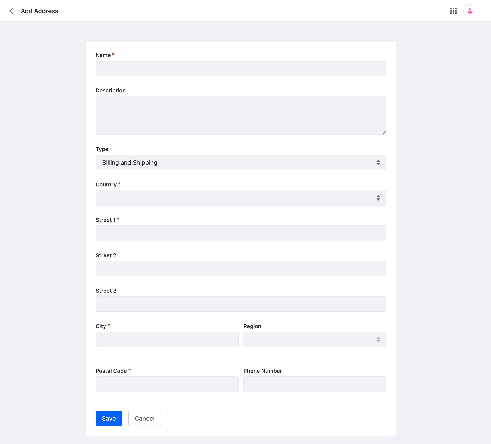
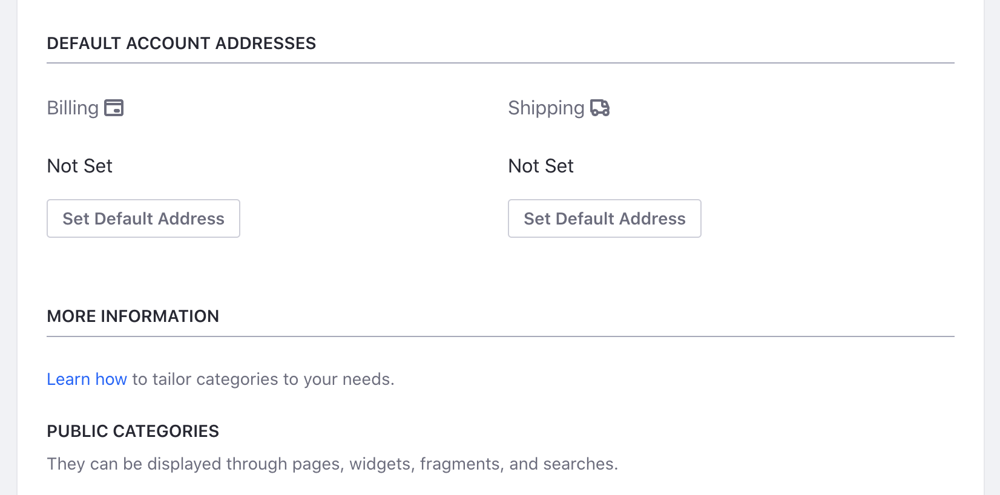

# Account Addresses

{bdg-secondary}`Available 7.4+`

Account Addresses are different billing or shipping addresses that are associated with a Business Account or a Person Account.

## Adding an Account Address

1. Open the Global Menu (). Navigate to *Control Panel* &rarr; *Accounts*.

1. Select an account by clicking its name. Or click the _Options_ icon () of the account and click _Edit_.

1. Click on the _Addresses_ tab. Click the _Add_ icon () to add a new address.

1. Fill out the add address form. Select whether the address is a billing address, shipping address, or both. Note that Name, Type, Country, Street 1, City, and Postal Code are required fields.

   

   Click *Save* to save the address.

## Editing an Account Address

To edit an existing address, 

1. Under the _Addresses_ tab, click the the _Options_ icon () of the address and click _Edit_.

   

1. Make your changes and click *Save*.

## Setting Default Account Addresses

To set a default billing address or shipping address,

1. Under the _Details_ tab, click *Set Default Address* either under Billing or Shipping.

   

1. A new window will open. Select an address from the list and click *Save*. Your default address is now set for the account.