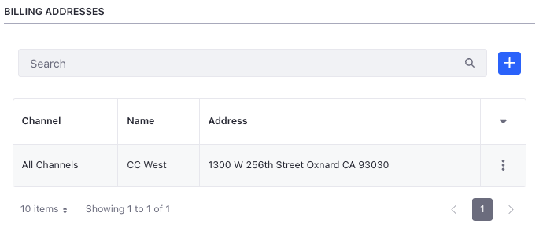
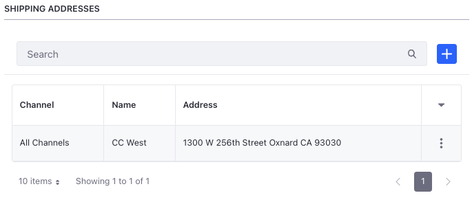
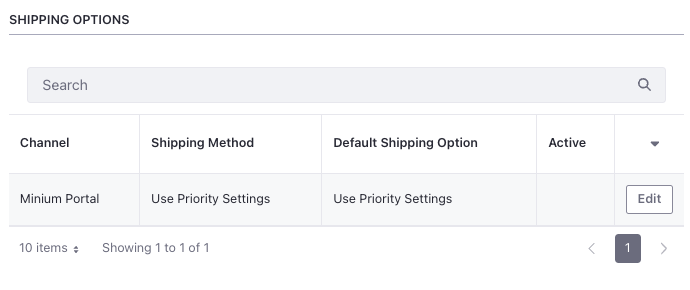
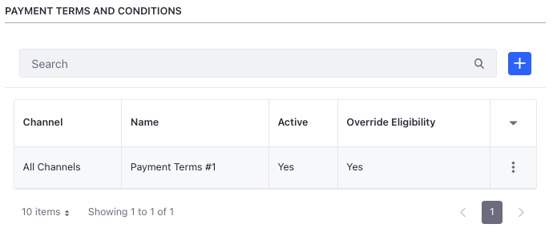
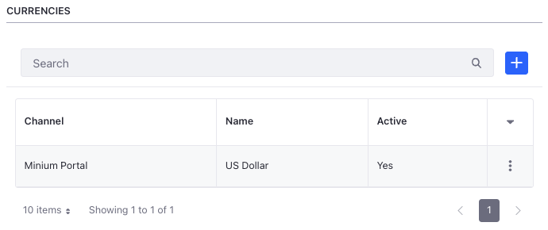
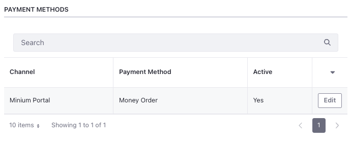
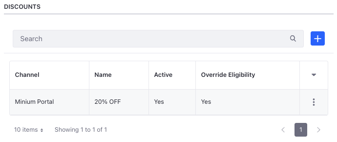

# Setting Channel Defaults

To set up channel defaults for an account, open the *Global Menu* () and navigate to *Control Panel* &rarr; *Accounts*. Select an account and click *Channel Defaults*. Follow the sections below to set up specific channel defaults.

## Setting Default Addresses

To set up a default billing address,

1. Open the *Global Menu* () and navigate to *Control Panel* &rarr; *Accounts*.

1. Select the account and click *Channel Defaults*.

1. Click *Add* () under Billing Address.

1. Select a channel from the *Channel* dropdown.

   ```{note}
   After setting defaults for one or more channels, you can select a default for all the remaining channels using the *All Other Channels* option in the *Channel* dropdown.
   ```

1. Select a billing address from the *Billing Address* dropdown.

   

1. Click *Save*.

You can follow the same steps to set a default shipping address under the *Shipping Address* section.



## Setting Default Terms and Conditions

To set up default delivery terms and conditions,

1. Open the *Global Menu* () and navigate to *Control Panel* &rarr; *Accounts*.

1. Select the account and click *Channel Defaults*.

1. Click *Add* () under *Delivery Terms and Conditions*.

1. Select a channel from the *Channel* dropdown.

1. Enable the *Override Eligibility* toggle to override eligibility set for the delivery terms and conditions individually.

1. Select one of the available delivery terms and conditions from the dropdown.

   

1. Click *Save*.

You can follow the steps above to set up default payment terms and conditions under the *Payment Terms and Conditions* section.



```{important}
Overriding eligibility for terms and conditions do not make them eligible for a particular channel. Payment terms are linked to a payment method and delivery terms are linked to a shipping option. When there are multiple eligible terms and conditions for a payment method or shipping option, overriding eligibility sets the selected terms and conditions as a default. 
```

## Setting Default Shipping Options and Payment Methods

To set up default shipping options,

1. Open the *Global Menu* () and navigate to *Control Panel* &rarr; *Accounts*.

1. Select the account and click *Channel Defaults*.

1. Click *Edit* next to the channel of your choice.

1. The default value uses existing priority settings configured for the channel. If there are other active shipping options present, you can choose one of them.

   

1. Click *Save*.

You can follow the same steps to set default payment methods under the *Payment Methods* section.



## Setting Default Price Lists and Discounts

To set up default *Price Lists*,

1. Open the *Global Menu* () and navigate to *Control Panel* &rarr; *Accounts*.

1. Select the account and click *Channel Defaults*.

1. Click *Add* () under *Price Lists*.

1. Select a channel from the *Channel* dropdown.

1. You can use the *Override Eligibility* toggle to override existing eligibility criteria configured for price lists.

1. Select a price list from the *Price List* dropdown.

   

1. Click *Save*.

You can follow the same steps to set default discounts under the *Discounts* section.



## Setting Default Currencies

To set up default currencies,

1. Open the *Global Menu* () and navigate to *Control Panel* &rarr; *Accounts*.

1. Select the account and click *Channel Defaults*.

1. Click *Add* () under *Currencies*.

1. Select a channel from the *Channel* dropdown and a currency from the *Currency* dropdown.

   

1. Click *Save*.

```{important}
This sets the default channel currency for the account during navigation only. Product pages and the catalog uses the currency set here. The currency set for the channel at the time of creation is not modified.
```

## Setting Channel Account Managers

Channel account managers can view and manage orders for accounts from one or more channels. If you have a channel account manager per channel, they can only manage orders coming for the selected account from the selected channel. You can have multiple channel account managers for one channel. To select a user as the channel account manager, you need the following permission.

| Permission                                                               | Description                                                            |
| :----------------------------------------------------------------------- | :--------------------------------------------------------------------- |
| Accounts > Account Entry: Manage Available Accounts via User Channel Rel | Manage accounts by creating a relationship between users and channels. |


```{note}
Users with this permission are available to select in the channel account manager dropdown. For the user to view and manage orders, you must also enable order related permissions. 

Channel account managers work with or without [organizations](https://learn.liferay.com/web/guest/w/dxp/users-and-permissions/organizations/understanding-organizations). If you use organizations, this user can manage accounts where they are a channel manager in addition to the accounts in the organization they have permission to manage. If you do not use organizations, you can use a channel account manager to control access to individual accounts.
```

To set up a default channel account manager,

1. Open the *Global Menu* () and navigate to *Control Panel* &rarr; *Accounts*.

2. Select the account of your choice and click the *Channel Defaults* tab.

3. Click the *Add* () button under *Channel Account Managers*.

4. Select a channel from the *Channel* dropdown.

5. Select a user from the *User* dropdown.

   

6. Click *Save*.

   ```{important}
   Channel account manager is not a new role in Liferay. The newly added permission gives the user a view into accounts outside the organization structure. This was not possible earlier. 
   ```
