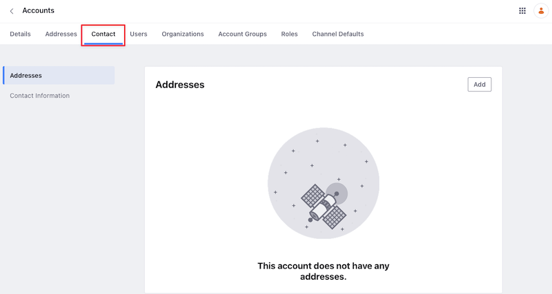
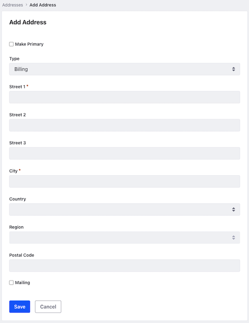
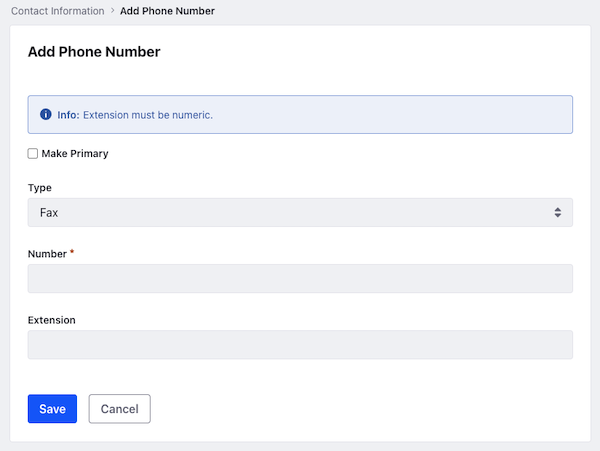
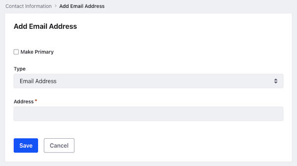
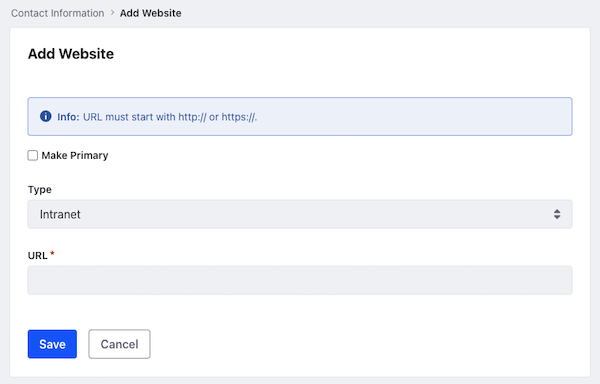

# Contacts

{bdg-secondary}`Liferay DXP 2024.Q2+/Portal 7.4 GA120+`

Using the new *Contact* tab on an account, you can add generic contact details related to the account. You can add the following information:

* Addresses
* Phone Numbers
* Email Addresses
* Websites
* Instant Messenger
* SMS
* Social Network

!!! important
    This feature is currently behind a release feature flag. Read [Release Feature Flags](../../system-administration/configuring-liferay/feature-flags.md#release-feature-flags) for more information.

To add one of the above fields,

1. Open the *Global Menu* () and navigate to *Control Panel* &rarr; *Accounts*.

1. Select the account you want to edit. Alternatively, click *Actions* () next to the desired account and choose *Edit*.

1. Open the *Contact* tab.

## Addresses

1. In the Addresses section, click *Add*.

1. (Optional) Check the *Primary* checkbox to make it a primary address. You can only have one primary address for an account regardless of its type.

1. Set the address type to *Billing*, *Other*, *P.O. Box*, or *Shipping*.

1. Enter the address in the required fields.

   

1. (Optional) Check the *Mailing* checkbox to make it a mailing address.

1. Click *Save*.

These addresses are for informational purposes only. You cannot use an address added here during checkout. For that, you must add an address in the *Addresses* tab. See [Account Addresses](./account-addresses.md) for more information.

## Phone Numbers

1. Open the Contact Information section and click *Add* next to PHONE NUMBERS.

1. (Optional) Check the *Primary* checkbox to make it a primary phone number. You can only have one primary address for an account regardless of its type.

1. Set the type to *Fax*, *Local*, *Other*, *Toll Free*, or *TTY*.

1. Enter the number in the required field.

   

1. Enter the extension, if any.

1. Click *Save*.

The first phone number you save automatically becomes the primary number. You can change this by adding a different phone number and marking it as primary. Alternatively, click *Actions* () next to a non-primary phone number and choose *Mark as Primary*.

## Email Addresses

1. Open the Contact Information section and click *Add* next to EMAIL ADDRESSES.

1. (Optional) Check the *Primary* checkbox to make it a primary email address. You can only have one primary email address for an account regardless of its type.

1. Set the type to *Email Address*, *Email Address 2*, or *Email Address 3*.

1. Enter the email address in the required field.

   

1. Click *Save*.

The first email address you save automatically becomes the primary email address. You can change this by adding a different email address and marking it as primary. Alternatively, click *Actions* () next to a non-primary email address and choose *Mark as Primary*.

## Websites

1. Open the Contact Information section and click *Add* next to WEBSITES.

1. (Optional) Check the *Primary* checkbox to make it a primary website. You can only have one primary website for an account regardless of its type.

1. Set the type to *Intranet* or *Public*.

1. Enter the website URL in the required field. Make sure to enter URLs with the `http://` or `https://` prefix.

   

1. Click *Save*.

The first website you save automatically becomes the primary website. You can change this by adding a website and marking it as primary. Alternatively, click *Actions* () next to a non-primary website and choose *Mark as Primary*.

## Instant Messenger

1. Open the Contact Information section and scroll down to INSTANT MESSENGER.

1. You can enter the Jabber username or Skype ID for the account.

1. Click *Save*.

After saving, an option to make a Skype call appears under the *Skype* text field. Click *Call This User* to make a Skype call. This works only if you have a Skype client installed for your operating system.

## SMS

1. Open the Contact Information section and scroll down to SMS.

1. Enter the contact information in the SMS field.

1. Click *Save*.

## Social Network

1. Open the Contact Information section and scroll down to SOCIAL NETWORK.

1. You can enter the Facebook or Twitter ID for the account.

1. Click *Save*.

!!! note
    The contact fields for an account are for informational purposes only.