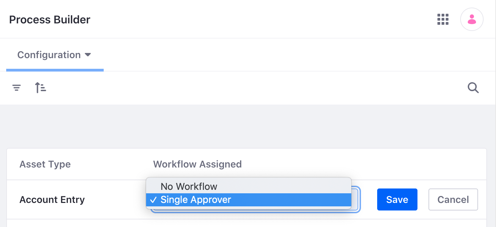
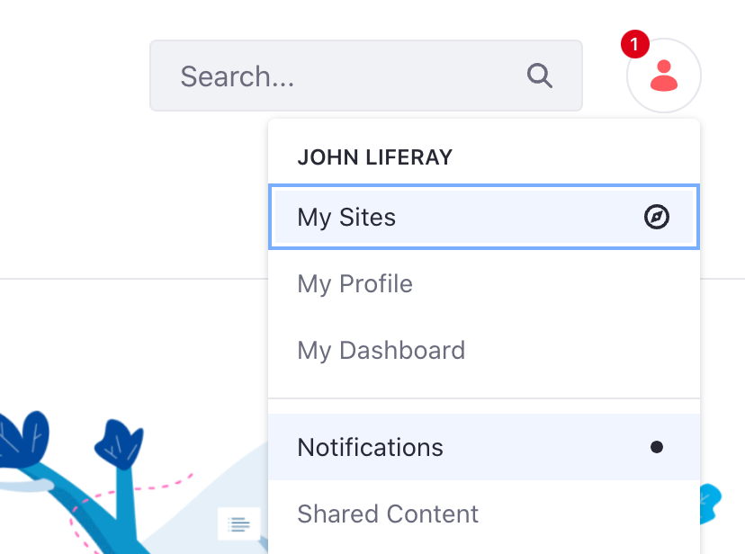
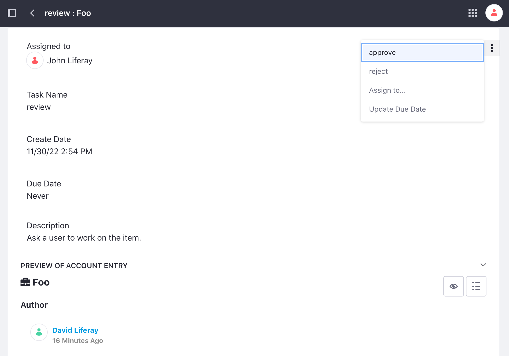

# Using Workflow with Accounts

{bdg-secondary}`Available Liferay 7.4 U49+/GA49+`

Accounts are fully integrated with Liferay's [workflow engine](../../process-automation/workflow/introduction-to-workflow.md) so you can enable an approval process for account creation.

To enable a workflow for Accounts,

1. Open the *Global Menu* (), go to the *Applications* tab &rarr; *Process Builder*.

1. Go to the *Configurations* tab and click *Edit* for Account Entry.

1. Use the drop-down menu to select a *workflow*.

   See [Workflow Designer Overview](../../process-automation/workflow/designing-and-managing-workflows/workflow-designer/workflow-designer-overview.md) to learn about designing custom workflows.

   

1. Click *Save*.

The workflow is now active. New accounts must go through the defined approval process before they are activated.

When [creating an account](../accounts.md#creating-an-account), its status is set to Pending and reviewers are notified.

Reviewers can approve or reject the pending account. See [Reviewing Assets](../../process-automation/workflow/using-workflows/reviewing-assets.md) for more information on the review process.

## Additional Information

* [Creating Accounts](../accounts.md#creating-an-account)
* [Workflow Designer Overview](../../process-automation/workflow/designing-and-managing-workflows/workflow-designer/workflow-designer-overview.md)
* [Reviewing Assets](../../process-automation/workflow/using-workflows/reviewing-assets.md)
