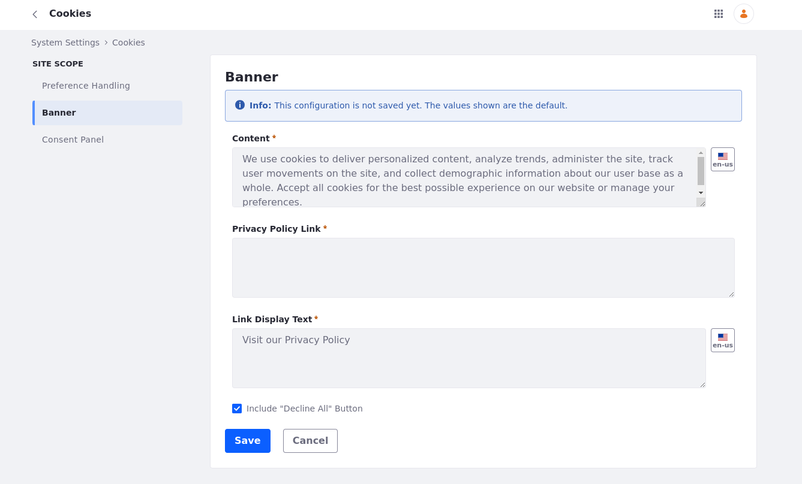

# Configuring GDPR-Compliant Cookies

Liferay offers capabilities within its interface that facilitates the implementation of GDPR-compliant cookie practices, allowing users to manage them how they please, providing a better experience through the user-friendly interface. Follow these steps to configure the Cookies's Preference Handling.

1. Open the *Global Menu* (), click on the Control Panel &rarr; System Settings &rarr; Plataform &rarr; *Cookies*.


```{note}
This applies the cookies configuration to all instances. You can also configure cookies by going to Control Panel &rarr; Instance Settings &rarr; Plataform &rarr; *Cookies*. This applies the configuration to specific instance only.
```

2. Set the chosen configurations for your Preference Handling. When cheking the *Enabled* box, you enable preference handling based on user selected choices. You may see also that more options are avaible on the left-handed Table of Contents: *Banner* and *Consent Panel*. When cheking the *Explicit Cookie Consent Mode*, then no cookies are set until the user agrees to cookie usages, otherwise, all cookies are set until the user opts out of them.


After cheking *Enabled*, you can start configuring the *Banner* and *Consent Panel* sections.

3. Once you are in *Banner*'s page, you may find the following costumizable options:



- **Content**: You can add the information included in your cookies policy, like what types of cookies are used, their purposes, how users can manage or disable cookies, and any other relevant information regarding data collection, tracking, and user privacy.

- **Privacy Policy Link**: Here you can add a hyperlink to your website's privacy policy page.

-**Link Display Text**: This will be the linked text that appeas as the hyperlink from *Privacy Policy*.

There is also the option to *Include "Decline All" Button* that adds a button on the pop-up cookie's notification.

When finished, click Save.

4. Once you click in *Consent Panel*, you may find the following costumizable options:


- **Title**: Here you place the Consent Panel's title.

-**Description**: You can give a general overview about the cookies for the user.

- **Cookie Policy Link**: Here you can add a hyperlink to your website's cookie policy page.

-**Link Display Text**: This will be the linked text that appeas as the hyperlink from *Privacy Policy*.

-**Strictly Necessary Cookies Description**: Here you can explain why are cookies necessary and why they can't be switched off.

-**Functional Cookies Description**: Here you can explain that the cookies may enable features such as customized preferences or settings, and the user may be set by the portal itself or by third-party providers. You may precheck this option.

-**Performance Cookies Description**: Here, you can elaborate on performance cookies and how they measure and improve the overall performance of the website by tracking visits, traffic sources, and page popularity while having full data privacy. You may precheck this option.

-**Personalization Cookies Description**: Here, you can write about how cookies personalize the user experience by tracking its interests and preferences. Also, by not allowing personalization, the user may experience less targeted advertising. You may precheck this option.

When finished, click Save.


