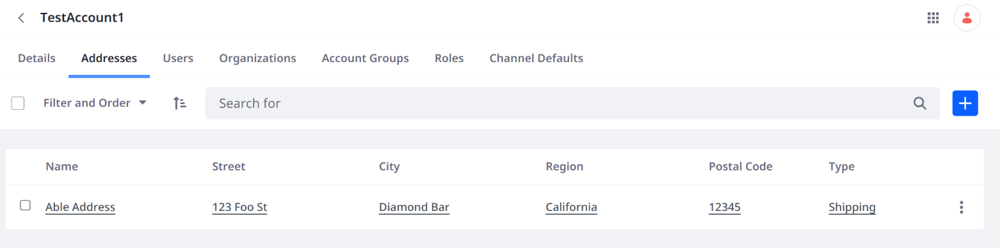

# Postal Address API Basics

{bdg-secondary}`Liferay DXP/Portal 7.4+`

Use Liferay's REST APIs to manage postal addresses.

## Add Postal Address to Account

```{include} /_snippets/run-liferay-dxp.md
```

Then, follow these steps:

1. Download and unzip [Postal Address API Basics](./liferay-n8y7.zip).

   ```bash
   curl https://resources.learn.liferay.com/dxp/latest/en/users-and-permissions/developer-guide/liferay-n8y7.zip -O
   ```

   ```bash
   unzip liferay-n8y7.zip
   ```

1. Use [Accounts_GET_FromInstance](./accounts-api-basics.md#get-accounts-from-instance) to get a list of accounts. Note the ID of the account where you'll add a postal address. You can also navigate to *Global Menu* &rarr; *Control Panel* &rarr; *Accounts* to see the list of accounts.

1. Use the cURL script to add a new postal address to your chosen account. On the command line, navigate to the `curl` folder. Execute the `PostalAddress_POST_ToAccount.sh` script. Replace `1234` with an account ID.

   ```bash
   ./PostalAddress_POST_ToAccount.sh 1234
   ```

   The JSON response shows a new postal address has been added:

   ```json
   {
     "addressCountry" : "United States",
     "addressLocality" : "Diamond Bar",
     "addressRegion" : "California",
     "addressType" : "shipping",
     "id" : 35706,
     "name" : "Able Address",
     "postalCode" : "12345",
     "primary" : false,
     "streetAddressLine1" : "123 Foo St",
     "streetAddressLine2" : "",
     "streetAddressLine3" : ""
   }
   ```

1. Navigate to *Global Menu* &rarr; *Control Panel* &rarr; *Accounts*. Select the account you chose in Step 2 and navigate to *Addresses*. See that a new postal address has been added to the account.

   

1. The REST service can also be called using the Java client. Navigate out of the `curl` folder and into the `java` folder. Compile the source files:

   ```bash
   javac -classpath .:* *.java
   ```

1. Run the `PostalAddress_POST_ToAccount.java` class. Replace `1234` with an account ID.

   ```bash
   java -classpath .:* -DaccountId=1234 PostalAddress_POST_ToAccount
   ```

## Examine the cURL Command

The `PostalAddress_POST_ToAccount.sh` script calls the REST service with a cURL command.

```{literalinclude} ./postal-address-api-basics/resources/liferay-n8y7.zip/curl/PostalAddress_POST_ToAccount.sh
   :language: bash
```

Here are the command's arguments:

| Arguments                                                                                                                                                                                                                                                                                                                             | Description                                         |
| :------------------------------------------------------------------------------------------------------------------------------------------------------------------------------------------------------------------------------------------------------------------------------------------------------------------------------------ | :-------------------------------------------------- |
| `-H "Content-Type: application/json"`                                                                                                                                                                                                                                                                                                 | Indicates that the request body format is JSON.     |
| `-X POST`                                                                                                                                                                                                                                                                                                                             | The HTTP method to invoke at the specified endpoint |
| `"http://localhost:8080/o/headless-admin-user/v1.0/accounts/${1}/postal-addresses"`                                                                                                                                                                                                                                                   | The REST service endpoint                           |
| `-d "{\"addressCountry\": \"United States\", \"addressLocality\": \"Diamond Bar\", \"addressRegion\": \"California\", \"addressType\": \"shipping\", \"name\": \"Able Address\", \"postalCode\": \"12345\", \"primary\": false, \"streetAddressLine1\": \"123 Foo St\", \"streetAddressLine2\": \"\", \"streetAddressLine3\": \"\"}"` | The data you are requesting to post                 |
| `-u "test@liferay.com:learn"`                                                                                                                                                                                                                                                                                                         | Basic authentication credentials                    |

!!! note
   Basic authentication is used here for demonstration purposes. For production, you should authorize users via [OAuth2](../../headless-delivery/using-oauth2.md). See [Using OAuth2 to Authorize Users](../../headless-delivery/using-oauth2/using-oauth2-to-authorize-users.md) for a sample React application that uses OAuth2.

The other cURL commands use similar JSON arguments.

## Examine the Java Class

The `PostalAddress_POST_ToAccount.java` class adds a postal address by calling the postal-address-related service.

```{literalinclude} ./postal-address-api-basics/resources/liferay-n8y7.zip/java/PostalAddress_POST_ToAccount.java
   :dedent: 1
   :language: java
   :lines: 9-35
```

This class invokes the REST service using only three lines of code:

| Line (abbreviated)                                                                   | Description                                                                                    |
| :----------------------------------------------------------------------------------- | :--------------------------------------------------------------------------------------------- |
| `PostalAddress.Builder builder = ...`                                                | Gets a `Builder` for generating a `PostalAddressResource` service instance.                    |
| `PostalAddressResource postalAddressResource = builder.authentication(...).build();` | Specifies basic authentication and generates a `PostalAddressResource` service instance.       |
| `PostalAddress postalAddress = postalAddressResource.postAccountPostalAddress(...);` | Calls the `postalAddressResource.postAccountPostalAddress` method and passes the data to post. |

Note that the project includes the `com.liferay.headless.admin.user.client.jar` file as a dependency. You can find client JAR dependency information for all REST applications in the API explorer in your installation at `/o/api`.

!!! note
   The `main` method's comment demonstrates running the class.

The other example Java classes are similar to this one, but call different `PostalAddressResource` methods.

!!! important
   See [PostalAddressResource](https://github.com/liferay/liferay-portal/blob/[$LIFERAY_LEARN_PORTAL_GIT_TAG$]/modules/apps/headless/headless-admin-user/headless-admin-user-client/src/main/java/com/liferay/headless/admin/user/client/resource/v1_0/PostalAddressResource.java) for service details.

Below are examples of calling other `PostalAddress` REST services using cURL and Java.

## Get Postal Addresses from Account

Get a list of postal addresses from an account with the following cURL or Java command. Replace `1234` with the account's ID.

### PostalAddresses_GET_FromAccount.sh

Command:

```bash
./PostalAddresses_GET_FromAccount.sh 1234
```

Code:

```{literalinclude} ./postal-address-api-basics/resources/liferay-n8y7.zip/curl/PostalAddresses_GET_FromAccount.sh
   :language: bash
```

### PostalAddresses_GET_FromAccount.java

Command:

```bash
java -classpath .:* -DaccountId=1234 PostalAddresses_GET_FromAccount
```

Code:

```{literalinclude} ./postal-address-api-basics/resources/liferay-n8y7.zip/java/PostalAddresses_GET_FromAccount.java
   :dedent: 1
   :language: java
   :lines: 8-18
```

The account's postal addresses are returned in the JSON response.

## Get Postal Addresses from Organization

Get a list of postal addresses from an organization with the following cURL or Java command. Replace `1234` with the organization's ID.

### PostalAddresses_GET_FromOrganization.sh

Command:

```bash
./PostalAddresses_GET_FromOrganization.sh 1234
```

Code:

```{literalinclude} ./postal-address-api-basics/resources/liferay-n8y7.zip/curl/PostalAddresses_GET_FromOrganization.sh
   :language: bash
```

### PostalAddresses_GET_FromOrganization.java

Command:

```bash
java -classpath .:* -DorganizationId=1234 PostalAddresses_GET_FromOrganization
```

Code:

```{literalinclude} ./postal-address-api-basics/resources/liferay-n8y7.zip/java/PostalAddresses_GET_FromOrganization.java
   :dedent: 1
   :language: java
   :lines: 8-18
```

The organization's postal addresses are returned in the JSON response.

## Get Postal Addresses from User

Get a list of postal addresses from a user with the following cURL or Java command. Replace `1234` with the user's ID.

### PostalAddresses_GET_FromUser.sh

Command:

```bash
./PostalAddresses_GET_FromUser.sh 1234
```

Code:

```{literalinclude} ./postal-address-api-basics/resources/liferay-n8y7.zip/curl/PostalAddresses_GET_FromUser.sh
   :language: bash
```

### PostalAddresses_GET_FromUser.java

Command:

```bash
java -classpath .:* -DuserAccountId=1234 PostalAddresses_GET_FromUser
```

Code:

```{literalinclude} ./postal-address-api-basics/resources/liferay-n8y7.zip/java/PostalAddresses_GET_FromUser.java
   :dedent: 1
   :language: java
   :lines: 8-18
```

The user's postal addresses are returned in the JSON response.

## Get a Postal Address

Get a specific postal address with the following cURL or Java command. Replace `1234` with the postal address's ID.

!!! tip
   Use ``PostalAddress_GET_FromAccount.[java|sh]`` to get account ``postal address`` IDs.

   Use ``PostalAddress_GET_FromOrganization.[java|sh]`` to get organization ``postal address`` IDs.

   Use ``PostalAddress_GET_FromUser.[java|sh]`` to get user ``postal address`` IDs.

### PostalAddress_GET_ById.sh

Command:

```bash
./PostalAddress_GET_ById.sh 1234
```

Code:

```{literalinclude} ./postal-address-api-basics/resources/liferay-n8y7.zip/curl/PostalAddress_GET_ById.sh
   :language: bash
```

### PostalAddress_GET_ById.java

Command:

```bash
java -classpath .:* -DpostalAddressId=1234 PostalAddress_GET_ById
```

Code:

```{literalinclude} ./postal-address-api-basics/resources/liferay-n8y7.zip/java/PostalAddress_GET_ById.java
   :dedent: 1
   :language: java
   :lines: 8-18
```

The postal address is returned in the JSON response.

## Patch a Postal Address

Partially edit an existing postal address with the following cURL or Java command. Replace `1234` with the postal address's ID.

### PostalAddress_PATCH_ById.sh

Command:

```bash
./PostalAddress_PATCH_ById.sh 1234
```

Code:

```{literalinclude} ./postal-address-api-basics/resources/liferay-n8y7.zip/curl/PostalAddress_PATCH_ById.sh
   :language: bash
```

### PostalAddress_PATCH_ById.java

Command:

```bash
java -classpath .:* -DpostalAddressId=1234 PostalAddress_PATCH_ById
```

Code:

```{literalinclude} ./postal-address-api-basics/resources/liferay-n8y7.zip/java/PostalAddress_PATCH_ById.java
   :dedent: 1
   :language: java
   :lines: 9-25
```

## Put a Postal Address

Completely overwrite an existing postal address with the following cURL or Java command. Replace `1234` with the postal address's ID.

### PostalAddress_PUT_ById.sh

Command:

```bash
./PostalAddress_PUT_ById.sh 1234
```

Code:

```{literalinclude} ./postal-address-api-basics/resources/liferay-n8y7.zip/curl/PostalAddress_PUT_ById.sh
   :language: bash
```

### PostalAddress_PUT_ById.java

Command:

```bash
java -classpath .:* -DpostalAddressId=1234 PostalAddress_PUT_ById
```

Code:

```{literalinclude} ./postal-address-api-basics/resources/liferay-n8y7.zip/java/PostalAddress_PUT_ById.java
   :dedent: 1
   :language: java
   :lines: 9-34
```

## Delete a Postal Address

Delete an existing postal address with the following cURL or Java command. Replace `1234` with the postal address's ID.

### PostalAddress_DELETE_ById.sh

Command:

```bash
./PostalAddress_DELETE_ById.sh 1234
```

Code:

```{literalinclude} ./postal-address-api-basics/resources/liferay-n8y7.zip/curl/PostalAddress_DELETE_ById.sh
   :language: bash
```

### PostalAddress_DELETE_ById.java

Command:

```bash
java -classpath .:* -DpostalAddressId=1234 PostalAddress_DELETE_ById
```

Code:

```{literalinclude} ./postal-address-api-basics/resources/liferay-n8y7.zip/java/PostalAddress_DELETE_ById.java
   :dedent: 1
   :language: java
   :lines: 8-17
```

The [API Explorer](../../headless-delivery/consuming-apis/consuming-rest-services.md) shows all of the `PostalAddress` services and schemas and has an interface to try out each service.

!!! note
    On Liferay DXP 2024.Q4+/GA129+, you can use external reference codes to `GET/PUT/PATCH/DELETE` postal addresses.

## Related Topics

- [Accounts API Basics](./accounts-api-basics.md)
- [OAuth2](../../headless-delivery/using-oauth2.md)
