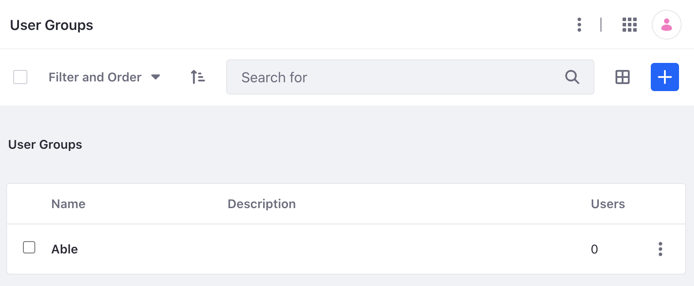

# User Groups API Basics

You can [Create and Manage User Groups](../user-groups/creating-and-managing-user-groups.md) from the Application menu, but you can also use Liferay's REST APIs. Call these services to manage user groups.

## Adding a User Group

```{include} /_snippets/run-liferay-dxp.md
```

Then follow these steps:

1. Download and unzip [User Groups API Basics](./liferay-y6f2.zip).

   ```bash
   curl https://learn.liferay.com/dxp/latest/en/users-and-permissions/developer-guide/liferay-y6f2.zip -O
   ```

   ```bash
   unzip liferay-y6f2.zip
   ```

1. Use the cURL script to add a new user group to your instance. On the command line, navigate to the `curl` folder. Execute the `UserGroup_POST_ToInstance.sh` script.

   ```bash
   ./UserGroup_POST_ToInstance.sh
   ```

   The JSON response shows a new user group has been added:

   ```bash
   "description" : "",
   "externalReferenceCode" : "72c5739f-a6e9-d4b8-5481-7cf1a427ea79",
   "id" : 43099,
   "name" : "Able",
   "usersCount" : 0

   ```

2. Navigate to *Global Menu* &rarr; *Control Panel* &rarr; *User Groups*. See that a new user group has been added.

   

3. The REST service can also be called using the Java client. Navigate out of the `curl` folder and into the `java` folder. Compile the source files with the following command:

   ```bash
   javac -classpath .:* *.java
   ```

4. Run the `UserGroup_POST_ToInstance.java` class with the following command.

   ```bash
   java -classpath .:* UserGroup_POST_ToInstance
   ```

## Examine the cURL Command

The `UserGroup_POST_ToInstance.sh` script calls the REST service with a cURL command.

```{literalinclude} ./user-groups-api-basics/resources/liferay-y6f2.zip/curl/UserGroup_POST_ToInstance.sh
    :language: bash
```

Here are the command's arguments:

| Arguments | Description |
| :--- | :--- |
| `-H "Content-Type: application/json"` | Indicates that the request body format is JSON. |
| `-X POST` | The HTTP method to invoke at the specified endpoint |
| `"http://localhost:8080/o/headless-admin-user/v1.0/user-groups"` | The REST service endpoint |
| `-d "{\"name\": \"Able\"}"` | The data you are requesting to post |
| `-u "test@liferay.com:learn"` | Basic authentication credentials |

```{note}
Basic authentication is used here for demonstration purposes. For production, you should authorize users via [OAuth2](../../headless-delivery/using-oauth2.md).
```

The other cURL commands use similar JSON arguments.

## Examine the Java Class

The `UserGroup_POST_ToInstance.java` class adds a user group by calling the user-group-related service.

```{literalinclude} ./user-groups-api-basics/resources/liferay-y6f2.zip/java/UserGroup_POST_ToInstance.java
   :dedent: 1
   :language: java
   :lines: 9-24
```

This class invokes the REST service using only three lines of code:

| Line (abbreviated) | Description |
| :----------------- | :---------- |
| `UserGroupResource.Builder builder = ...` | Gets a `Builder` for generating an `UserGroupResource` service instance. |
| `UserGroupResource userGroupResource = builder.authentication(...).build();` | Specifies basic authentication and generates a `UserGroupResource` service instance. |
| `UserGroup userGroup = userGroupResource.postUserGroup(...);` | Calls the `userGroupResource.postUserGroup` method and passes the data to post. |

Note that the project includes the `com.liferay.headless.admin.user.client.jar` file as a dependency. You can find client JAR dependency information for all REST applications in the API explorer in your installation at `/o/api`.

```{note}
The `main` method's comment demonstrates running the class.
```

The other example Java classes are similar to this one, but call different `UserGroupResource` methods.

```{important}
See [UserGroupResource](https://github.com/liferay/liferay-portal/blob/[$LIFERAY_LEARN_PORTAL_GIT_TAG$]/modules/apps/headless/headless-admin-user-client/src/main/java/com/liferay/headless/admin/user/client/resource/v1_0/UserGroupResource.java) for service details.
```

Below are examples of calling other `UserGroup` REST services using cURL and Java.

## Get User Groups from Instance

You can list User Groups by executing the following cURL or Java command.

### UserGroups_GET_FromInstance.sh

Command:

```bash
./UserGroups_GET_FromInstance.sh
```

Code:

```{literalinclude} ./user-groups-api-basics/resources/liferay-y6f2.zip/curl/UserGroups_GET_FromInstance.sh
   :language: bash
```

### UserGroups_GET_FromInstance.java

Command:

```bash
java -classpath .:* UserGroups_GET_FromInstance
```

Code:

```{literalinclude} ./user-groups-api-basics/resources/liferay-y6f2.zip/java/UserGroups_GET_FromInstance.java
   :dedent: 1
   :language: java
   :lines: 11-22
```

The Instance's `UserGroup` objects appear in JSON.

## Get a User Group

Get a specific user group with the following cURL or Java command.

```{tip}
Use ``UserGroups_GET_FromInstance.[java|sh]`` to get instance ``User Group`` IDs.
```

### UserGroup_GET_ById.sh

Command:

```bash
./UserGroup_GET_ById.sh 1234
```

Code:

```{literalinclude} ./user-groups-api-basics/resources/liferay-y6f2.zip/curl/UserGroup_GET_ById.sh
   :language: bash
```

### UserGroup_GET_ById.java

Command:

```bash
java -classpath .:* -DuserGroupId=1234 UserGroup_GET_ById
```

Code:

```{literalinclude} ./user-groups-api-basics/resources/liferay-y6f2.zip/java/UserGroup_GET_ById.java
   :dedent: 1
   :language: java
   :lines: 8-18
```

The `UserGroup` fields appear in JSON.

## Patch a User Group

Do a partial edit of an existing user group with the following cURL and Java commands. Replace `1234` with your User Group's ID.

### UserGroup_PATCH_ById.sh

Command:

```bash
./UserGroup_PATCH_ById.sh 1234
```

Code:

```{literalinclude} ./user-groups-api-basics/resources/liferay-y6f2.zip/curl/UserGroup_PATCH_ById.sh
   :language: bash
```

### UserGroup_PATCH_ById.java

Command:

```bash
java -classpath .:* -DuserGroupId=1234 UserGroup_PATCH_ById
```

Code:

```{literalinclude} ./user-groups-api-basics/resources/liferay-y6f2.zip/java/UserGroup_PATCH_ById.java
   :dedent: 1
   :language: java
   :lines: 9-25
```

## Put a User Group

Completely overwrite an existing user group with the following cURL and Java commands. Replace `1234` with your user group's ID.

### UserGroup_PUT_ById.sh

Command:

```bash
./UserGroup_PUT_ById.sh 1234
```

Code:

```{literalinclude} ./user-groups-api-basics/resources/liferay-y6f2.zip/curl/UserGroup_PUT_ById.sh
   :language: bash
```

### UserGroup_PUT_ById.java

Command:

```bash
java -classpath .:* -DuserGroupId=1234 UserGroup_PUT_ById
```

Code:

```{literalinclude} ./user-groups-api-basics/resources/liferay-y6f2.zip/java/UserGroup_PUT_ById.java
   :dedent: 1
   :language: java
   :lines: 9-25
```

## Delete a User Group

Delete an existing User Group with the following cURL and Java commands. Replace `1234` with your User Group's ID.

### UserGroup_DELETE_ById.sh

Command:

```bash
./UserGroup_DELETE_ById.sh 1234
```

Code:

```{literalinclude} ./user-groups-api-basics/resources/liferay-y6f2.zip/curl/UserGroup_DELETE_ById.sh
   :language: bash
```

### UserGroup_DELETE_ById.java

Command

```bash
java -classpath .:* -DuserGroupId=1234 UserGroup_DELETE_ById
```

Code:

```{literalinclude} ./user-groups-api-basics/resources/liferay-y6f2.zip/java/UserGroup_DELETE_ById.java
   :dedent: 1
   :language: java
   :lines: 8-17
```

The [API Explorer](../../headless-delivery/consuming-apis/consuming-rest-services.md) shows all of the `UserGroup` services and schemas and has an interface to try out each service.
