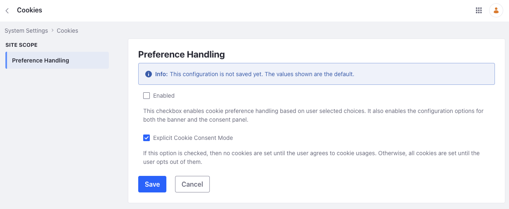
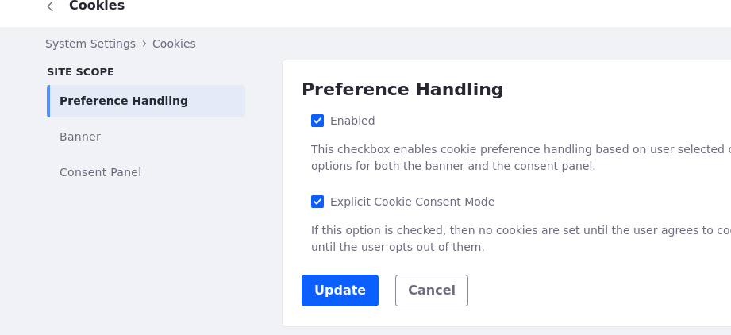
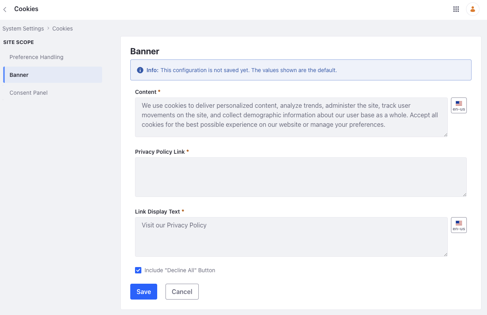
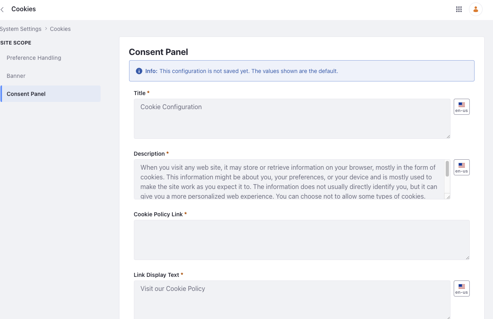
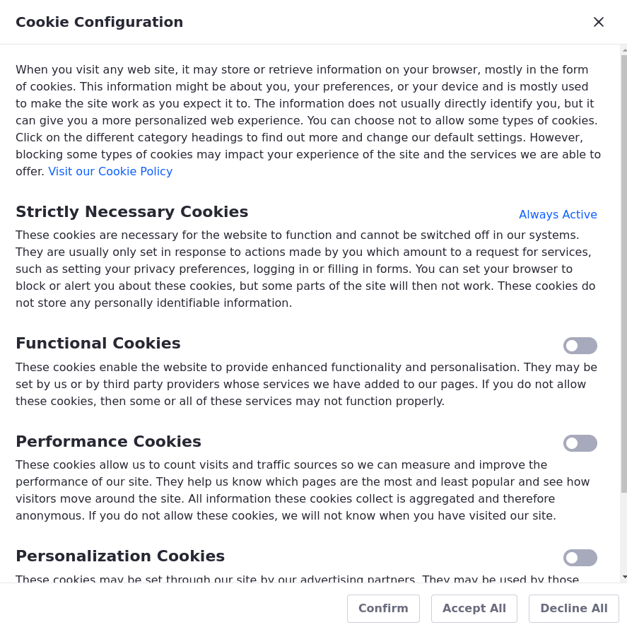

# Enabling GDPR Compliance for Cookies

You can ensure [GDPR compliance](https://gdpr.eu/cookies) for your cookies using Liferay's configuration interface. 

1. Open the *Global Menu* (), and navigate to *Control Panel* &rarr; *System Settings* &rarr; *Platform* &rarr; *Cookies*.

   

   There are two checkboxes here: Enabled and Explicit Cookie Consent Mode. Though enabled by default, the explicit cookie consent mode doesn't work if the Enabled checkbox is unchecked.

1. To set your handling preference, check the *Enabled* checkbox. With the Explicit Cookie Consent Mode checked, no cookies are set until the user explicitly agrees to cookie usages. If unchecked, all cookies are set until the user opts out of them.

1. Click *Update*.

   

   Two new options appear in the left menu: *Banner* and *Consent Panel*.

   

   !!! note
       This applies the configuration to all sites. If you want to configure cookie settings for a specific site, go to *Control Panel* &rarr; *Instance Settings* &rarr; *Platform* &rarr; *Cookies*.

1. Go to the *Banner* tab and choose your options for the cookie banner (see Banner Options below).

   

1. Click *Save*.

1. Go to the *Consent Panel* tab and choose your options for the consent panel (see Consent Panel Options below).

   

1. Click *Save*.

## Banner Options

Your cookie policy appears when users log in through a banner. It displays the text from the Content field, your privacy Policy Link, and Link Display Text. Users can select from three options: *Configuration*, *Accept All* and *Decline All*. You can customize these options in the Banner tab.

**Content**: Add the information included in your cookie policy, like the types of cookies used, their purposes, how users can manage or disable cookies, and any other relevant information regarding data collection, tracking, and user privacy.

**Privacy Policy Link**: Add a link to your site's privacy policy page.

**Link Display Text**: Specify the text that appears as the link to the privacy policy page.

**Include "Decline All" Button**: Check this option to add a *Decline All* button on the cookie banner.

## Consent Panel Options

The Consent Panel appears when users click the *Configuration* link on the banner. Users can use it to select the types of cookies they consent to have stored. 

 You may customize the following options:

**Title**: Adds a title to your consent panel.

**Description**: Add a general overview about the usage of cookies on your site.

**Cookie Policy Link**: Add a link to your site's cookie policy page.

**Link Display Text**: Specify the text that appears as the link to the cookie policy page.

**Strictly Necessary Cookies Description**: Describe the cookies that are necessary for the proper functioning of your site.

**Functional Cookies Description**: Describe cookies you store to provide enhanced functionality and personalization. You can check the *Prechecked* checkbox to enable this when the user opens the consent panel.

**Performance Cookies Description**: Describe performance cookies you store, including how they measure and improve the overall performance of the website by counting visits, traffic sources, and page popularity, and any steps you have taken to maintain full data privacy. You can check the *Prechecked* checkbox to enable this when the user opens the consent panel.

**Personalization Cookies Description**: Describe cookies that personalize the user experience. For example, you might have cookies that build a profile of users to show relevant ads. By not allowing personalization cookies, users may receive less targeted advertising. You can check the *Prechecked* checkbox to enable this when the user opens the consent panel.

See also:

* [Managing User Data (GDPR)](https://learn.liferay.com/web/guest/w/dxp/users-and-permissions/managing-user-data)
* [Sanitizing User Data](https://learn.liferay.com/web/guest/w/dxp/users-and-permissions/managing-user-data/sanitizing-user-data)
