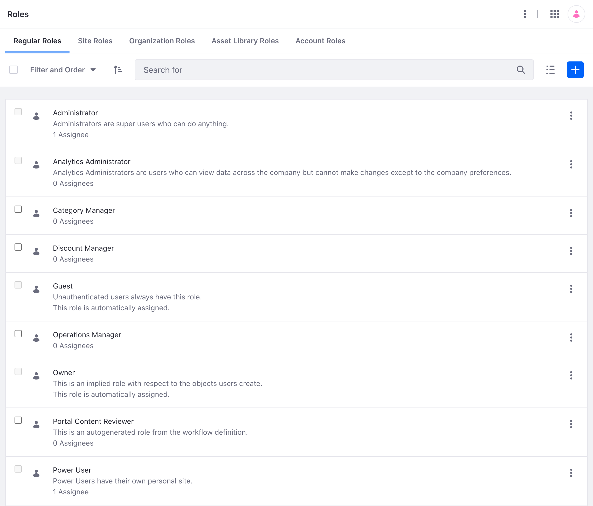

---
toc:
  - ./roles-and-permissions/understanding-roles-and-permissions.md
  - ./roles-and-permissions/creating-and-managing-roles.md
  - ./roles-and-permissions/defining-role-permissions.md
  - ./roles-and-permissions/assigning-users-to-roles.md
  - ./roles-and-permissions/assigning-roles-to-user-segments.md
  - ./roles-and-permissions/configuring-a-password-policy.md
  - ./roles-and-permissions/default-roles-reference.md
uuid: eb520fa9-64a8-4e79-be23-4b8dc5027641
taxonomy-category-names:
- Security
- User, Organization, and Account Management
- Liferay Self-Hosted
- Liferay SaaS
- Liferay PaaS
---

# Roles and Permissions

To get things done in Liferay DXP, [users](./users.md) must have the proper permissions. Roles join users with permissions. Most administrative work for roles and permissions is done in *Control Panel* &rarr; *Users* &rarr; *Roles*.

To skip straight to creating roles and assigning users, see

- [Role Creation and Management](./roles-and-permissions/creating-and-managing-roles.md)
- [Defining Role Permissions](./roles-and-permissions/defining-role-permissions.md)
- [Assigning Users to Roles](./roles-and-permissions/assigning-users-to-roles.md)

!!! note
    [Site Teams](../site-building/sites/site-membership/creating-teams-for-sites.md) have a dedicated permissions management User Interface.
