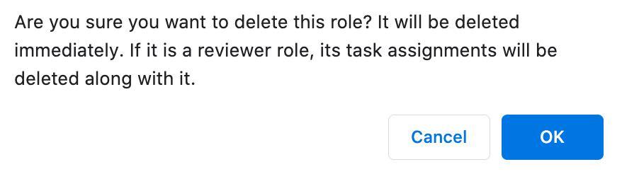
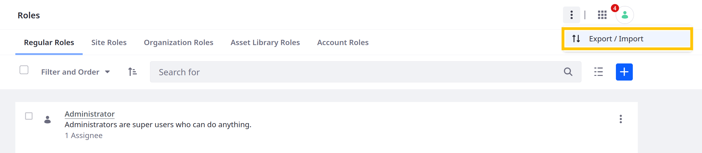
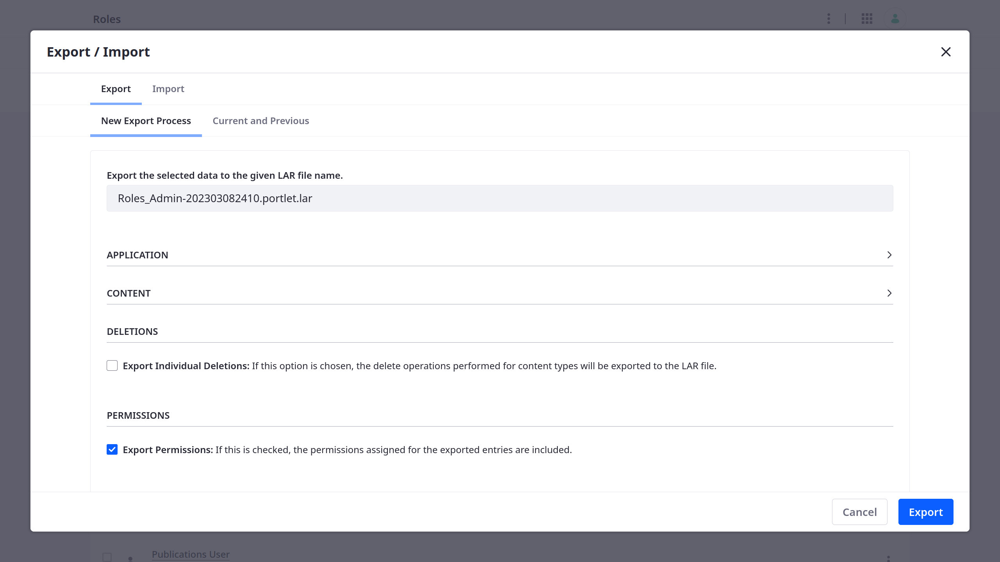

# Creating and Managing Roles

Once you [understand](./understanding-roles-and-permissions.md) roles and permissions, you can create the roles you need to empower your users to work within your Liferay DXP solution.

Create and manage roles in Control Panel &rarr; Users &rarr; Roles.

## Creating Roles

First, [determine the scope](./understanding-roles-and-permissions.md) of the role you must create. Roles can be scoped globally (regular roles), by site, organization, asset library, or account.

1. Open the *Global Menu* (), go to the *Control Panel* tab, and click *Roles*.

1. Click *Add* ().

1. Select a role type.

1. Enter a localizable title and description.

1. Enter a key. This is a unique identifier for referencing the role programmatically. By default, the title value is used.

1. Click *Save*.


Now you can [define role permissions](./defining-role-permissions.md) and [assign the role to users](./assigning-users-to-roles.md).

## Updating Roles

You can update a role's title, description, and key at any time, but you cannot change its type/scope.

To do this, click the role's *Actions* button () and select *Edit*. When finished, click *Save*.

## Role Management Permissions

You can assign permissions for managing individual roles. 

1. Click the role's *Actions* button () and select *Permissions*.

1. Specify the actions that existing regular roles can perform on the selected role. This assignment is for each individual role and is different from [defining permission for the Roles application](./defining-role-permissions.md).

   

By default, only the Owner and Administrator regular roles can grant these permissions for a role. The Administrator role doesn't appear in the permissions matrix because its permissions cannot be modified. The default user in a testing installation has this permission at the global scope and can carry out all actions, as well as assign users and define permissions for a role.

```{warning}
Be careful about granting these permissions. This is administrative functionality that's best left to a few trusted users.
```

## Deleting Roles

1. Click the role's *Actions* button () and select *Delete*. 

1. Confirm that you really want to delete the role. The role is deleted immediately, along with any [workflow task assignments](../../process-automation/workflow/using-workflows/reviewing-assets.md) associated with it.

   

## Exporting and Importing Roles

If needed, you can export and import roles. However, Liferay only exports company-wide and personal site permissions. Site and asset library-related permissions are not exported.

To begin an export or import process, 

1. Open the Roles application, click the *Actions* button  in the Application Bar, and select *Export/Import*.

   

1. Configure export/import processes, download and upload LAR files, or review current and previous export/import processes.

   

## Deleting Asset Containers Deletes their Assets

A Web Content folder contains Web Content articles. The Web Content folder is an asset container, and the Web Content article is an asset. It's possible to give a role permission to delete an asset container without giving the role permission to delete individual assets. In that case, beware: if a role assignee deletes an asset container with individual assets in it, the individual assets themselves are deleted as well.

| Asset Container            | Asset                     |
|:---------------------------|:--------------------------|
| Web Content Folder         | Web Content Article       |
| Knowledge Base Folder      | Knowledge Base Article    |
| Message Boards Category    | Message Boards Thread     |
| Wiki Node                  | Wiki Page                 |
| Documents and Media Folder | Document                  |
| Form                       | Form Record               |
| Dynamic Data List          | Dynamic Data List Records |
| App Builder Object         | App Builder App           |

Besides Web Content folders, examples of asset containers include Bookmarks folders, Message Boards categories, Wiki nodes, and Documents and Media folders.

## Related Topics

* [Understanding Roles and Permissions](./understanding-roles-and-permissions.md)
* [Defining Role Permissions](./defining-role-permissions.md)
* [Default Roles Reference](./default-roles-reference.md)
