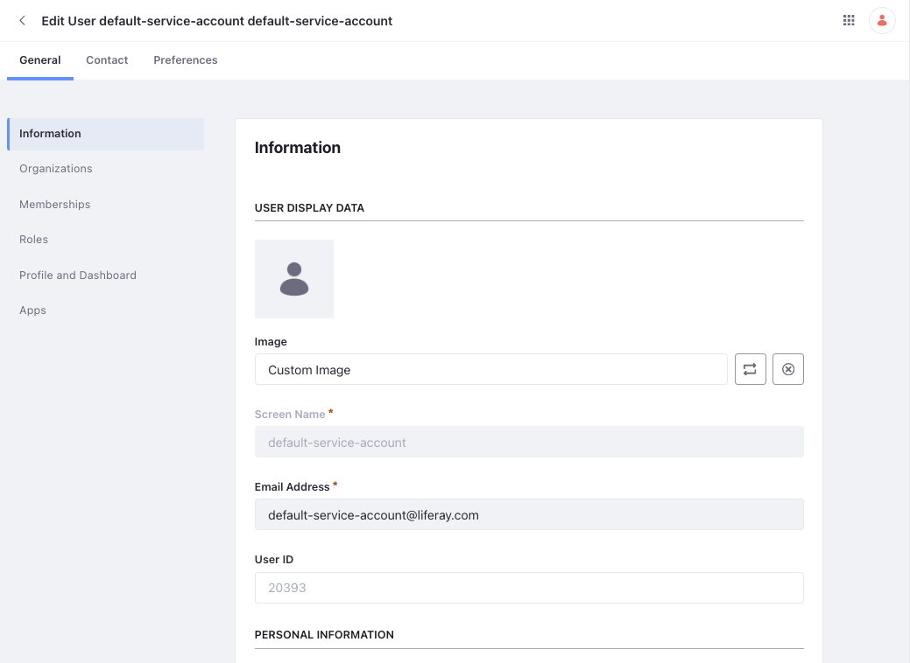

# Service Accounts

A service account is a common abstraction in systems used to make authenticated API requests on behalf of the system. Every virtual instance in Liferay comes with one service account out-of-the-box. It can be used to execute tasks for OAuth2 applications and headless delivery.

This is useful in scenarios where there's no need for a real user to perform an operation. For instance, a real user needn't create a user from a third-party application via API. In this case, you can use the service account to make the authenticated request to create the user.

## Service Account Details

Every virtual instance has one default service account. To view this,

1. Open the *Global Menu* () and navigate to *Control Panel* &rarr; *Service Accounts*.

1. Select the `default-service-account default-service-account` entry.

As with a regular user, you can view details about the service account here. The screen name, `default-service-account`, is reserved and you cannot use it while creating another user. The *Password* section is not available for a service account as it can't be used to log in to Liferay.

!!! important
    You cannot delete a service account, you can only deactivate it.