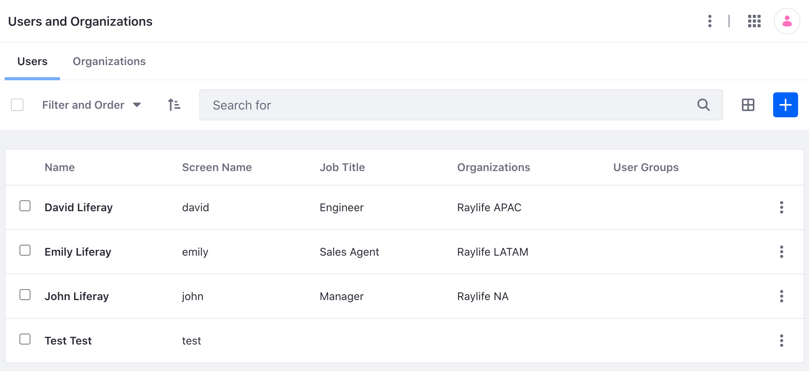
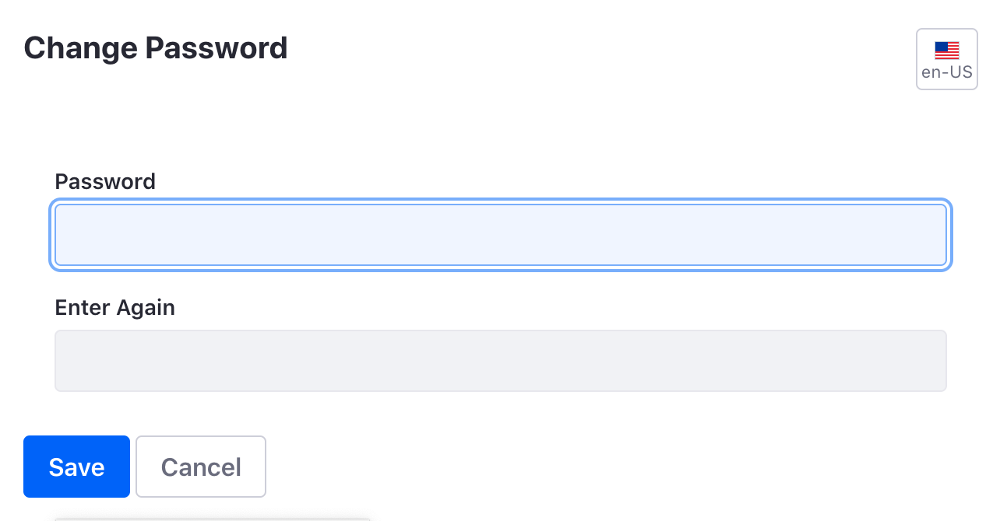
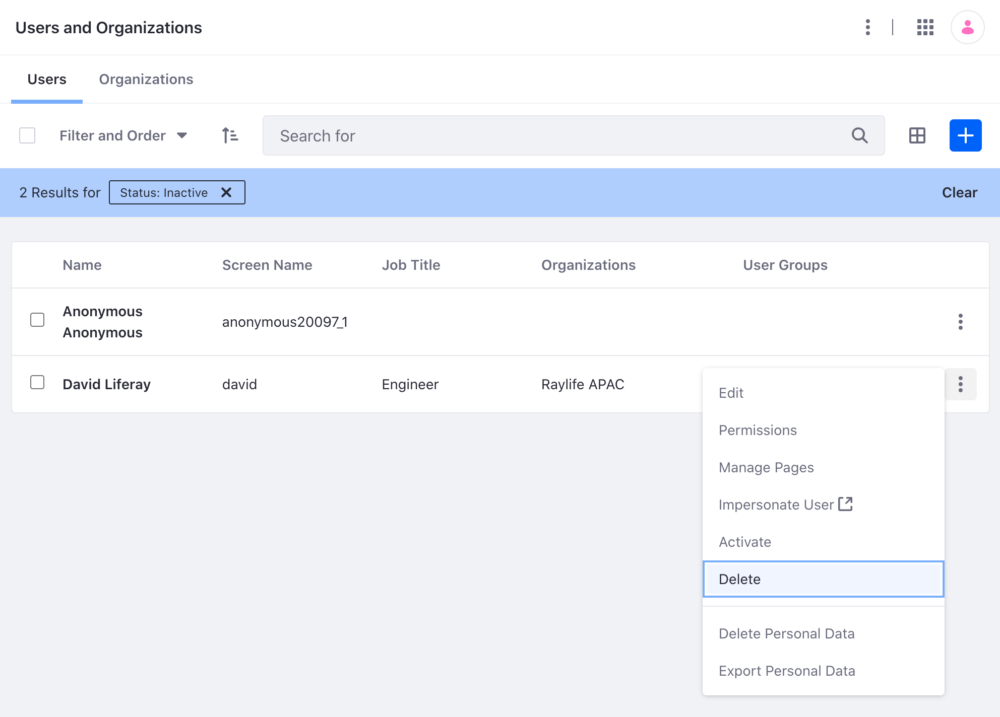

# Adding and Managing Users

Core user management activities include adding, editing, and deleting users. These activities are typically restricted to Administrative users.

## Adding Users

1. Open the *Global Menu* () and go to *Control Panel* &rarr; *Users and Organizations*.

1. In the Users tab, click the *New* button.

    

1. Fill out the Add User form and click *Save*. At a minimum, provide a screen name, first name, last name, and email address for the user.

    !!! note
        Screen names and email addresses are not interchangeable. A screen name cannot contain an `@` symbol because it is used in the URL to a user's pages.

        The add user functionality is split over several independent forms. Save the first form to create the user, and then you'll see a success message saying `Success. Your request completed successfully.`

You can add additional information after creating the user.

### Setting Passwords for New Users

When you create users, Liferay generates their passwords. If a [mail server was set up](../../installation-and-upgrades/setting-up-liferay/configuring-mail.md), Liferay sends an email message with the users' new passwords.

If you haven't set up a mail server, click the *Password* item from the general menu and manually set a password for your new user. Enter the new password twice.

### Open Registration

By default, guest users can create user accounts.

See [Configuring Authentication](../../installation-and-upgrades/securing-liferay/authentication-basics.md) to learn more about configuring registration and authentication for users.

### Configuring a User Directory

Organizations that manage users with LDAP can sync their LDAP server with Liferay to import users. See [Connecting to a User Directory](../connecting-to-a-user-directory/connecting-to-an-ldap-directory.md) to learn more.

<!-- ### Other Methods

Are there other methods of adding users? -->

## Editing Users

1. Open the *Global Menu* () and go to *Control Panel* &rarr; *Users and Organizations*.

1. Click *Actions* () next to a user.

    The following options are available:

    | Option               | Description                                                                        |
    | :------------------- | :--------------------------------------------------------------------------------- |
    | Edit                 | Modify any aspect of the User account.                                             |
    | Permissions          | Define which Roles have permissions to edit the User.                              |
    | Manage Pages         | Configure the personal pages of a User.                                            |
    | Impersonate User     | Browse the Site in another window as though you were that User.                    |
    | Deactivate           | [Disable the user's account](#deactivating-users).                                 |
    | Erase Personal Data  | [Delete the User's personal data](../managing-user-data/sanitizing-user-data.md).  |
    | Export Personal Data | [Download the User's personal data](../managing-user-data/exporting-user-data.md). |

## Deactivating and Deleting Users

Removing users is a two-step process for several reasons:

- You or the user may decide you really wanted that account.
- Users are often tied to content with possible [legal ramifications](../managing-user-data.md) in your country.
- You may need time to review a user's account activity before removing all evidence of that user's existence.

For these and more reasons, you must first *deactivate* a user before *deleting* them.

!!! note
    A user with the `Delete` permission can activate, deactivate, and delete users. Starting from Liferay DXP 2023.Q4+/Portal 7.4 GA98+, two new permissions, `Activate` and `Deactivate`, have been added to give more granular control over who can activate and deactivate other users.

### Deactivating Users

Deactivating a user prevents the user from logging in, but preserves the user. You can toggle between active and inactive users in the users view. If all the users are active, this filtering option doesn't appear.

To deactivate a user,

1. Open the *Global Menu* () and go to *Control Panel* &rarr; *Users and Organizations*.

1. Locate the user to deactivate and click the *Actions* () button next to the user.

1. Select *Deactivate*.

The user is now deactivated and can no longer log in. Users can be reactivated by finding them in the users table (be sure you're filtering the table results by deactivated users), clicking *Actions* (), and selecting *Activate*. There's no confirmation window for activation: users are automatically restored to their former status after activation.

### Deleting Users

To guard against accidental deletion of users, users must be deactivated first, and then can be deleted.

1. Follow the steps above to deactivate the user.

1. Click *Filter and order* at the top of the table to display a selector. Click *Inactive* to view the user you just deactivated.

    

1. Click the *Actions* () button, and click *Delete* to delete the user.

The user is now deleted. There is no way to recover the user once deleted besides restoring from a prior backup.

## Impersonating Users

You can impersonate users to view the system as the user would see it. This helps to diagnose permission issues an administrator can't see, such as making sure a user doesn't have access to sensitive data. Only users with the administrator role can impersonate.

1. Open the *Global Menu* () and go to *Control Panel* &rarr; *Users and Organizations*.

1. Locate the user to impersonate and click *Actions* () next to the user.

1. Click *Impersonate User*.

This opens another browser window logged in as that user.

## Resetting a User Password

The Add User functionality includes a *Require Password Reset* check box at the bottom of the password form. The default password policy prevents administrators from de-selecting this option. You can, however, modify the default password policy to make this box usable.

1. Open the *Global Menu* () and go to *Control Panel* &rarr; *Password Policies*.

1. Click on the *Default Password Policy*.

1. De-select the *Change Required* switcher in the *Password Changes* section. Now you can decide whether users you add must reset their passwords.

See [Password Policies](../roles-and-permissions/configuring-a-password-policy.md) for more information on editing the default policy or creating your own.

## Related Topics

- [Understanding Users](./understanding-users.md)
- [Authentication Basics](../../installation-and-upgrades/securing-liferay/authentication-basics.md)
- [Connecting to an LDAP Directory](../connecting-to-a-user-directory/connecting-to-an-ldap-directory.md)