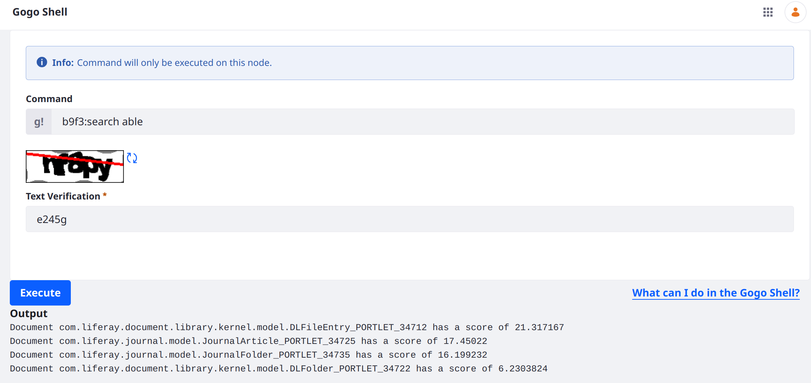

---
taxonomy-category-names:
- Search
- Liferay PaaS
- Liferay Self-Hosted
- Java Development
uuid: 637981f4-8656-4b49-9926-18823840bdf9
---
# Search Queries and Filters

To get sensible results from the [search engine](../installing-and-upgrading-a-search-engine/installing-a-search-engine.md), you must provide a sensible query. Liferay's query APIs are found in the `portal-search-api` module and are used to construct both queries and filters.

*Filters* ask a yes or no question for every search document and do not calculate relevance. A filter might ask _is the status field equal to staging or live?_

*Queries* ask the same yes or no question compute how well a document matches the specified criteria. This is the concept of [relevance scoring](https://www.elastic.co/guide/en/elasticsearch/guide/current/scoring-theory.html). A query might ask _Does the document's content field contain the words "Liferay", "Content", or "Management", and how relevant is the content of the document to the searched keywords?_

To use queries and filters in Liferay, construct the query and then add it to the request as a query or filter:

1. Add a query to the request with `SearchRequestBuilder.query(fooQuery)`.
1. To filter instead of querying, add it to the search request with `SearchRequestBuilder.postFilterQuery(fooQuery)`.

Here you can deploy, test, and inspect a [Gogo Shell command](../../liferay-internals/fundamentals/using-the-gogo-shell/gogo-shell-commands.md) that queries the [company index](../search-administration-and-tuning/elasticsearch-indexes-reference.md).

!!! tip
    While developing, it can be helpful to inspect the query as generated by the search engine. See [Inspecting any Liferay-Generated Elasticsearch Query](../installing-and-upgrading-a-search-engine/elasticsearch/troubleshooting-elasticsearch-installation.md#inspecting-any-liferay-generated-elasticsearch-query) for information.

## Deploy A Gogo Shell Command with Custom Search Queries

```{include} /_snippets/run-liferay-portal.md
```

Then, download the project and complete some prerequisites:

1. Download and unzip the liferay-b9f3 project:

   ```bash
   curl https://resources.learn.liferay.com/dxp/latest/en/using-search/developer-guide/liferay-b9f3.zip -O
   ```

   ```bash
   unzip liferay-b9f3.zip
   ```

1. From the module root, build and deploy.

   ```bash
   ./gradlew deploy -Ddeploy.docker.container.id=$(docker ps -lq)
   ```

   !!! note
       This command is the same as copying the deployed jars to `/opt/liferay/osgi/modules` on the Docker container.

1. Confirm the deployment in the Liferay Docker container console.

    ```bash
    STARTED com.acme.b9f3.impl_1.0.0 [1775]
    ```

1. The B9F3 sample includes a shell script that loads documents and content into Liferay. To run it, first retrieve the default site's ID and the global site's ID from the running Liferay instance.

   In the default site, open *Site Menu* () &rarr; *Configuration* &rarr; *Site Settings*.

1. Go to *Site Configuration* and record the Site ID.

1. Go to the Global site. Click *Site Selector* () &rarr; *Available Sites* &rarr; *Global*.

1. Find and record the Site ID for the Global site.

1. To run the script, go to `liferay-b9f3/curl` in the terminal. 

1. Run the shell script with the site IDs as arguments:

    ```bash
    ./populate_b9f3.sh [default site ID] [global site ID]
    ```

    For example,

    ```bash
    ./populate_b9f3.sh 20116 20119
    ```

    The script adds these resources:

    - Web Content:
        - Able Content
        - Able Content Folder
            - Able Content 

    - Document and Media:
        - Able Document
        - Able Document Folder
            - Able Document 

## Test the B9F3 Search Queries

1. On the locally running Liferay's home page, enter _able_ into the search bar:


    Six results appear.

1. Open the Global Menu (), navigate to *Control Panel* &rarr; *Gogo Shell*.

1. Enter _b9f3:search able_ and answer the CAPTCHA challenge.

1. Click _Execute_. 

   

1. Four results appear, all of them root content. Anything nested inside the created folders does not have a `folderId` of `0`, and is not returned. However, the folders themselves are returned, because they are contained in the root folder, and given a `folderId` of `0`.

!!! tip
    The root folder in the Documents and Media and Web Content applications have a `folderId` of `0`. You can check the indexed folder ID of each search result by enabling _Display Results in Document Form_ in the Search Results widget. See [Inspecting Search Engine Documents](../search-pages-and-widgets/search-results/configuring-the-search-results-widget.md#inspecting-search-engine-documents) for more information. 

## Understanding the B9F3 Search Queries

First, initialize a `SearchRequestBuilder`. You can use this object to construct the search request.

```{literalinclude} ./search-queries-and-filters/resources/liferay-b9f3.zip/b9f3-impl/src/main/java/com/acme/b9f3/internal/osgi/commands/B9F3OSGiCommands.java
   :dedent: 2
   :language: java
   :lines: 32-33
```

Next, populate the `SearchContext` within the request. This sets the entry class names to search and the company ID of the instance to search within. It also sets the keywords to search. These keywords are entered by the user at search time.

!!! note
    You must either set keywords into the search context or enable empty search in the request builder with `searchRequestBuilder.emptySearchEnabled(true);`.

```{literalinclude} ./search-queries-and-filters/resources/liferay-b9f3.zip/b9f3-impl/src/main/java/com/acme/b9f3/internal/osgi/commands/B9F3OSGiCommands.java
   :dedent: 2
   :language: java
   :lines: 35-46
```

Now fashion the query clauses. This example nests two MUST query clauses inside a boolean query: one clause is a term query for matching the `folderId` field to the value `0`, and the other is for performing a full text match query of the user's search keywords to the localized title field.

```{literalinclude} ./search-queries-and-filters/resources/liferay-b9f3.zip/b9f3-impl/src/main/java/com/acme/b9f3/internal/osgi/commands/B9F3OSGiCommands.java
   :dedent: 2
   :language: java
   :lines: 48-56
```

Add the boolean query with its nested clauses to the request, execute the request, then process the response as needed. This prints the document's `uid` field and its score.

```{literalinclude} ./search-queries-and-filters/resources/liferay-b9f3.zip/b9f3-impl/src/main/java/com/acme/b9f3/internal/osgi/commands/B9F3OSGiCommands.java
   :dedent: 2
   :language: java
   :lines: 58-75
```

These Liferay services are referenced in the B9F3 code:

```{literalinclude} ./search-queries-and-filters/resources/liferay-b9f3.zip/b9f3-impl/src/main/java/com/acme/b9f3/internal/osgi/commands/B9F3OSGiCommands.java
   :dedent: 1
   :language: java
   :lines: 78-95
```

## Implementing Nested Queries

To create queries for object fields, web content structure fields, or document metadata sets, you must query the field according to its nested structure using a [nested query](https://www.elastic.co/guide/en/elasticsearch/reference/current/query-dsl-nested-query.html). Inside the query, specify the path (e.g., `ddmFieldArray` for web content and document metadata sets, `nestedFieldArray` for objects) and create a boolean query with two clauses that use dot notation: one clause matches the field name, and the other matches the value (e.g., the user's keywords).

### Querying Web Content Structure Fields 

Web content structures and documents and media metadata sets are indexed similarly. A web content structure field is indexed like this:

```
{
   ddmFieldName=ddm__text__35174__Text25689566_en_US,
   ddmFieldValueText_en_US_String_sortable=able text,
   ddmValueFieldName=ddmFieldValueText_en_US,
   ddmFieldValueText_en_US=Able text
}
```

In Elasticsearch's query syntax you might create a query like this for the field: 

```json
{
  "nested": {
    "path": "ddmFieldArray",
    "query": {
      "bool": {
        "must": [
          {
            "match": {
              "ddmFieldArray.ddmFieldName": "ddm__text__35174__Text25689566_en_US"
            }
          },
          {
            "match": {
              "ddmFieldArray.ddmFieldValueText_en_US": "${keywords}"
            }
          }
        ]
      }
    }
  }
}
```

You can create the same query in Liferay's Java search API:

```java
BooleanQuery booleanQuery = queries.booleanQuery();

MatchQuery fieldNameQuery = queries.match("ddmFieldArray.ddmFieldName", "ddm__text__35174__Text25689566_en_US");

MatchQuery fieldValueQuery = queries.match("ddmFieldArray.ddmFieldValueKeyword_en_US", keywords);

booleanQuery.addMustQueryClauses(fieldNameQuery, fieldValueQuery);

NestedQuery nestedQuery = queries.nested("ddmFieldArray", booleanQuery);
```

### Querying Object Fields

An object's text field is indexed like this:

```
[
   {
      fieldName=fooText,
      value_en_US=Able Text,
      valueFieldName=value_en_US
   },
   {
      fieldName=fooText,
      value_keyword_lowercase=Able Text,
      valueFieldName=value_keyword_lowercase
   }
]
```

In Elasticsearch's query syntax you might create a query like this for the field: 

```json
{
  "nested": {
    "path": "nestedFieldArray",
    "query": {
      "bool": {
        "must": [
          {
            "match": {
              "nestedFieldArray.fieldName": "fooText"
            }
          },
          {
            "match": {
              "nestedFieldArray.value_en_US": "${keywords}"
            }
          }
        ]
      }
    }
  }
}
```

You can create the same query in Liferay's Java search API:

```java
BooleanQuery booleanQuery = queries.booleanQuery();

MatchQuery fieldNameQuery = queries.match("nestedFieldArray.fieldName", "fooText");

MatchQuery fieldValueQuery = queries.match("nestedFieldArray.value_en_US", keywords);

booleanQuery.addMustQueryClauses(fieldNameQuery, fieldValueQuery);

NestedQuery nestedQuery = queries.nested("nestedFieldArray", booleanQuery);
```

## Filtering

There's no separate API for filtering. Construct the query as usual and add it to the search request, specifying it as a filter using the `SearchRequestBuilder.postFilterQuery(fooQuery)` method.

For example, you can change the B9F3 code to first filter the documents with the `folderId` of `0` and then perform the match query on the keywords and title field:

```java
TermQuery termQuery = _queries.term(Field.FOLDER_ID, "0");

searchRequestBuiler.postFilterQuery(termQuery);

MatchQuery matchQuery = _queries.match(
    StringBundler.concat(
        "localized_", Field.TITLE, StringPool.UNDERLINE,
           LocaleUtil.US), keywords);

searchRequestBuilder.query(matchQuery);

SearchRequest searchRequest = searchRequestBuilder.build();
```

## Related Topics

- [Search Headless API](search-headless-apis.md)
- [Search Blueprints](../liferay-enterprise-search/search-experiences/search-blueprints.md)
