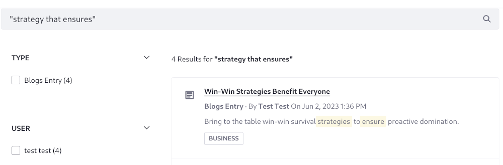
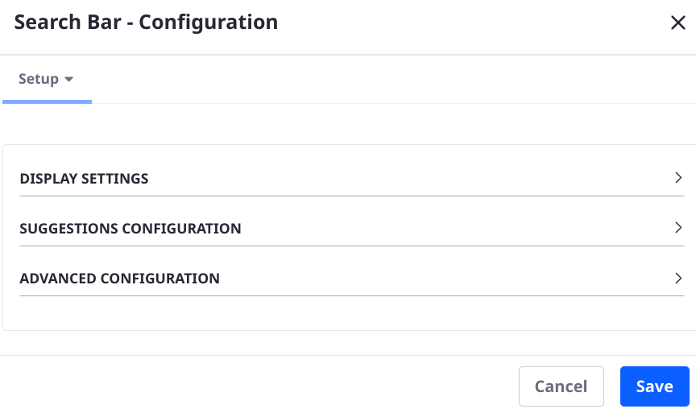

---
taxonomy-category-names:
- Search
- Liferay Self-Hosted
- Liferay PaaS
- Liferay SaaS
uuid: 97837f94-619a-4ac0-9b0c-bf9dca31e748
---
# Searching for Content

All indexed content (a.k.a. _assets_ in Liferay DXP) can be returned as search results. [Custom content can also be indexed](https://help.liferay.com/hc/en-us/articles/360032260612-Model-Entity-Indexing-Framework), so your installation might have additional asset types beyond the ones included by default. The following image shows an example of the different types of content that is indexed in Liferay DXP:


## Using the Search Bar

Using the default Liferay DXP setup, users can engage with search by entering search terms in the Search Bar. Execute a search and you're taken to a [search page](../search-pages-and-widgets/working-with-search-pages/search-pages.md) with various search widgets deployed.


### Entering Search Terms

Liferay's search infrastructure supports full text search as implemented by its supported search engines ([Elasticsearch](https://www.elastic.co/guide/en/elasticsearch/reference/current/full-text-queries.html) and [Solr](http://lucene.apache.org/solr/features.html)).

Full text search compares all the words entered in a search query (for example, *stock market*) to all the words in each indexed document. A search engine like Elasticsearch calculates relevance scores to ensure the best results are returned first (like a Blogs Entry about a recent bull market). Anything with words like *stock* or *market* is returned.

In addition to full text search, advanced search syntax is supported. The underlying search engine determines the precise behavior, so consult the [Elasticsearch](https://www.elastic.co/guide/en/elasticsearch/reference/7.6/query-dsl-simple-query-string-query.html) or [Solr](https://lucene.apache.org/solr/guide/7_0/query-syntax-and-parsing.html) documentation for the details.


### Search Bar Suggestions: Search as the User Types

{bdg-secondary}`7.4 U36+ and GA36+`

Out of the box on the most recent Liferay 7.4, the Search bar provides search suggestions as users type their search phrases:


For the details on how it works, see [Search Bar Suggestions](../search-pages-and-widgets/search-bar-suggestions.md)

### Quoted Search

Wrapping search bar queries in quotation marks forces the search engine to produce matches more strictly. The exact behavior depends on the type of field being searched.

#### Quoted Full Text Search: Ensuring Match Order

Placing search bar queries in quotes matches the searched terms to the field only if they appear in the exact same order. The search engine does not match the exact quoted phrase, because analysis still takes place on the indexed content and the search phrase.

Consider a blog entry including this text in its `content` field:

> Bring to the table win-win survival _strategies to ensure_ proactive collaboration.

With the default English analyzer, the search phrase _"strategy that ensures"_ returns this blog entry. The same analysis is performed on the search keywords and the indexed text, accounting for stemming, stop word removal, and other tokenization. Quoting the phrase enforces that the separate tokens in the phrase match with the tokens in the indexed document field, including their relative position to each other.

By contrast, entering the search keywords _"strategies ensure"_ will not return the above blogs entry document, because the relative position of the tokens produced by analysis are different between the search keywords and the indexed content.



#### Quoted Keyword Search: Exact Phrase Matching

When searching non-analyzed fields (e.g., keyword fields), a quoted search phrase and the field value must match exactly.

In a regular Liferay search, both analyzed and non-analyzed fields are present in index documents. The non-analyzed fields produce results only if their content matches the quoted search phrase exactly, while the analyzed fields produce results as long as their tokens match the quoted search phrase's tokens and they appear in the same relative positions.

### Prefix Searching

With prefix searching, searching for the term *instrument* returns documents not only containing the full word, but also variants with *instrument* as the prefix. For example, results with *instruments*, *instrumental*, and *instrumentation* are also returned.


```{note}
Prefix searching is available for many fields out of the box, but it's more complicated under the hood. The details of the field mapping, including the analyzer used on the field and any transformations performed, determine the final behavior.
```

Another way to ensure users see results is through [search suggestions](../search-pages-and-widgets/search-results/enabling-search-suggestions.md).

### Configuring the Search Bar

The Search Bar's behavior can be configured via its widget configuration screen. Configuration options are categorized as Display Settings, Suggestions Configuration, or Advanced Configuration.



```{note}
When you configure the globally embedded Search Bar widget at the top of one page, it configures the page-top Search Bar widget on all pages in the site. It also overrides the [destination Search Page's](../search-pages-and-widgets/working-with-search-pages/search-pages.md) Search Bar widget, if they're configured differently. However, it does not override Search Bar widgets manually placed on other pages.
```

#### Display Settings

**Display Template:** Select the [widget template](../../site-building/displaying-content/additional-content-display-options/styling-widgets-with-widget-templates.md) that styles the search bar. There's one alternative template available out-of-the-box: Left Aligned Icon Layout. If using [search bar suggestions](../search-pages-and-widgets/search-bar-suggestions.md), you must use the default display template.

**Keywords Parameter Name:** Edit the parameter name for the keywords entered in the search. For example, the default URL when searching for the keyword term _data_ looks like this:

```
http://localhost:8080/web/guest/search?q=data
```

If you change the Keywords Parameter Name to _keyword_ it looks like this:

```
http://localhost:8080/web/guest/search?keyword=data
```

**Scope:** Choose between three options: This Site (default), Everything, and Let the User Choose. *This Site* means only the assets associated with the site where the search is executed are searched. Expand the scope of the search to all sites by selecting *Everything*. To let users choose which scope they want to search, select *Let the User Choose*.


**Scope Parameter Name:** Set the URL parameter name for the scope where the search is taking place. This parameter only appears in the URL if the scope _Let the User Choose_ is selected. The default value is _scope_, so searching for the word _data_ produces the default URL of

```
http://localhost:8080/web/guest/search?q=data&scope=this-site
```

Changing _scope_ to _target_ would produce this URL:

```
http://localhost:8080/web/guest/search?q=data&target=this-site
```

**Destination Page:** Provide a friendly URL to the [search page](../search-pages-and-widgets/working-with-search-pages/search-pages.md). If not configured or if it points to a page that doesn't exist, a message appears for administrators that the search bar must be configured for it to appear to users.

#### Suggestions Configuration

If [Search Bar Suggestions](../search-pages-and-widgets/search-bar-suggestions.md) is available and enabled, additional configurations appear in the Search Bar widget configuration. See [Configuring Search Bar Suggestions](../search-pages-and-widgets/search-bar-suggestions/configuring-search-bar-suggestions.md) to understand these configuration options.

#### Advanced Configuration

**Use Advanced Search Syntax:** If using Elasticsearch, enabling this allows users to enter [Query String Syntax](https://www.elastic.co/guide/en/elasticsearch/reference/7.6/query-dsl-simple-query-string-query.html) into the Search Bar. If using Solr, consult its documentation for the [proper syntax](https://lucene.apache.org/solr/guide/7_0/query-syntax-and-parsing.html).

**Show Results from Staged Sites:** Content from [Staging environments](../../site-building/publishing-tools/staging.md) is [not searchable](../search-pages-and-widgets/search-results/search-results-behavior.md#search-and-staging) on live sites, regardless of this setting. This setting enables searching for content from other local staging sites when the Everything scope is configured in a site with local staging enabled.

## Searching for Liferay Objects

Liferay 7.4 includes [Liferay Objects](../../building-applications/objects.md), a GUI-driven application-building framework. Fields of each Object's definition can be declared searchable; Object Entries (the records submitted by the application's users) can then be queried and returned in the Search Results widget. 

```{important}
The scope of the Object determines how it must be searched:

* If the scope of the Object is Company, the Object's Entries are only searched when the Search Bar is configured to search Everything.
* If the scope of the Object is Site, the Object's Entries can be searched when the Search bar is configured to search in This Site.
```

The Type Facet and the Search Results widget support searching for Liferay Objects in the following manner:

* The Type Facet automatically includes published Objects: 

   

* The Search Results widget automatically displays the Object Entry's title and a summary.

   

For Liferay 7.4 U64+/GA64+, clicking an object entry in search results redirects to the entry's [display page](../../building-applications/objects/displaying-object-entries.md#creating-display-page-templates-for-objects), if one exists.

For Liferay DXP 2024.Q1+/Liferay Portal 7.4 GA112+, the entries of account restricted objects appear in search results, if the search user has the `Accounts > Account Entry: View` permission in an account- or regular-scoped role. Because many permissions clauses are added to the search query for users with administrative access to sites, organizations, and accounts, poor search performance can result. If you notice this in your system, you can limit the number of permissions clauses in the search framework's [initial permissions check](../../../../using-search/search-pages-and-widgets/search-results/search-results-behavior.md#initial-permissions-checking). To do this, configure the [Permission Checker's](../../../../using-search/search-configuration-reference.md#permission-checker) Permissions Term Limit setting.

## Related Topics

* [Understanding Search Results](../search-pages-and-widgets/search-results/search-results-behavior.md)
* [Enabling Search Suggestions](../search-pages-and-widgets/search-results/enabling-search-suggestions.md)
