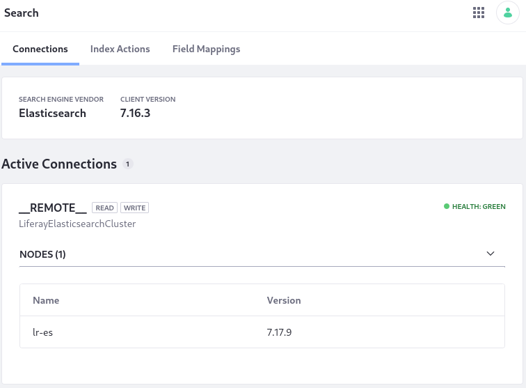

# Exercise: Run Liferay and Elasticsearch Using Docker

> Applies to: Liferay DXP 7.3+

Here you can walk through a minimal Liferay-Elasticsearch setup on your local machine to see how the [REST Client](https://www.elastic.co/guide/en/elasticsearch/client/java-rest/7.x/java-rest-high.html) connection between Elasticsearch and Liferay DXP 7.3+ is configured. The example uses two Docker containers: one Elasticsearch container and one Liferay DXP container. For more conceptual and production-like information see [Installing Elasticsearch](./getting-started-with-elasticsearch.md).

Read [Securing Elasticsearch](./securing-elasticsearch.md) to enable authentication and encryption on the Elasticsearch connection.

## Create Local Folders for Bind Mounting to the Docker Containers

Create a local folder structure that can be bind mounted to the Elasticsearch and DXP containers' system folders for providing plugins and configuration files. Since Elasticsearch must write to the mounted folder, here the `-m a+w` modifier is given. You must understand and apply the proper permissions applicable to your system:

```bash
mkdir -p test-es-install/dxp/files/osgi/configs && mkdir -p test-es-install/elasticsearch -m a+w && cd test-es-install
```

```{tip}
The `cd test-es-install` command at the end puts you in the `test-es-install` folder. Make sure you run the remaining commands for both Elasticsearch and Liferay DXP from this folder.
```
## Install Elasticsearch

<!-- First start a network? That might avoid the docker inspect stuff -->

1. Configure and start an Elasticsearch container named `elasticsearch-liferay`:

   ```bash
   docker run -it --name elasticsearch-liferay -p 9200:9200 -e "discovery.type=single-node" -e "node.name=es-node1" -v $(pwd)/elasticsearch:/usr/share/elasticsearch/data docker.elastic.co/elasticsearch/elasticsearch:8.8.1
   ```

   Once started, log messages with important security information are printed:

   ```bash
   ✅ Elasticsearch security features have been automatically configured!
   ✅ Authentication is enabled and cluster connections are encrypted.

   ℹ️  Password for the elastic user (reset with `bin/elasticsearch-reset-password -u elastic`):
     +A_xSB6C7tRqU=nVzH9L

   ℹ️  HTTP CA certificate SHA-256 fingerprint:
     d262f608258b1d99fa2648f967ca1b036ee3b40cfe8a8925b0ebe22441c1545e

   ℹ️  Configure Kibana to use this cluster:
   • Run Kibana and click the configuration link in the terminal when Kibana starts.
   • Copy the following enrollment token and paste it into Kibana in your browser (valid for the next 30 minutes):
     eyJ2ZXIiOiI4LjguMSIsImFkciI6WyIxNzIuMTcuMC4yOjkyMDAiXSwiZmdyIjoiZDI2MmY2MDgyNThiMWQ5OWZhMjY0OGY5NjdjYTFiMDM2ZWUzYjQwY2ZlOGE4OTI1YjBlYmUyMjQ0MWMxNTQ1ZSIsImtleSI6IlA3NzdONDBCRHJMc01NTjlLTjBWOmY2RHc5dVpHUVEtNEpibk5PcG5EMUEifQ==

   ℹ️ Configure other nodes to join this cluster:
   • Copy the following enrollment token and start new Elasticsearch nodes with `bin/elasticsearch --enrollment-token <token>` (valid for the next 30 minutes):
     eyJ2ZXIiOiI4LjguMSIsImFkciI6WyIxNzIuMTcuMC4yOjkyMDAiXSwiZmdyIjoiZDI2MmY2MDgyNThiMWQ5OWZhMjY0OGY5NjdjYTFiMDM2ZWUzYjQwY2ZlOGE4OTI1YjBlYmUyMjQ0MWMxNTQ1ZSIsImtleSI6IlFiNzdONDBCRHJMc01NTjlLTjBXOkY1MzBBdXMtUzVlMTZ0UzJQSnZfWWcifQ==

     If you're running in Docker, copy the enrollment token and run:
     `docker run -e "ENROLLMENT_TOKEN=<token>" docker.elastic.co/elasticsearch/elasticsearch:8.8.1`
     ```

1. Copy the `elastic` user password somewhere, then copy the SSL certificates folder from the running container to the `test-es-install` folder:

   ```bash
   docker cp elasticsearch-liferay:/usr/share/elasticsearch/config/certs/ .
   ```

   Optional: use the certificate and the password to make sure Elasticsearch is running:

   ```bash
   curl --cacert ./certs/http_ca.crt -u elastic:+A_xSB6C7tRqU=nVzH9L https://localhost:9200
   ```

   You'll see JSON like this:

   ```json
   {
     "name" : "es-node1",
     "cluster_name" : "docker-cluster",
     "cluster_uuid" : "kprsj4NIS229pu3_7jcQZA",
     "version" : {
       "number" : "8.8.1",
       "build_flavor" : "default",
       "build_type" : "docker",
       "build_hash" : "f8edfccba429b6477927a7c1ce1bc6729521305e",
       "build_date" : "2023-06-05T21:32:25.188464208Z",
       "build_snapshot" : false,
       "lucene_version" : "9.6.0",
       "minimum_wire_compatibility_version" : "7.17.0",
       "minimum_index_compatibility_version" : "7.0.0"
     },
     "tagline" : "You Know, for Search"
   }
   ```

1. In a new terminal window, install the required Elasticsearch plugins. Use `docker exec -it` to access an interactive bash shell:

   ```bash
   docker exec -it elasticsearch-liferay bash -c '/usr/share/elasticsearch/bin/elasticsearch-plugin install analysis-icu && /usr/share/elasticsearch/bin/elasticsearch-plugin install analysis-kuromoji && /usr/share/elasticsearch/bin/elasticsearch-plugin install analysis-smartcn && /usr/share/elasticsearch/bin/elasticsearch-plugin install analysis-stempel'
   ```

1. Restart the Elasticsearch container to register the plugins. CTRL+C stops the container, then start it again by running 

   ```bash
   docker start -i elasticsearch-liferay
   ```

1. Get the IPv4 address of the running Elasticsearch container:

   ```bash
   docker network inspect bridge
   ```

   In this example it's `172.17.0.2`. If your system provides a different IP address, you must use it in the `docker run --add-host elasticsearch-liferay:[IP]...` command when running Liferay DXP.

   ```bash
   "Containers": {
               "2d4614fdcce2159322fa7922bfc5f866b79bd7f609a65cc888f9a260f80731f4": {
                   "Name": "elasticsearch-liferay",
                   "EndpointID": "e89c3d0a87cc528753470eb359cee3b85fea9f9a5df3b249d54d203741a650a8",
                   "MacAddress": "02:42:ac:11:00:02",
                   "IPv4Address": "172.17.0.2/16",
                   "IPv6Address": ""
               }
           },
   ```

## Install Liferay DXP

Specify the properties Liferay DXP needs to connect with Elasticsearch, then run the DXP container.

1. First populate the Elasticsearch 7 configuration file by running

   <!-- add security settings: but how do i load certs so the container can see them? the docker cp gets me the crt file so I can make curl calls, but what does Liferay's container need? what structure and mounting strategy to use? -->
   <!-- probably add the crt to a local mounted folder and reference it from there in the config file -->
   ```bash
   cat <<EOT >> dxp/files/osgi/configs/com.liferay.portal.search.elasticsearch7.configuration.ElasticsearchConfiguration.config
   
   authenticationEnabled=B"true"
   httpSSLEnabled=B"true"
   logExceptionsOnly="false"
   networkHostAddresses="http://elasticsearch-liferay:9200"
   password="[See Elasticsearch startup logs]"
   productionModeEnabled=B"true"
   trustStorePassword="liferay"
   trustStorePath="/PATH/TO/elastic-nodes.p12"
   truststoreType="pkcs12"
   username="elastic"
   EOT
   ```

1. Once the configuration files are in place, start the DXP container with 

   <!-- rename to liferay74? -->
   ```bash
   docker run -it --name dxp74  --add-host elasticsearch-liferay:172.17.0.2 -p 8080:8080 -v $(pwd)/dxp:/mnt/liferay [$LIFERAY_LEARN_PORTAL_DOCKER_IMAGE$]
   ```

1. **Checkpoint:** Verify that the Elasticsearch connection is active in Control Panel &rarr; Configuration &rarr; Search.

   

Re-index your search and spell check indexes. Both re-index actions are carried out from the Index Actions tab of Control Panel &rarr; Configuration &rarr; Search.

## Related Topics

* [Securing Elasticsearch](./securing-elasticsearch.md)
* [Liferay Enterprise Search](../../liferay-enterprise-search.md)
* [Search Pages](../../search-pages-and-widgets/working-with-search-pages/search-pages.md)
* [Administering and Tuning Search](../../search-administration-and-tuning.md)
* [Elasticsearch Connector Settings](./elasticsearch-connector-configuration-reference.md)
