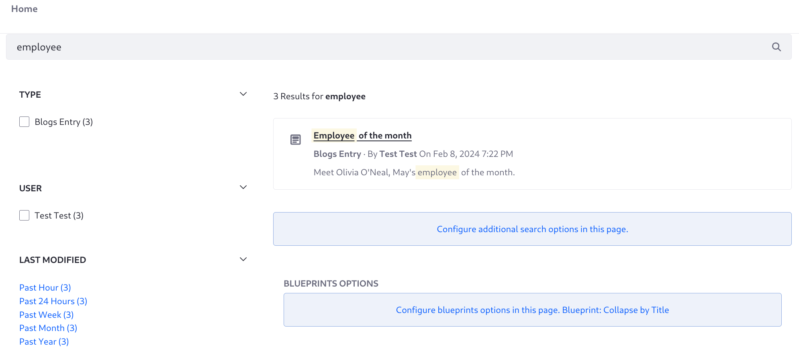

---
taxonomy-category-names:
- Search
- Liferay Enterprise Search
- Search Experiences and Blueprints
- Liferay Self-Hosted
- Liferay PaaS
- Liferay SaaS
uuid: 46e00046-f0b0-4700-b73f-6d75d914800d
---
# Collapsing Search Results

You can collapse search results with an identical keyword field value. For example, an internal blog titled "Employee of the Month" could produce multiple identically titled search results. To collapse all secondary results into the best matching result, use the `collapse` configuration. See Elasticsearch's [Collapse Search Results](https://www.elastic.co/guide/en/elasticsearch/reference/current/collapse-search-results.html) for details on how the feature works.


There are a couple things to note when deciding to use the collapse feature:

1. Liferay's default indexer clauses can interfere with attempts to collapse results by the title field. If you experience this in testing, [disable the search framework indexer clauses](./creating-and-managing-search-blueprints.md#advanced-configuring-query-clause-contributors) in the blueprint and construct the query from scratch. For example, add the _Text Match Over Multiple Fields_ element into the blueprint.
1. The results count remains the count from the original search response before the collapse was applied. Therefore, collapsing results causes inaccurate result counts and pagination will not work as expected.

NEED MORE INFORMATION ON PAGINATION ISSUES

## Example: Collapse Results by Localized Title

To use result collapsing by localized title,

1. Open _Site Menu_ () &rarr; _Content & Data_ &rarr; _Blogs_, and create three blogs with these field values:

   Blog 1, Title:

   ```
   Employee of the month
   ```

   Blog 1, Content:

   ```
   Meet Rex Randle, employee of the month for March.
   ```


   Blog 2, Title:

   ```
   Employee of the Month
   ```

   Blog 2, Content:

   ```
   Meet Olivia O'Neal, employee of the month for April.
   ```

   Blog 3, Title:

   ```
   Employee Of The Month
   ```

   Blog 3, Content:

   ```
   Meet Preston Palmer, employee of the month for May.
   ```

1. [Create a blueprint](./creating-and-managing-search-blueprints.md). Open _Global Menu_ () &rarr; _Applications_ &rarr; _Blueprints (Search Experiences)_.

1. Click _New_, enter the title _Collapse by localized title_, and click _Create_.

1. Open the [preview window](./creating-and-managing-search-blueprints.md#testing-a-blueprint-with-the-preview-sidebar) and search for _employee_. Three results appear.

1. Open _Configuration_ and enter this in the Advanced Configuration field:

   ```json
   {
      "collapse": {
         "field": "localized_title_${context.language_id}_sortable.keyword_lowercase"
      }
   }
   ```
1. In the preview window, search for _employee_ again. A single result appears.

1. If you're using the blueprint on a search page, save it and [apply it to the search page](./using-a-search-blueprint-on-a-search-page.md).



## Related Topics

- [Creating and Managing Search Blueprints](./creating-and-managing-search-blueprints.md)
- [Working with Search Pages](../../../search-pages-and-widgets/working-with-search-pages.md)
- [Search Results](../../../search-pages-and-widgets/search-results.md)
