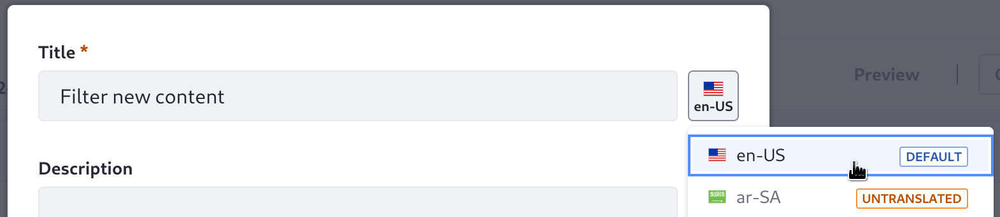

---
taxonomy-category-names:
- Search
- Liferay Enterprise Search
- Search Experiences and Blueprints
- Liferay Self-Hosted
- Liferay PaaS
- Liferay SaaS
uuid: 9c605bf4-a130-4723-93e3-04c2f725098b
---
# Managing Elements

To create new Elements, click _Add_ (). See [Creating Elements](./creating-elements.md) for more details.

As of Liferay DXP 2023.Q4+, the title and description fields are localizable. To provide translations, use one of these approaches:

1. After the element is created, re-open the title and description modal, then select the language and begin translating.

   

1. Use the [Language Override](../../../../system-administration/configuring-liferay/changing-language-translations.md#adding-a-language-key-and-translation) application to provide a language key (e.g., `search-for-new-content`) and its translated values (e.g., _Search for New Content_ in the English translation).

To delete existing custom Elements, select the Element(s) using the checkbox selector and click the Delete () button.


```{note}
System Elements (i.e., out-of-the-box) cannot be edited or deleted. Copy a system Element if you want to base a custom Element on it.
```

To duplicate an existing Element, click _Actions_ () and select _Copy_. You can delete or edit the duplicated Element just like any other custom Element.

To export an Element, click _Actions_ () for the Element and select _Export_.

To import an Element, click _Actions_ () in the top corner of the screen (next to the Global Menu icon). Click _Import_ and browse to the Element's JSON file.


```{warning}
The [Element schema](./creating-elements.md#understanding-the-element-schema) can change. If the schema changes between Liferay versions, importing an older Element's JSON may fail.
```

## Related Topics

- [Creating Elements](./creating-elements.md)
- [Predefined Element Variables Reference](./predefined-element-variables-reference.md)
- [Creating and Managing Search Blueprints](../creating-and-managing-search-blueprints.md)
