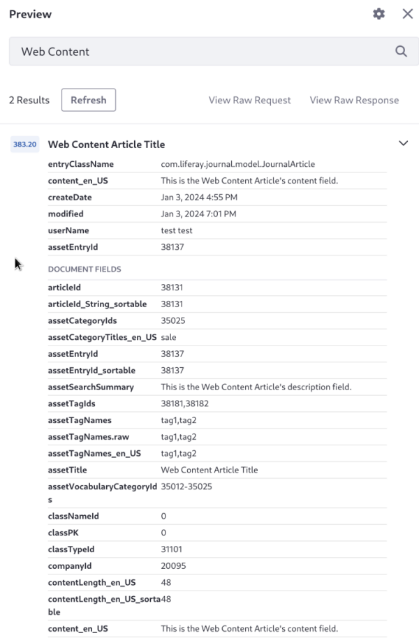

# Optimizing Search Response Size

In rare cases, an overly large search response can result in ERROR messages from the search engine:

```bash
ERROR [http-nio-8080-exec-335][ElasticsearchIndexSearcher:165] java.lang.RuntimeException: java.io.IOException: entity content is too long [117672846] for the configured buffer limit [104857600]
```

If too many large documents are returned in the response, the response size can become larger than the maximum allowed response size. You can shrink the response size with a search blueprint in these ways:

1. By filtering the stored fields returned by the search engine
1. By excluding the source field from the response

## Filtering Stored Fields

By default, Liferay requests all [stored fields](https://www.elastic.co/guide/en/elasticsearch/reference/7.x/mapping-store.html) from Elasticsearch. Stored fields are specified in the mappings:

```json
"userId": {
   "store": true,
   "type": "keyword"
},
```

Usually, returning all stored fields is innocuous. In rare cases, an overly large response can result in ERROR messages indicating that the returned content is too long for the configured buffer limit.

To reduce the response size of searches and improve performance generally, you can filter the stored fields. For this you must [create a Search Blueprint](./creating-and-managing-search-blueprints.md) with JSON like the following in the [Advanced Configuration](search-blueprints-configuration-reference.md#advanced-configuration) field:

```json
{
   "stored_fields": [
      "userId"
   ]
}
```

This communicates that only the `userId` field should be returned in each document.

!!! note
   If you inspect the response or use the _View Results in Document Form_ setting in the Search Results widget, you can see that more fields are returned than those declared in `stored_fields`. Liferay's search framework automatically adds certain fields needed for Liferay to function properly, such as `entryClassName`, `entryClassPK`, and `companyId`.

### Returning Fields for Summaries in the Search Results Widget

The Search Results widget requires certain fields in the response for generating [result summaries](../../../search-pages-and-widgets/search-results/search-results-behavior.md#result-summaries). The summary fields are asset-specific, but many assets require at least the localized version of the title, content, and description fields. 


Your use case determines the stored fields you should return in the response.

Fields available for display in the Search Results summaries are defined by the Search Results widget's display logic ([`SearchResultsSummaryDisplayBuilder`](https://github.com/liferay/liferay-portal/blob/[$LIFERAY_LEARN_PORTAL_GIT_TAG$]/modules/apps/portal-search/portal-search-web/src/main/java/com/liferay/portal/search/web/internal/result/display/context/builder/SearchResultSummaryDisplayContextBuilder.java) and [`SearchResultsSummaryDisplayContext`](https://github.com/liferay/liferay-portal/blob/[$LIFERAY_LEARN_PORTAL_GIT_TAG$]/modules/apps/portal-search/portal-search-web/src/main/java/com/liferay/portal/search/web/internal/result/display/context/SearchResultSummaryDisplayContext.java)).

## Excluding the Source Field

The `_source` field contains the original document body that was passed to the index request. This field is not itself indexed, but is stored and returned in the search response for each document. If you are encountering errors from a too large search response, you can exclude the `_source` field.

To exclude the source field, you must set `fetchSource` to `false` in the [Advanced Configuration](search-blueprints-configuration-reference.md#advanced-configuration) of a blueprint:

```json
{
   "source": {
      "fetchSource": false
   }
}
```

As demonstrated in the following example, you can exclude the source field and limit the returned stored fields simultaneously.

## Example: Limiting the Fields Returned in the Search Response

Although uncommon, searching in a system with lots of translated content can produce a search response that's too large. One workaround is to disable unneeded locales in Liferay, to avoid returning more translated fields than necessary. Another approach is trimming the response with a search blueprint, as described here:

1. First add a web content article. Open the Site menu () and go to *Content & Data* &rarr; *Web Content*.

1. Click *Add* () &rarr; *Basic Web Content* and give it this content:

   - **Title:** Web Content Article Title
   - **Description:** Web Content Article Description
   - **Content:** Web Content Article Content


1. Open the Global Menu () &rarr; Applications &rarr; Blueprints (Search Experiences).

1. Click _Add_ ().

1. Name the blueprint _Filter Stored Fields_.

1. Open the blueprint's [_Preview_](./creating-and-managing-search-blueprints.md#testing-a-blueprint-with-the-preview-sidebar) screen, and search for _web content_.

1. Expand the document preview for the web content you created and observe that the document contains many fields:

   

1. Click _Configuration_.

1. Replace the contents of the Advanced Configuration field with this:

   ```json
   {
      "source": {
         "fetchSource": false
      },
      "stored_fields": [
         "content_${context.language_id}",
         "description_${context.language_id}",
         "title_${context.language_id}"
      ]
   }
   ```

   This configuration specifies that only the content, description, and title fields of the current session language should be returned in the response.

1. Open the blueprint's [_Preview_](./creating-and-managing-search-blueprints.md#testing-a-blueprint-with-the-preview-sidebar) screen, and search for _web content_ again.

1. Expand the document preview for the Test Test user and observe that the document contains only the fields you specified and a few added by Liferay's search framework:

   

Excluding the source field and filtering the stored fields is rarely needed, but can be helpful if you're encountering search engine error messages about the response being too large.

## Related Topics

- [Creating Blueprints](./creating-and-managing-search-blueprints.md)
- [Search Blueprints Configuration Reference](./search-blueprints-configuration-reference.md)
- [Troubleshooting Elasticsearch Installation](../../../installing-and-upgrading-a-search-engine/elasticsearch/troubleshooting-elasticsearch-installation.md)
