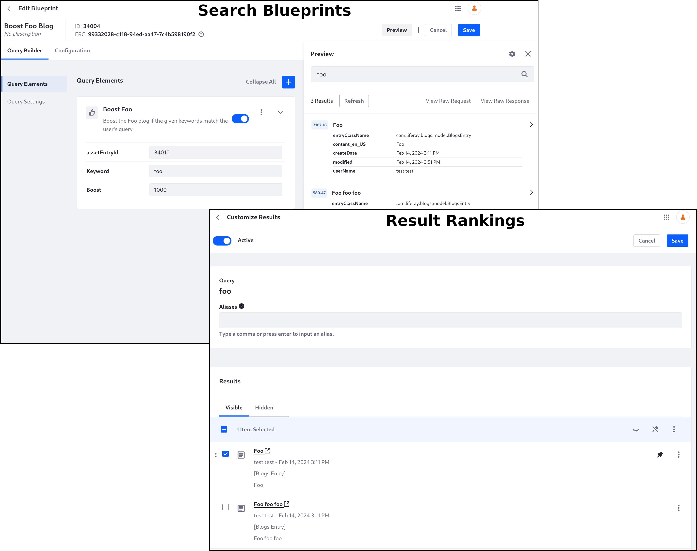
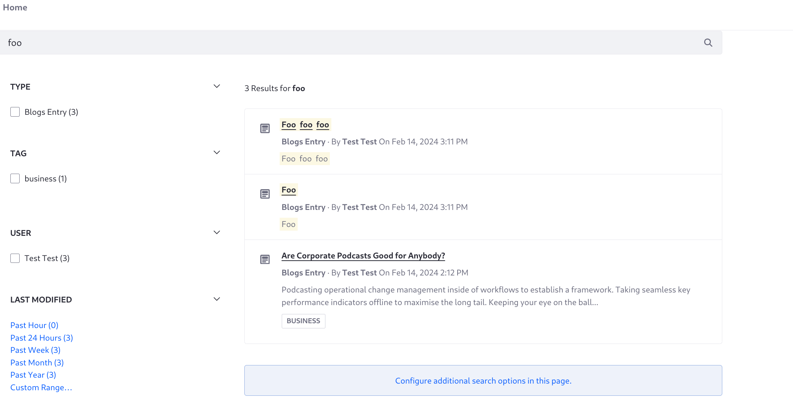
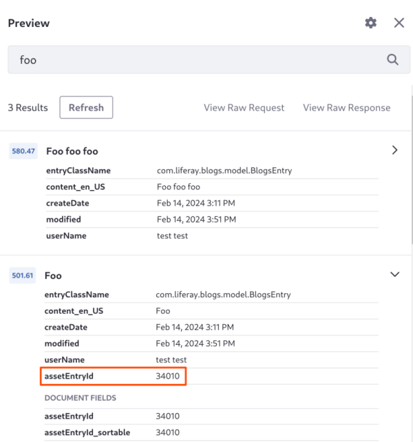
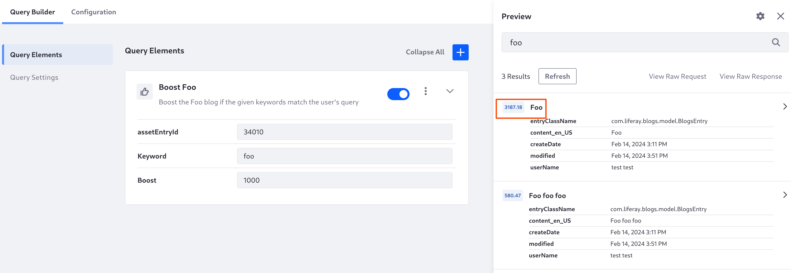
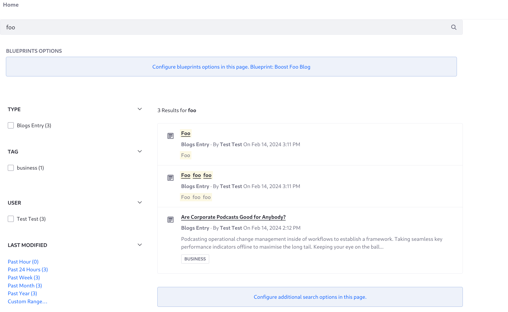

---
taxonomy-category-names:
- Search
- Liferay Enterprise Search
- Search Administration and Tuning
- Search Experiences and Blueprints
- Liferay Self-Hosted
- Liferay PaaS
- Liferay SaaS
uuid: 40e102ac-f887-40dd-a310-c6cd9a10cc4f
---
# Pinning Results

Liferay's [Result Rankings](../../../search-administration-and-tuning/result-rankings.md) application allows pinning results to the top of the results list. However, Result Rankings and Search Blueprints are not designed to work together. Instead, you can simulate the pinning behavior in a search blueprint by adding a high boost to the matching result.

To pin results with a blueprint, 

1. Create a [custom element](./creating-and-managing-elements/creating-elements.md).
1. Use a query within a `should` clause to match only the desired result. A term query on the content's `assetEntryId` field can provide this.
1. Boost a match to the query.
1. Use a condition to make sure that the configured keyword matches the user's search keyword.



For example, pin a certain blogs entry to the top of results when the user searches for _foo_:

1. Add two new blogs entries. Open _Site Menu_ &rarr; _Content & Data_ &rarr; _Blogs_:
   - First Blogs Entry 
     - Title: _Foo_
     - Content: _Foo_
     - Publish the blog.
   - Second Blogs Entry
     - Title: _Foo foo foo_
     - Content: _Foo foo foo_
     - Publish the blog.

1. Go to the _Home_ page and enter _foo_ into the search bar. The blog titled _Foo foo foo_ is returned first because the frequency of the searched term is higher.

   

1. [Create an element](creating-and-managing-elements/creating-elements.md) with these contents:

   ```json
   {
      "description_i18n": {
         "en_US": "Boost the Foo blog if the given keywords match the user's query"
      },
      "elementDefinition": {
         "category": "boost",
         "configuration": {
            "queryConfiguration": {
               "queryEntries": [
                  {
                     "clauses": [
                        {
                           "context": "query",
                           "occur": "should",
                           "query": {
                              "term": {
                                 "assetEntryId": {
                                    "boost": "${configuration.boost}",
                                    "value": "${configuration.asset_entry_id}"
                                 }
                              }
                           }
                        }
                     ],
                     "condition": {
                        "contains": {
                           "parameterName": "keywords",
                           "value": "${configuration.keyword}"
                        }
                     }
                  }
               ]
            }
         },
         "icon": "thumbs-up",
         "uiConfiguration": {
            "fieldSets": [
               {
                  "fields": [
                     {
                        "label": "assetEntryId",
                        "name": "asset_entry_id",
                        "type": "number"
                     },
                     {
                        "label": "keyword",
                        "name": "keyword",
                        "type": "keywords",
                        "typeOptions": {"required": true }
                     },
                     {
                        "defaultValue": 1000,
                        "label": "boost",
                        "name": "boost",
                        "type": "number",
                        "typeOptions": {
                           "min": 0
                        }
                     }
                  ]
               }
            ]
         }
      },
      "title_i18n": {
         "en_US": "Boost Foo"
      }
   }
   ```

1. [Create a blueprint](./creating-and-managing-search-blueprints.md). Name it _Pin Foo Blog_.

1. Add the element _Boost Foo_.

1. Find the blog entry's `assetEntryId`. Open the [preview window](creating-and-managing-search-blueprints.md#testing-a-blueprint-with-the-preview-sidebar) and search for _foo_. The _Foo foo foo_ blog will be first again, so expand the second result and find its `assetEntryId` field. Here it's `34010`:

   

1. Enter the keyword _foo_.

1. Search for _foo_ in the preview window once more, and the blog entry matching the `assetEntryId` is pinned to the top of the results because of the high boost value.

   

1. If desired, [add the blueprint to the search page](./using-a-search-blueprint-on-a-search-page.md) and test it there.



Using a similar approach, you can hide a specific result from the search results.

## Related Topics

- [Using Predefined Variables](creating-and-managing-elements/creating-elements.md#using-predefined-variables)
- [Search Administration and Tuning](../../../search-administration-and-tuning.md)
- [Search Configuration Reference](../../../search-configuration-reference.md)
