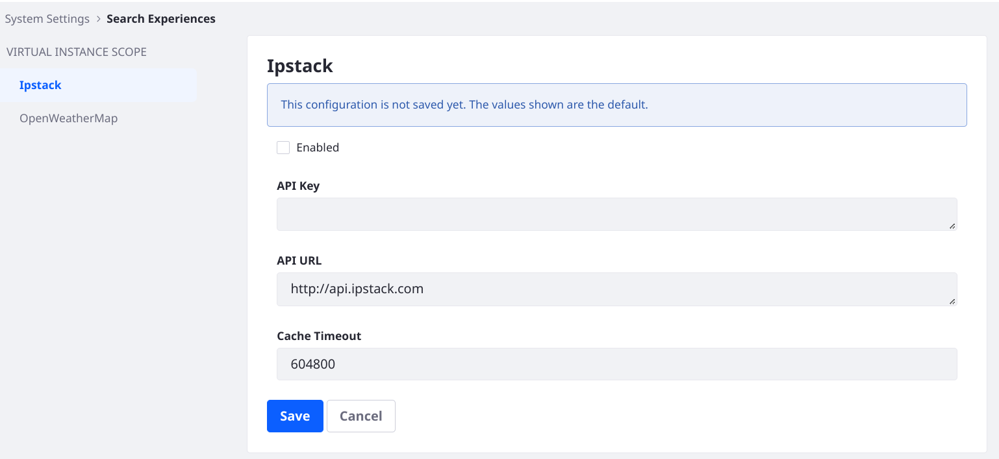

---
taxonomy-category-names:
- Search
- Liferay Enterprise Search
- Search Experiences and Blueprints
- Reference
- Liferay Self-Hosted
- Liferay PaaS
- Liferay SaaS
uuid: ef70f47a-a2c2-4371-95e0-e11c5107c60e
---
# Search Blueprints Configuration Reference

The Search Blueprints user interface has a Query Builder for creating Blueprints. Beyond adding Elements and configuring the query settings, there are additional configurations that are important for many Blueprints use cases. To work with these configurations go to the Global Menu &rarr; Applications &rarr; Blueprints. Add a new Blueprint or open an existing one, then click the _Configuration_ tab.


Each configuration field consists of a single text area that accepts a JSON string.

## Aggregation Configuration

Configure [Aggregations](https://www.elastic.co/guide/en/elasticsearch/reference/8.13/search-aggregations.html) in the Search Blueprint. Aggregations take the results of a query and group the data into logical sets. Aggregations can be composed to provide complex data summaries.

Aggregations added in Search Blueprints are applied in addition to those already present in the search request (e.g., from facets).

```{note}
Aggregations can be configured and are returned in the search response, but there is no out-of-the-box way to display or otherwise process the Blueprint-added aggregation in Liferay's UI. Custom code is required to consume the aggregations added in Blueprints.
```

To add an Aggregation to a Blueprint, 

1. From the Blueprint editor, click the _Configuration_ tab.
1. Find the Aggregation Configuration text area and enter valid JSON. Use the Elasticsearch DSL to craft the JSON.

   ```{warning}
   Some aggregations properties are not supported by Liferay's search API.
   ```

   ```json
   {
      "aggs": {
         "date_histogram-test": {
            "date_histogram": {
               "date_histogram_interval": "minute",
               "field": "modified",
               "keyed": true,
               "min_doc_count": 1,
               "order": {
                  "_count": "asc"
               }
            }
         }
      }
   }
   ```

## Highlight Configuration

Configure [Highlights](https://www.elastic.co/guide/en/elasticsearch/reference/8.13/highlighting.html) in Search Blueprints. If you add a highlight configuration in Search Blueprints, it overrides the default search highlight configuration.

To add a Highlight to a Blueprint, 

1. From the Blueprint editor, click the _Configuration_ tab.
1. Find the Highlight Configuration text area and enter valid JSON. The properties and their possible values are detailed in the [Elasticsearch documentation](https://www.elastic.co/guide/en/elasticsearch/reference/8.13/highlighting.html).

   ```json
   {
      "fields": {
         "content_${context.language_id}": {},
         "title_${context.language_id}": {}
      },
      "fragment_size": 100,
      "number_of_fragments": 10,
      "post_tags": [
         "</liferay-hl>"
      ],
      "pre_tags": [
         "<liferay-hl>"
      ],
      "require_field_match": true
   }
   ```

## Sort Configuration

Configure [Sorts](https://www.elastic.co/guide/en/elasticsearch/reference/8.13/sort-search-results.html) in Search Blueprints. Sorts added via Search Blueprints are applied in addition to those already in the search request (e.g., from the Sort widget). However, Sorts added in a Search Blueprint are not reflected in the Sort widget's UI or configuration screen.

```{warning}
Do not use both the Sort widget and a Blueprint to configure Sorts on a search page. Consistent behavior cannot be guaranteed if you combine Sorts from the Sort widget and a Search Blueprint's Sort Configuration.
```

To add a Sort to a Blueprint, 

1. From the Blueprint editor, click the _Configuration_ tab.
1. Find the Sort Configuration text area and enter valid JSON.

   ```json
   {
      "sorts": [
         {
            "title_sortable": "desc"
         }
      ]
   }
   ```

## Parameter Configuration

Declare new template variables from search context attributes. For example, a Custom Filter widget could be combined with a Widget Template and a Blueprint to allow the end user to toggle the search results between unpublished and draft content. 

This example adds a new search context attribute that excludes Web Content from the search results if the value of the attribute is _true_.

1. Add the Parameter Configuration to a new Blueprint: go to the _Configuration_ tab and find the Parameter Configuration text box. Add

   ```json
   {
      "parameters": {
         "exclude.journal_articles": {
            "type": "String"
         }
      }
   }
   ```

1. Add a Custom Element to the Blueprint: Go to the _Query Builder_ tab, find the Custom JSON Element, and click _Add_. Overwrite the existing content:

   ```json
   {
      "description_i18n": {
         "en_US": "Conditionally exclude journal articles from the search."
      },
      "elementDefinition": {
         "category": "hide",
         "configuration": {
            "queryConfiguration": {
               "queryEntries": [
                  {
                     "clauses": [
                        {
                           "context": "query",
                           "occur": "filter",
                           "query": {
                              "bool": {
                                 "should": [
                                    {
                                       "bool": {
                                          "must_not": [
                                             {
                                                "term": {
                                                   "entryClassName": {
                                                   "value": "com.liferay.journal.model.JournalArticle"}
                                                }
                                             }
                                          ]
                                       }
                                    },
                                    {
                                       "bool": {
                                          "must": [
                                             {
                                                "term": {
                                                   "discussion": false
                                                }
                                             }
                                          ]
                                       }
                                    }
                                 ]
                              }
                           }
                        }				
                     ],
                     "condition": {
                        "contains": {
                           "parameterName": "exclude.journal_articles",
                           "value": "true"
                        }
                     }
                  }
               ]
            }
         },
         "icon": "hidden"
      },
      "title_i18n": {
         "en_US": "Exclude Journal Articles"
      }
   }
   ```

1. Add the search context attribute. For testing purposes you can do this in the [preview](creating-and-managing-search-blueprints.md#testing-a-blueprint-with-the-preview-sidebar) sidebar.

1. Click _Preview_. Add search context attributes to the Blueprint preview search by clicking the gear icon (). Enter the key/value pair for the attribute: `exclude.journal_articles`/`true`

1. Then click _Done_. 

**Checkpoint:** Execute a search that you expect to return a Web Content article (add one if needed) and verify that the article is not returned. Open the attribute configuration again and set the value to _false_. Verify that the preview search now includes the Web Content.


   ```{tip}
   You can configure search context attributes on a Search Page using the [Low Level Search Options](../../../search-pages-and-widgets/search-results/understanding-low-level-search-options.md) widget.
   ```

## Advanced Configuration

```{warning}
This is an advanced feature that is rarely needed. Because no out-of-the-box feature in Liferay's UI responds to this configuration, only custom code can consume the result of this configuration in the search response.
```

The Advanced Configuration adds [source includes and excludes](https://www.elastic.co/guide/en/elasticsearch/reference/8.13/mapping-source-field.html#include-exclude) as search request parameters. The `_source` field contains the stored document body that was passed to the index request. This field is not itself indexed. The Advanced Configuration in Blueprints lets you prune the `_source` field by specifying what fields to include or exclude from the field. As it overlaps in functionality and may conflict with the Low Level Search Option widget's _Fields to Return_ configuration, you must not use both approaches in tandem. To add an Advanced configuration to a Blueprint, 

1. From the Blueprint editor, click the _Configuration_ tab.
1. Find the Advanced Configuration text area and enter the `excludes` and `includes` you need. Wildcards are permitted.

```json
{
    "source":{
        "excludes":[
            "<fieldName1>",
            "<fieldName2>"
        ],
        "fetchSource":true,
        "includes":[
            "<fieldName3>",
            "<fieldName4>"
        ]
    }
}
```

## Configuring Search Blueprints in the Control Panel

Most configurations for Search Blueprints are found directly in the Blueprints application and in the search page itself. However, there are two system/instance configurations that enable services supporting geolocation capabilities in Search Blueprints.

Both configuration entries can be found in the Search Experiences category of Control Panel &rarr; System/Instance Settings.



[Ipstack](https://ipstack.com/) provides geolocation information based on the user's IP address.

| Ipstack Configuration | Default Value | Description | 
| :-------------------- | :------------ | :---------  |
| Enabled               | False         | Check the box to enable the ipstack service.  |
| API Key               | None          | You must obtain an API key from ipstack.com to enable the service.  |
| API URL               | http://api.ipstack.com | Provide the URL to the service. |
| Cache Timeout         | 604800        | Set the time (ms) until the cached data expires and the API is re-invoked. |

[OpenWeatherMap](https://openweathermap.org) is used in conjunction with ipstack to provide weather information based on the user's location. To use this in Search Blueprints you must also enable ipstack.

| Ipstack Configuration | Default Value | Description | 
| :-------------------- | :------------ | :---------  |
| Enabled               | False         | Check the box to enable the OpenWeatherMap service.  |
| API Key               | None          | You must obtain an API key from openweathermap.org to enable the service.  |
| API URL               | http://api.openweathermap.org/data/2.5/weather | Provide the URL to the service. |
| Cache Timeout         | 604800        | Set the time (ms) until the cached data expires and the API is re-invoked. |
| Units                 | Metric        | Set the system for the weather data units: choose Imperial, Metric, or Standard. |

