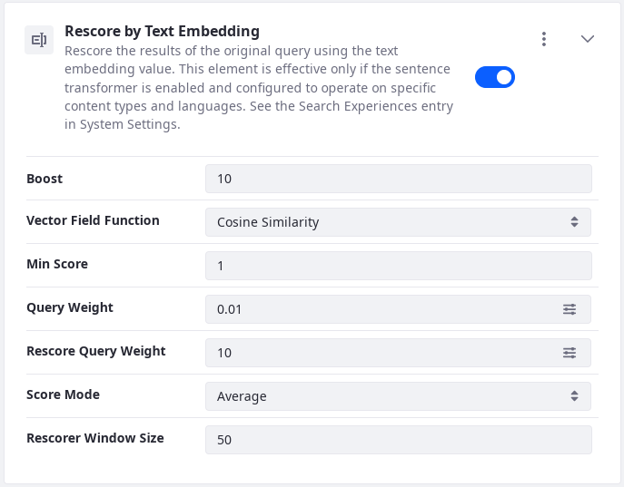

# Semantic Search
{bdg-primary}`Subscription`
{bdg-secondary}`7.4 U50+`

<!-- Questions and comments:

1. Are the vector representations (the text embeddings) stored in the transformer service? I don't see anything in the returned documents, and I saw txtai munching a lot of data as I added Liferay Learn articles via the ingester, so I am guessing the answer is "yes". So I cannot really say that the transformed text embeddings are indexed with the Liferay documents. Might want to get a good diagram prepared for this.
2. I hate calling these things text embeddings, as a noun. They're the vector representations of the text as produced by the text embedding transformation technique (I think; obviously I could be very wrong). But, if that's the dumb jargon someone came up with and everyone uses, I guess we'll go with it.
3. Our descriptions don't include any indication of which document fields are processed by the transformer. Are we only talking about content, content_xx_XX, or is it some kind of amalgamation of all the text fields in a document? Something else?
-->


<!-- The Intro still needs lots of work--skip it for now and start with Enabling Semantic Search -->
Defines both semantic and lexical search https://en.wikipedia.org/wiki/Semantic_search

Ideally, searching for "tech news" returns a document with a field containing the text "During economic downturns Linux distros gain on traditionally dominant operating system vendors." No amount of processing in a traditional search can provide this result. For this you need semantic search.

The best search knows not only the words you type into the search bar, but also the intent behind the words. Even sophisticated lexical searches like Liferay's (as powered by Elasticsearch) cannot do this, although it fakes it pretty well by applying inventive techniques like 
- analysis to tokenize the keywords and document fields.
- fuzziness and slop to enable imprecise matching.
- stemming to break words down into their roots to allow synonym matching.
- stop words to ignore insignificant words.
Adding these techniques to process the tokenized keywords and document fields can be enough for many search needs. If you add  Liferay DXP's Synonym Sets to this capability you can even make sure that the search returns results matching synonymous terms that wouldn't be caught by stemming: for example, set _doctor_ as synonymous with _medical_. All these techniques are designed to make a search better answer the question "what did you mean by that?", but they're orthogonal to the question at best. Semantic search greatly closes the gap between what a lexical search can accomplish and what the user really wants from the search: processing not just the words of the search, but the intent behind it.

<!-- If we get specific we better be able to deliver this result. -->

With this initial release, Administrators can enable an additional content processing pipeline: when this feature is enabled, the platform is producing a vector representation of the input text (for supported content types*) called sentence embedding and it gets stored in the index document in Elasticsearch. At search time, the search keywords entered by users go through the same process so it becomes possible to perform similarity searches to provide better, semantically more relevant search results for users.

## Enabling Semantic Search

To enable semantic search in Liferay,

1. Set up a sentence transformer provider and configure it in Liferay.
1. Create a search blueprint to perform a similarity search between the text embeddings representation of the search terms versus the text embeddings representation of the document text. query account for the dense vector field containing the text embedding that is the natural language representation of the words.
1. Create a search blueprint using the necessary Search Experiences elements.

```{important} 
You must re-index if ...
```

### Setting up a Sentence Transformer Provider

A sentence transformer has two jobs:

1. create a text embedding representation of the index document's fields (which are stored in the index).
1. at search time, create a text embedding representation of the search phrase typed into the search bar.

On top of that, you need a model to perform a [similarity search](https://www.elastic.co/blog/text-similarity-search-with-vectors-in-elasticsearch) of the search phrase embeddings and the document embeddings. Models are housed in Hugging Face even if you use txtai as the transformer.

Choose from one of two sentence transformer providers that can be configured to work with Liferay's search index documents: [txtai](https://neuml.github.io/txtai/) and [Hugging Face](https://huggingface.co/).

#### Starting a txtai Instance

<!-- Say something about this setup is intended for testing, point to the txtai docs for more information? -->

Set up txtai to access its APIs. To start a txtai docker container, see the [txtai documentation](https://neuml.github.io/txtai/cloud/) or follow these basic steps for Linux:

1. Create a `txtai` directory and `cd` into it.

1. From the `txtai` folder, download the Dockerfile with

   ```sh
   curl https://raw.githubusercontent.com/neuml/txtai/master/docker/api/Dockerfile -O
   ```

1. Create a `config.yml` file in the `txtai` folder, and give it these minimal contents:

   ```yaml
   path: /tmp/index

   writable: False

   embeddings:
        path: sentence-transformers/nli-mpnet-base-v2
   ```

1. From the txtai folder, run

   ```sh
   docker build -t txtai-api .
   ```

1. Start the container:

   ```sh
   docker run -p 8000:8000 --rm -it txtai-api
   ```
 
   Depending on the size of the models, it can take several minutes for the service to initialize. 

1. Once the txtai server is running, go to Liferay's Control Panel &rarr; Search Experiences &rarr; Semantic Search and configure it:

   - Set Sentence Transformer Enabled to true.
   - Select _txtai_ as the Sentence Transformer Provider.
   - If you followed the above test setup, leave the default value in txtai Host Address.
   - Leave the default value (768) in Embedding Vector Dimensions

<!-- Needed: a reference section for all the settings (Hugging Face specific ones too)-->


#### Provisioning a Hugging Face Instance

To use Hugging Face as the sentence transformer provider, create a [Hugging Face account](https://huggingface.co/join).

Once you have an account,

1. Go to your account settings and find _Access Tokens_. Copy your token.
1. Go to Liferay's Control Panel &rarr; Search Experiences &rarr; Semantic Search and configure its sentence transformer settings, selecting Hugging Face and entering the access token you copied.
1. Choose one of the models from the list at <https://huggingface.co/models?pipeline_tag=feature-extraction>. 
1. Enter the model name as the title of the model.

Liferay DXP supports txtai (self-hosted / self-managed) and Hugging Face's Inference API as sentence transformer providers. Administrators can enable and configure these services through the System/ Instance Settings.

### Creating a Search Blueprint for Semantic Search
<!-- A user searching for this might be better served with a title like "Re-Scoring the Query with Text Embeddings". -->

To build a semantic search experience leveraging the sentence embeddings created by the sentence transformer provider you configured, Liferay includes an out-of-the-box element (in 7.4 Update/GA 50+) called Rescore by Text Embedding that re-scores the results of the original query using the text embedding value. Use the element to build a [search blueprint](./creating-and-managing-search-blueprints.md). With this element and the visual query builder in Blueprints, you can configure and test the search query to build the right semantic search solution.

<!-- For how it works: There's an ootb element rescore by text embedding, ping petteri: it rescores x results using a special function which uses the vector field. produce initial results by keyword, rescore them using the vector representations. the function can be chosen, dotProduct or cosin -->

```{important}
The out-of-the-box Rescore by Text Embedding element (available in 7.4 Update/GA 50+), when configured to work with a sentence transformer, can produce more semantically targeted search results for some data sets. However, many semantic search solutions will require manual tweaking and perhaps new elements to achieve a robust semantic search solution.
```



This element is effective only if the sentence transformer is enabled and configured to operate on specific content types and languages. See the Search Experiences entry in System Settings to configure transformation.

## Configuring the Rescore by Text Embedding Element

Several configurable options are provided in the Rescore by Text Embedding element: 

**Boost:** Defaulting to 10, this setting determines by how much to boost re-scored results.

**Vector Field Function:** Choose from the Cosine Similarity or Dot Product functions. Defaulting to use the Cosine Similarity function, the selected function measures similarity between the searched keywords and the target document text embeddings. Check the model's documentation to determine which function is most suitable. 

**Min Score:** Defaulting to 1, this setting's integer (or 0) sets the minimum score a returned document must have to be included in the re-score query. 

**Query Weight:** Defaulting to 0.01, this setting controls the weight of the original query in the final score calculation.

**Rescore Query Weight:** Defaulting to 10, this sets the weight of the re-score query in the final score calculation.

**Score Mode:** Defaulting to Average, this setting dictates the strategy to use when combining the original query scores with the results of the re-score. Choose from Average, Max, Min, Multiply, or Total.

**Rescorer Window Size:** Defaulting to 50, you can choose the number of results to re-score at a time. Choosing a very high window size can impact performance negatively .

## Configuring the Semantic Search Indexing Settings

Additional configuration options are available for Semantic Search. Visit Control Panel &rarr; System Settings &rarr; Semantic Search, and find the Indexing Settings section.

**Max Character Count:** 500 Set the maximum number of characters to be sent to the sentence transformer. By default up to 500 characters are sent to be transformed into their vector representations.

**Text Truncation Strategy:** Beginning Select from which portion of the text the sample for the sentence transformer should be taken from. This setting applies only if the text is longer than the maximum character count. Choose from Beginning (the default), Middle, or End.

Select whether to extract the pre-transformation sample from the Beginning (default), Middle, or End of the text. This setting applies only if the text is longer than the maximum character count.

**Asset Entry Class Names:** Select the asset types to be transformed. By default all supported asset types are processed, including Blogs Entry, Knowledge Base Article, Message Boards Message, Web Content Article, and Wiki Page. 

**Language IDs:** Select the languages and localizations to be transformed. By default all listed languages are selected: Arabic (Saudi Arabia), Catalan (Spain), Chinese (China), Dutch (Netherlands), English (United States), Finnish (Finland), French (France), German (Germany), Hungarian (Hungary), Japanese (Japan), Portuguese (Brazil), Spanish (Spain), and Swedish (Sweden). Select multiple languages from the list using _Ctrl + Click_.

**Cache Timeout:** Set the cache timeout in milliseconds for transformed search keywords. By default 604800 is used (about ten minutes).

## Understanding Semantic Search in Liferay

Providing a robust understanding of a semantic search's intricacies is beyond the scope of this brief explanation. Instead we'll focus on how Liferay's Semantic Search implementation works, along the way explaining a few fundamental concepts of a semantic search.

Semantic search impacts the Liferay search at both index time and search time.

During the indexing phase, 

* Standard processing occurs:
  * Content in Liferay is sent to the search engine where it's processed according to its data type: text is analyzed appropriately and stored in the index.
* Additional Semantic Search processing occurs:
  * Following the configuration in System/Instance Settings, the text snippet is sent to the sentence transformer, text embedding occurs, and a vector representation is created based on the model used the by the transformer. The result of the text embedding process is stored in the [Liferay Company Index](../../search-administration-and-tuning/elasticsearch-indexes-reference.md) as a [dense_vector](https://www.elastic.co/guide/en/elasticsearch/reference/7.x/dense-vector.html) field for each document[^1].

[^1]: To inspect the [mapping](../../search-administration-and-tuning/search-administration.md#field-mappings) for these transformer-produced dense vector fields, open the Control Panel &rarr; Search &rarr; Field Mappings. Copy the mappings into a file and search for *dense_vector*.

During the search phase,

* Standard Processing occurs:
  * The search phrase entered in the Search Bar widget is received by Liferay's search framework, sent through to the search engine for analysis and additional processing, matched to existing index documents in the search engine, which are scored for relevance and returned to Liferay for its additional processing (highlighting, summarizing, performing additional filtering for permissions, etc.). 
* Additional Semantic Search Processing occurs:
  * The search phrase is sent to the sentence transformer, text embedding occurs, and a vector representation is created. Before rendering the search results scored by lexical relevance, the results captured within the window limit setting are re-scored by comparing the vector representation of the search phrase with the dense vector fields stored in the search documents. New scores are calculated, and the newly ordered set of results are returned to the search page for consumption by the end user.


<!-- TODO: Quickly follow this documentation with a more robust example article, configuring the ootb element differently and including Petteri's more complicated custom element? -->


<!-- COMMENTS BELOW, DON'TBOTHER READING
depending on data set and the model, can improve the results, but...

there's another element Search with Sentence Embedding taht may be in producst or may just doc it (really complicated, more on the true semantic side instead of a rescore

see the blueprint on the ticket, may or may not be included in the product
### Specify a Pre-Trained Model

Semantic Search: User story has steps on using the ingester module to index from Liferay Learn and HC to get data, how to set up text AI using docker. See the confluence page (tibor linked in DM) for links to other articles to familiarize myself. Sys Settings > Semantic Search setting

enable the ff for the epic

set the transformer txtai or HF (need account and access token)

needs the model pre-trained by someone else (this is also hugging face; need an account), sending them a sentence and getting back vectors. the model used in our config must support feature extraction

for HF enter the model (there will be a selector)

the number of dimensions setting is needed for txtai or HF: to figure out how many dimensions they produce there's a test to perform in HF; test columns is the number of dimensions. it's important to get it right.

There will be a "test connection" button in system setting

Only certain asset types are supported as per the config (no custom structures, commerce stuff, objects)

Search time cache timeout so the provider is not hit for multiple repeated searches over and over. No index time caching.

send a sentence get back a vector/ 500 max char count by default, beginning of the content by default


Use txtai for testing
-->
